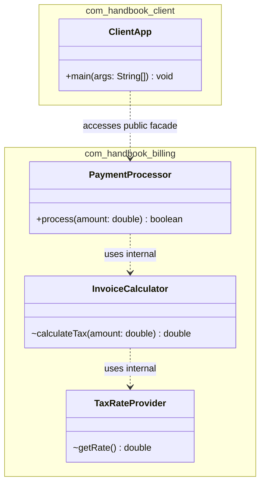

# 📦 P00.M03.L03 — Day 2 Packages, Modules, Visibility & Naming

> **Date:** August 3, 2026
> **Topic:** Package Organization Strategies, Access Control & Architectural Encapsulation
> **Focus:** Package-by-Feature vs. Package-by-Layer · Package-Private Boundaries · UML Packaging · Facade Pattern

---

## 🎯 TL;DR (Read this if you only have 30 seconds)

- **Default visibility** in Java = **package-private**. No keyword needed.
- **Package-private** = visible only to classes in the *same package* (not even subclasses elsewhere get in).
- **Don't make everything `public`.** Only expose a small "front door" — everything behind it stays hidden.
- **Package-by-Feature** (`com.app.cart`, `com.app.payment`) beats **Package-by-Layer** (`com.app.controllers`, `com.app.services`) almost every time — it gives you real encapsulation, not just a tidy folder structure.
- **Facade Pattern + package-private** = the core trick for building clean module boundaries.
- Tests in `src/test/java/...` magically get access to package-private code because Maven/Gradle put them in the *same package namespace* at compile time.

---

## 1. 🚀 Core Fundamentals (Quick Recall)

| # | Concept | Explanation |
|---|---------|-------------|
| 1 | **Default visibility** | Writing a class/method/field with *no* modifier keyword gives it **package-private** (a.k.a. "default") scope. |
| 2 | **Package-private scope** | Accessible only by classes in the **exact same package**. Subclasses in *other* packages are locked out — inheritance doesn't override this. |
| 3 | **Risk of over-exposing `public`** | Marking every class `public` leaks internal implementation details to the whole codebase → tight coupling, a polluted namespace, and callers who can bypass your business rules by reaching straight into internals. |
| 4 | **Facade + package-private** | Make one class `public` (the *Facade* / entry point). Everything it depends on internally stays package-private, so outside code is *physically incapable* of touching it. |
| 5 | **Reverse domain naming** | `com.company.feature` — all lowercase, based on a reversed domain name. Guarantees global uniqueness across dependencies and avoids filesystem case-sensitivity conflicts (e.g., Windows vs. Linux). |

### Warm-up Code: A Package-Private Helper

```java
package com.handbook.math;

/**
 * Package-private utility calculator.
 * Hidden from external packages.
 */
class InternalCalculator {

    int add(int a, int b) { return a + b; }
    int sub(int a, int b) { return a - b; }
    int mul(int a, int b) { return a * b; }

    int div(int a, int b) {
        if (b == 0) {
            throw new IllegalArgumentException("Division by zero is not allowed.");
        }
        return a / b;
    }
}
```

> 💡 Notice: no `public` keyword on the class. That single omission is what makes it invisible outside `com.handbook.math`.

---

## 2. 🏗️ Architecture Strategies: Layer vs. Feature

This is the **big idea** of the day. Two ways to organize the same codebase — one quietly sabotages encapsulation, the other reinforces it.

| Dimension | Package-by-Layer ❌ | Package-by-Feature ✅ |
|---|---|---|
| **Structure** | `com.app.controllers`, `com.app.services`, `com.app.repositories` | `com.app.cart`, `com.app.payment`, `com.app.user` |
| **Cohesion & Coupling** | Low cohesion, high coupling | High cohesion, low coupling |
| **Encapsulation** | Forces nearly every class to be `public` (classes in different layer-packages must see each other) | Maximizes package-private (`~`) encapsulation — internals stay hidden within the feature |
| **Modularity test** | Deleting a feature means hunting across 4+ folders | Delete one feature package in a **single operation** |
| **Navigation** | Constant jumping between unrelated technical folders | All related files for one feature sit together |
| **Microservice readiness** | Poor — technical layers are tangled together | Excellent — feature packages map 1:1 to Bounded Contexts |

### 🧠 Why does Layer architecture force everything `public`?

Because `Controller`, `Service`, and `Repository` for the *same feature* live in **different package nodes**. Java's package-private rule only allows same-package access — so the moment your controller (in `com.app.controllers`) needs to call a service (in `com.app.services`), that service class **must** be `public`. Multiply this across every layer and every feature, and you end up with an entire codebase that's `public` by necessity, not by design.

Package-by-Feature avoids this because the controller, service, and repository for *cart* can all live together in `com.app.cart` — so only the outward-facing class needs to be `public`; everything else stays locked down.

---

## 3. 🛠️ Coding Practice Exercises

### Exercise 1 — Package-Private Facade (Security Module)

**Step 1: The hidden helper** — lives in `com.handbook.security`, no `public` keyword:

```java
package com.handbook.security;

// Package-private helper (no public modifier)
class PasswordEncryptor {
    String encrypt(String rawPassword) {
        return "HASHED_" + rawPassword + "_SALT";
    }
}
```

**Step 2: The public Facade** — the *only* door into this module:

```java
package com.handbook.security;

// Public entry point to the security module
public class SecurityService {

    private final PasswordEncryptor encryptor = new PasswordEncryptor();

    public boolean authenticate(String user, String rawPassword) {
        String hashedPassword = encryptor.encrypt(rawPassword);
        System.out.println("Authenticating user " + user + " with hash " + hashedPassword);
        return true;
    }
}
```

**Step 3: Client code from a different package** — proof the wall works:

```java
package com.handbook.client;

import com.handbook.security.SecurityService;
// import com.handbook.security.PasswordEncryptor; // COMPILE ERROR! Not visible.

public class ClientApp {
    public static void main(String[] args) {
        SecurityService securityService = new SecurityService();
        securityService.authenticate("burhan", "secret123");

        // PasswordEncryptor encryptor = new PasswordEncryptor();
        // ❌ Compiler Error: PasswordEncryptor is not public in com.handbook.security
    }
}
```

> 🔒 **Key takeaway:** the compiler itself enforces the architecture. No one can accidentally (or lazily) reach into `PasswordEncryptor` from outside — it's not a convention, it's a hard rule.

---

### Exercise 2 — Package-by-Feature Refactor (Billing Module)

**Package-private helpers:**

```java
package com.handbook.billing;

// Package-private helper 1
class TaxRateProvider {
    double getRate() {
        return 0.10; // 10% hardcoded tax rate
    }
}

// Package-private helper 2
class InvoiceCalculator {
    private final TaxRateProvider taxRateProvider;

    // Constructor injection for package helpers
    InvoiceCalculator(TaxRateProvider taxRateProvider) {
        this.taxRateProvider = taxRateProvider;
    }

    InvoiceCalculator() {
        this(new TaxRateProvider());
    }

    double calculateTax(double amount) {
        return amount * taxRateProvider.getRate();
    }
}
```

**Public Facade:**

```java
package com.handbook.billing;

public class PaymentProcessor {
    // Direct field initialization used for default internal helper
    private final InvoiceCalculator invoiceCalculator = new InvoiceCalculator();

    public boolean process(double amount) {
        if (amount <= 0) return false;

        double tax = invoiceCalculator.calculateTax(amount);
        double total = amount + tax;

        System.out.println("Processed payment of $" + total + " (Base: $" + amount + " + Tax: $" + tax + ")");
        return true;
    }
}
```

**Unit test — same package, so it can peek inside:**

```java
package com.handbook.billing; // src/test/java/com/handbook/billing

import org.junit.jupiter.api.Test;
import static org.junit.jupiter.api.Assertions.*;

public class PaymentProcessorTest {

    @Test
    void testPackagePrivateInvoiceCalculatorDirectly() {
        // Because this test lives in com.handbook.billing,
        // it can test package-private classes directly!
        InvoiceCalculator calculator = new InvoiceCalculator();
        double tax = calculator.calculateTax(100.0);

        assertEquals(10.0, tax);
    }
}
```

---

## 4. 📐 UML Architecture Diagram



**UML Visibility Legend:**

| Symbol | Meaning |
|:---:|---|
| `+` | Public |
| `-` | Private |
| `~` | Package-Private (Default) |

> 📌 Notice the diagram itself tells the story: only `PaymentProcessor.process()` has a `+`. Everything else is `~`, and the only arrow crossing package boundaries points at the Facade.

---

## 5. 💡 Deep Dive Q&A

### Q1: Inline field initialization vs. constructor initialization — when to use which?

| Approach | Example | Best for | Why |
|---|---|---|---|
| **Inline field init** | `private final Helper helper = new Helper();` | Simple, stateless defaults with no parameters, exceptions, or conditional logic | Clean, removes constructor boilerplate. (Fun fact: the compiler moves inline initializers into the *top* of every constructor at compile time anyway — it's syntactic sugar, not a different mechanism.) |
| **Constructor init** | `this.helper = helper;` | Dependency Injection (IoC), parameter passing, mocking in tests, multi-line/conditional setup | Decouples classes from concrete implementations and makes unit testing with mocks straightforward. |

### Q2: Why can unit tests in `src/test/java` access package-private methods?

- In a standard Maven/Gradle layout: production code lives in `src/main/java/com/app/...` and tests live in `src/test/java/com/app/...`.
- At compile/runtime, the build tool merges both trees onto the **same classpath** under the **same package name** (`com.app...`).
- Result: tests are treated as if they live in the exact same package as the code they're testing — so they get full package-private access **without** forcing you to make internal classes `public` just so tests can reach them.

> This is *the* reason package-private isn't just "private but slightly looser" — it's a deliberate design lever that keeps your public API surface minimal while still being 100% testable.

---

## 6. 🌐 Open Source Connection — Real World Proof

- **JUnit 5 Jupiter Engine**: packages like `org.junit.jupiter.engine.execution` use package-private visibility to encapsulate core execution logic.
- Classes such as `ExecutableInvoker` and `InvocationInterceptorChain` are deliberately package-private — this stops extension authors from writing code that tightly couples to JUnit's internal execution loop, which JUnit is free to refactor later without breaking anyone.

> 🔎 **Pattern to remember:** mature libraries use package-private *aggressively* as a form of future-proofing. If it's not public, they can change it without a breaking release.

---

## 7. 🧠 End-of-Day Reflection Summary

1. **Layer vs. Feature** — Layer groups by *technology* (controllers, services, repositories) → low cohesion. Feature groups by *business domain* (cart, payment, user) → high cohesion and real encapsulation.
2. **The Layer "public trap"** — because controllers and services sit in separate package nodes, Layer architecture *forces* nearly every class to be `public`, whether you want that or not.
3. **Feature encapsulation** — Feature packages let internal services/repositories stay package-private (`~`), keeping the coupling and attack surface as small as possible.
4. **UML visibility tokens** — `+` Public · `-` Private · `~` Package-Private. Read a class diagram's visibility markers before its method names — they tell you the *shape* of the architecture at a glance.
5. **Testing advantage** — sharing the same package namespace across `src/main` and `src/test` unlocks white-box testing without ever exposing internals to the outside world.

---

## 🔁 Quick Self-Check (for revision)

Try answering these from memory before re-reading the notes above:

1. What visibility does a class get if you write no modifier at all?
2. Can a subclass in a *different* package access a package-private member of its parent?
3. Why does Package-by-Layer architecture force classes to be `public`?
4. In the Facade pattern, which class is `public` and why does everything else stay hidden?
5. Why can `PaymentProcessorTest` call `InvoiceCalculator` directly even though `InvoiceCalculator` isn't public?
6. What do `+`, `-`, and `~` mean in a UML class diagram?
7. Why is reverse domain naming (`com.company.feature`) used instead of something arbitrary?

> ✅ If you can answer all seven without scrolling up, you've retained today's lesson.