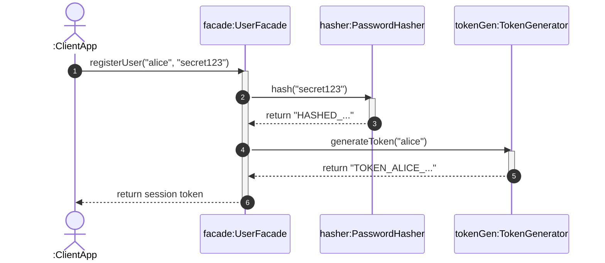

# 📘 P00.M03.L03 — Day 3 Encapsulated User Management Subsystem

> **Package-by-Feature Design · Facade Pattern · Minimizing API Surface Area**

| | |
|---|---|
| 🗓️ **Date** | August 4, 2026 |
| 🧩 **Module** | Phase 00 / Module 03 / Lesson 03 |
| 🎯 **Core Theme** | Encapsulation through package structure + the Facade pattern |

---

## 🧭 How to Use This README

This is a **revision-ready summary**. Read the Executive Summary first for a 30-second refresher, then drill into whichever section you're shaky on. Code, diagrams, and a glossary are included so you don't need to jump back to the original notes.

---

## 📌 Executive Summary — The 4 Things to Remember

| # | Concept | One-Line Memory Hook |
|---|---------|----------------------|
| 1 | **Bloch's Rule** (*Effective Java*, Item 15) | *"Minimize the accessibility of classes and members."* — when in doubt, make it less visible. |
| 2 | **Package-Private Scope (`~`)** | Java's *default* access level (no keyword) — visible only within the same package. |
| 3 | **Facade Pattern** | One clean `public` door hides many `~` package-private rooms behind it. |
| 4 | **Package-by-Feature** | Group by *capability*, not by *layer* — lets helpers safely stay package-private. |

---

## 🧠 1. Warm-Up & Recall Review

### Q&A Flashcards

<details>
<summary><b>Q1: Package-by-Feature vs. Package-by-Layer — what's the difference?</b></summary>

- **Package-by-Feature:** All classes for one capability (e.g., "user auth") live in the *same* package/directory. Since collaborators are local, helper classes can stay `package-private`.
- **Package-by-Layer:** Classes are split across packages by role (`controller`, `service`, `repository`). To let these layers talk to each other across package boundaries, classes are forced to become `public` — **this breaks tight encapsulation.**

</details>

<details>
<summary><b>Q2: What's the UML symbol for package-private?</b></summary>

**`~`** (tilde) — as opposed to `+` (public), `-` (private), and `#` (protected).

</details>

<details>
<summary><b>Q3: How do you declare a package-private class/method in Java?</b></summary>

Simply **omit** any access modifier keyword:

```java
class MyClass { ... }        // package-private class
String generateToken() { ... } // package-private method
```

</details>

<details>
<summary><b>Q4: Can you unit test package-private classes? How?</b></summary>

Yes. Place the test file under:
```
src/test/java/com/handbook/...
```
using the **exact same package declaration** as the class under test in:
```
src/main/java/com/handbook/...
```

⚠️ **Key insight:** Java grants package-private access based on the `package` **declaration line in the file**, not on the physical directory path. Same package name = same access, even across `src/main` and `src/test`.

</details>

<details>
<summary><b>Q5: What role does the Facade Pattern play?</b></summary>

It simplifies client interaction by exposing **one public entry point**, while hiding all internal coordination and low-level processing behind it.

</details>

### 🔧 Warm-Up Code

```java
package com.handbook.auth;

public class Auth {
    // Package-private method — no access modifier written
    String generateToken(String username) {
        return "Here is the generated Token";
    }
}
```

---

## 🎥 2. Video Lecture Insights — Facade & Law of Demeter

### 🏢 The Building Analogy
A building's **façade** (exterior) hides everything messy inside — plumbing, electrical wiring, HVAC ducts. Visitors only ever interact with the **front entrance**. They never need to know how the internals work.

### 📏 Law of Demeter ("Principle of Least Knowledge")
> *Only talk to your immediate friends.*

- Client code should call methods only on objects it *directly* holds a reference to.
- In this lesson's example: clients talk **only** to `UserFacade`.
- They never touch `PasswordHasher` or `TokenGenerator` directly — those are "friends of a friend," which the Law of Demeter says to avoid.

---

## 📖 3. Reading Summary — The Car Analogy

| Layer | Real-World Equivalent | Code Equivalent |
|-------|------------------------|------------------|
| **Interface the user sees** | The "Engine Start/Stop" button | `startEngine()` facade method |
| **Hidden complexity** | Fuel injection, spark plug timing, starter motor current | Internal package-private helper classes |

**Takeaway:** The driver never manually manages ignition internals — the facade method coordinates everything internally *and* protects internal state from being tampered with externally.

---

## 💻 4. Step-by-Step Code Implementations

### 🛠️ Exercise 1 — Debugging Compiler Errors & Wildcard Compilation

**❌ The Common Mistake** — compiling a facade without also passing its package-private dependency's source file:

```powershell
# CAUTION: Missing SecretKey.java dependency!
javac -d target/classes .\src\main\java\com\handbook\internal\KeyProviderFacade.java .\src\main\java\com\handbook\external\AppClient.java
# Result: error: cannot find symbol (class SecretKey)
```

**✅ The Fix** — explicitly include all dependency files:

```powershell
javac -d target/classes .\src\main\java\com\handbook\internal\SecretKey.java .\src\main\java\com\handbook\internal\KeyProviderFacade.java .\src\main\java\com\handbook\external\AppClient.java
```

**✅ Or — the scalable fix**, compile everything found recursively:

```powershell
javac -d target/classes (Get-ChildItem -Recurse -Filter *.java).FullName
```

> 💡 **Why this matters:** `javac` needs the source of every type it references at compile time — package-private visibility doesn't exempt a file from needing to be *found*, it only restricts who can *reference* it once compiled.

---

### 🧪 Exercise 2 — Hands-On Lab: `UserFacade`

#### 📁 Directory Structure

```text
src/main/java/handbook/phase00/p00m03l03/
├── UserFacade.java        (Public Facade)
├── PasswordHasher.java    (Package-Private Helper)
└── TokenGenerator.java    (Package-Private Helper)
src/test/java/handbook/phase00/p00m03l03/
└── UserFacadeTest.java    (JUnit 5 Test Suite)
```

#### 1️⃣ `PasswordHasher.java` — Package-Private Helper
```java
package handbook.phase00.p00m03l03;

class PasswordHasher { 
    String hash(String rawPassword) {
        if (rawPassword == null || rawPassword.trim().isEmpty()) {
            throw new IllegalArgumentException("Password required.");
        }
        return "HASHED_" + Integer.toHexString(rawPassword.hashCode());
    }
}
```

#### 2️⃣ `TokenGenerator.java` — Package-Private Helper
```java
package handbook.phase00.p00m03l03;

class TokenGenerator { 
    String generateToken(String username) {
        if (username == null || username.trim().isEmpty()) {
            throw new IllegalArgumentException("Username required.");
        }
        return "TOKEN_" + username.trim().toUpperCase() + "_" + System.currentTimeMillis();
    }
}
```

#### 3️⃣ `UserFacade.java` — 🚪 Public Entry Point
```java
package handbook.phase00.p00m03l03;

public class UserFacade {
    private final PasswordHasher hasher = new PasswordHasher();
    private final TokenGenerator tokenGen = new TokenGenerator();

    public String registerUser(String username, String password) {
        if (username == null || username.trim().length() < 3) {
            throw new IllegalArgumentException("Username must be at least 3 characters.");
        }
        String hashedPassword = hasher.hash(password);
        System.out.println("User registered with hash: " + hashedPassword);
        return tokenGen.generateToken(username);
    }
}
```

#### 4️⃣ `UserFacadeTest.java` — JUnit 5 Test Suite
```java
package handbook.phase00.p00m03l03;

import org.junit.jupiter.api.BeforeEach;
import org.junit.jupiter.api.Test;
import static org.junit.jupiter.api.Assertions.*;

public class UserFacadeTest {

    private UserFacade facade;

    @BeforeEach
    void setUp() {
        facade = new UserFacade();
    }

    @Test
    void testUserRegistrationReturnsToken() {
        String token = facade.registerUser("alice", "secret123");
        assertNotNull(token);
        assertTrue(token.startsWith("TOKEN_ALICE_"));
    }

    @Test
    void testInvalidUsernameThrowsException() {
        assertThrows(IllegalArgumentException.class, () -> facade.registerUser("ab", "secret123"));
    }
}
```

> 🔑 **Notice:** `UserFacadeTest` can call `new UserFacade()` and, if it needed to, could also directly access `PasswordHasher`/`TokenGenerator` — because it lives in the *same package*. External code outside `handbook.phase00.p00m03l03` cannot.

---

## 📊 5. UML Sequence Diagram

Shows how the client talks **only** to `UserFacade`, which internally delegates to the package-private helpers.



**Reading it:** the `Client` never sees `Hasher` or `Token` — it only ever sends one message and receives one reply. Everything between steps 2–5 is invisible to the outside world.

---

## ⚙️ 6. Engineering Insight & Open Source Connection

### 🧩 Minimizing API Surface Area

| Concept | Detail |
|---------|--------|
| **What counts as "API surface"** | Every `public` class, interface, method, or field. |
| **Refactoring Risk** | Changing or deleting a `public` entity = a **breaking change** for downstream consumers. |
| **Safe Isolation** | `package-private` classes can be freely renamed, refactored, or deleted — nothing outside the package can be relying on them. |

> 📐 **Mental model:** Public API = a promise you made to the world. Package-private code = a promise you only made to yourself.

### 🌍 Real-World Example: `java.net.URL`

- `new URL("https://example.com").openStream()` → uses `URL` as the **public facade**.
- The real implementation, `sun.net.www.protocol.https.HttpsURLConnectionImpl`, stays **hidden and package-private**.
- This prevents *your* application code from ever coupling directly to Java's internal protocol-handling machinery — the JDK team can rewrite that internal class freely without breaking your code.

---

## 📝 7. End-of-Day Reflection — Final Recap

1. ✅ **Bloch's Rule:** Default to package-private; only go `public` when external access is truly required.
2. ✅ **Facade Benefits:** One controlled public interface → hides complexity → reduces external coupling.
3. ✅ **Illegal Access Behavior:** Trying to instantiate a package-private class from *outside* its package → **compile-time error** (`cannot find symbol`).
4. ✅ **Sequence Diagrams:** Great tool for visualizing request flow and delegation boundaries.
5. ✅ **Maintainability Win:** Package-private code can be redesigned anytime with zero risk of breaking external consumers.

---

## 📚 Glossary — Quick Reference

| Term | Meaning |
|------|---------|
| **Facade Pattern** | A design pattern that provides a single, simplified public interface to a complex subsystem. |
| **Package-Private** | Java's default access level; visible only to classes in the same package. Symbol: `~`. |
| **Law of Demeter** | Design principle: only interact with your direct collaborators, not "friends of friends." |
| **API Surface Area** | The total set of `public` elements exposed by your code — the bigger it is, the more you're committed to supporting. |
| **Package-by-Feature** | Organizing code by *what it does* (a feature/capability) rather than by *technical role* (layer). |
| **Package-by-Layer** | Organizing code by technical role (`controller`/`service`/`repository`), often forcing wider visibility. |

---

## 🎯 Self-Check Before Moving On

Ask yourself — can you answer these without peeking?

- [ ] Why does package-by-layer force classes to become `public`, while package-by-feature doesn't?
- [ ] What UML symbol represents package-private, and how does it differ from `-` (private)?
- [ ] Why does a JUnit test file in `src/test/java/...` get package-private access to code in `src/main/java/...`?
- [ ] Why did the `javac` compilation fail in Exercise 1, and what were the two ways to fix it?
- [ ] In the `UserFacade` example, which class(es) would break external client code if renamed? Which wouldn't?
- [ ] How does `java.net.URL` itself demonstrate the Facade pattern in the real JDK?

> If you can answer all six confidently, you've mastered this lesson. 🎉