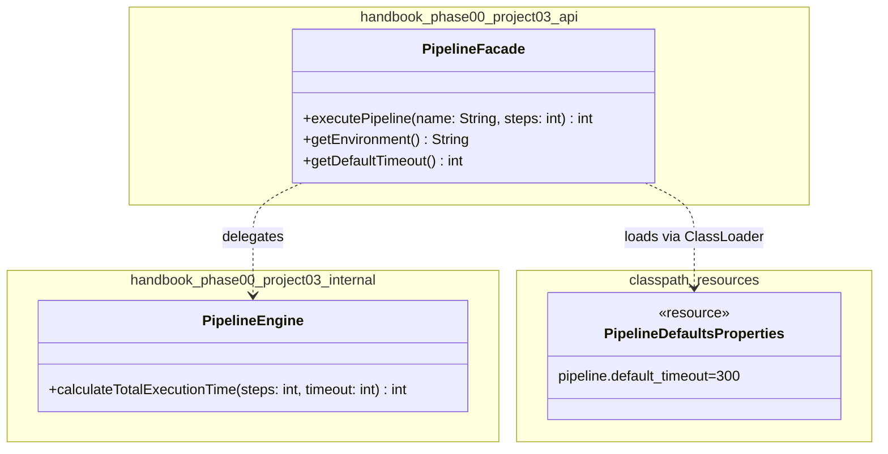

# 📚 Module 00.03 — Project Day Multi-Package Build & Release Pipeline Subsystem

> **Date:** August 5, 2026
> **Focus:** Java Modular Layouts · Package Encapsulation · Classpath Resources · Maven Lifecycle · Git Versioning
> **Purpose of this doc:** Fast, structured recall for revision — read top to bottom in ~10 minutes, or jump to a section using the table of contents.

---

## 🗺️ Table of Contents

1. [Quick Recall — Core Concepts](#1-quick-recall--core-concepts)
2. [Terminal Commands Cheat Sheet](#2-terminal-commands-cheat-sheet)
3. [Lecture Summary — Clean Modular Layouts](#3-lecture-summary--clean-modular-layouts)
4. [Reading Notes — Modular Monoliths](#4-reading-notes--modular-monoliths)
5. [Coding Exercise — Access Guard Pattern](#5-coding-exercise--access-guard-pattern)
6. [Project Walkthrough — Pipeline Subsystem](#6-project-walkthrough--pipeline-subsystem)
7. [Architecture Diagram](#7-architecture-diagram)
8. [Real-World Parallel — Spring Boot](#8-real-world-parallel--spring-boot)
9. [Key Takeaways & Interview-Style Q&A](#9-key-takeaways--interview-style-qa)

---

## 1. Quick Recall — Core Concepts

### 🌳 Git Object Model (DAG)

| Object | Role |
|---|---|
| **Blob** | Stores raw file content (hashed) |
| **Tree** | Directory structure — points to blobs & sub-trees |
| **Commit** | Immutable snapshot of a tree + pointer to parent commit(s) |
| **Branch** | A movable label pointing at a commit, inside a **Directed Acyclic Graph** |

> 🧠 **Memory hook:** *Blob → Tree → Commit → Branch* is basically *content → structure → snapshot → pointer*.

### 📦 Maven Dependency Scopes

| Scope | Available in | Ships in final JAR? |
|---|---|---|
| `compile` (default) | Compile, test, runtime — transitive | ✅ Yes |
| `test` | Only `src/test/java` | ❌ No |

> 🧠 Use `test` scope for JUnit/AssertJ so test tools never leak into production.

### 📂 Classpath Resources vs. File System

| Approach | Works in IDE? | Works inside packaged JAR? |
|---|---|---|
| `new File("...")` | ✅ | ❌ (files become zip entries — no OS path exists) |
| `ClassLoader.getResourceAsStream("...")` | ✅ | ✅ (reads bytes straight from classpath memory) |

> ⚠️ **Rule of thumb:** Always load config/resources via `ClassLoader.getResourceAsStream()` if the code might ever run from a JAR.

### 🔒 Effective Java — Item 15 (Joshua Bloch)

> "Minimize the accessibility of classes and members."

- Smaller public API surface = fewer things that can break clients when internals change.
- Less to document, test, and maintain long-term.

### 🧩 Package-by-Feature vs. Package-by-Layer

| Style | Structure | Encapsulation |
|---|---|---|
| **By Feature** | Group related domain classes together | Helpers can stay **package-private** ✅ |
| **By Layer** | `controller/`, `service/`, `repository/` cross-cutting | Classes forced `public`, internals leak ❌ |

---

## 2. Terminal Commands Cheat Sheet

```bash
# Build project, skip tests (flag is CASE-SENSITIVE)
mvn clean package -DskipTests
```
> ⚠️ `-DSkipTests` (capital S) is silently ignored by Maven — always lowercase `skip`.

```bash
# Create an annotated Git release tag
git tag -a v1.0.0-p00m03 -m "Release Module 00.03 Project"
```
> 🧠 Annotated tags (`-a`) store tagger name, date, and message — use these for releases (vs. lightweight tags for quick bookmarks).

---

## 3. Lecture Summary — Clean Modular Layouts

**Core Lesson:** Separate high-level *entry points* from low-level *engines*.

**Architecture Rules:**
- ✅ Public contracts live in an `api` package.
- ✅ Implementation details live in `internal` (or package-private classes).
- ✅ Follow Maven's standard layout: `src/main/java`, `src/main/resources`.

---

## 4. Reading Notes — Modular Monoliths

| Source | Idea |
|---|---|
| **Monolith First** (Martin Fowler) | Most successful microservices *started* as monoliths. Splitting into services too early locks in wrong boundaries and creates costly network-level refactors. |
| **Microservice Premium** (Martin Fowler) | Microservices add real operational tax: network latency, distributed tracing, eventual consistency. A well-modularized monolith gets clean code *without* that tax. |
| **Modular Monolith Primer** (Kamil Grzybek) | Enforce boundaries **in-memory** using package visibility — public facade in `api`, engines/mappers hidden in `internal`. |

> 🧠 **One-liner for revision:** *"Modular monolith = microservice-style boundaries, monolith-style deployment simplicity."*

---

## 5. Coding Exercise — Access Guard Pattern

**Goal:** Demonstrate package-private encapsulation — `AuditLogger` must never be touched from outside its package.

```java
// Package 1: com.handbook.internal
package com.handbook.internal;

class AuditLogger { // package-private: invisible outside this package
    void log(String event) {
        System.out.println("The event is logged: " + event);
    }
}

public class PipelineEngine {
    private final AuditLogger logger = new AuditLogger();

    public void logEvent(String event) {
        logger.log(event);
    }
}
```

```java
// Package 2: com.handbook.api
package com.handbook.api;

import com.handbook.internal.PipelineEngine;

public class PipelineFacade {
    public static void main(String[] args) {
        PipelineEngine engine = new PipelineEngine();
        engine.logEvent("Pipeline Execution Started");
    }
}
```

> 🧠 **What to notice:** `PipelineFacade` (in `api`) can use the *public* `PipelineEngine`, but has zero visibility into `AuditLogger` — it's truly sealed inside `internal`.

---

## 6. Project Walkthrough — Pipeline Subsystem

### 📁 Project Structure

```text
projects/module-03-project/
  pom.xml
  src/
    main/resources/
      pipeline-defaults.properties
    main/java/handbook/phase00/project03/api/
      PipelineFacade.java
    main/java/handbook/phase00/project03/internal/
      PipelineEngine.java
    test/java/handbook/phase00/project03/
      PipelineFacadeTest.java
```

### ⚙️ Config — `pipeline-defaults.properties`

```properties
pipeline.default_timeout=300
pipeline.max_retries=3
pipeline.environment=STAGING
```

### 🧮 Engine — `PipelineEngine.java`

```java
package handbook.phase00.project03.internal;

public class PipelineEngine {
    public int calculateTotalExecutionTime(int stepCount, int baseTimeout) {
        if (stepCount <= 0) {
            throw new IllegalArgumentException("Step count must be positive.");
        }
        return stepCount * baseTimeout;
    }
}
```

### 🚪 Gateway — `PipelineFacade.java`

- Loads `pipeline-defaults.properties` via `ClassLoader.getResourceAsStream()` (JAR-safe).
- Validates/exposes execution parameters.
- Delegates all math to `PipelineEngine`.

| Component | Responsibility |
|---|---|
| `PipelineFacade` (api) | User-facing contract, defaults, input validation, delegation |
| `PipelineEngine` (internal) | Isolated calculation logic — free to change without breaking callers |
| `pipeline-defaults.properties` | Externalized config, loaded from classpath |

---

## 7. Architecture Diagram



---

## 8. Real-World Parallel — Spring Boot

| Handbook Concept | Spring Boot Equivalent |
|---|---|
| `api` package (public facade) | `@SpringBootApplication` under `org.springframework.boot` |
| `internal` package (hidden engine) | Auto-configuration internals |
| Classpath resource loading | Metadata dynamically loaded from `META-INF/spring.factories` |

> 🧠 Even massive frameworks like Spring Boot follow the exact same facade/internal split you just built.

---

## 9. Key Takeaways & Interview-Style Q&A

**Q: Why split `PipelineFacade` and `PipelineEngine` into separate packages?**
> `PipelineFacade` is the stable, user-facing contract (validation + delegation). `PipelineEngine` is free to change its internal math/logic without ever breaking external callers — classic separation of concerns.

**Q: Why externalize properties instead of hardcoding them?**
> Avoids recompilation for config changes and enables different values per environment (STAGING vs PROD) at runtime.

**Q: What's the JUnit best practice for grouped checks?**
> Use `assertAll` so all assertions run and report together, instead of stopping at the first failure.

**Q: How do you cleanly test for expected exceptions?**
> Use `assertThrows` to assert boundary/precondition violations (e.g., negative step count).

**Q: How does versioning tie together Git and Maven?**
> Git tags (`v1.0.0-p00m03`) mark the exact commit that corresponds to a Maven build artifact (`<version>1.0.0-SNAPSHOT</version>`) — this links source control history directly to deployable JARs.

---

### ✅ Revision Checklist

- [ ] Can I explain blob → tree → commit → branch without notes?
- [ ] Do I know why `compile` vs `test` scope matters for JAR size/pollution?
- [ ] Can I explain *why* `new File()` breaks inside a JAR?
- [ ] Can I redraw the `api` / `internal` package split from memory?
- [ ] Can I explain the Monolith First argument in one sentence?
- [ ] Do I remember the exact `-DskipTests` casing gotcha?

---

*Saved at: `projects/module-03-project/docs/architecture.md`*