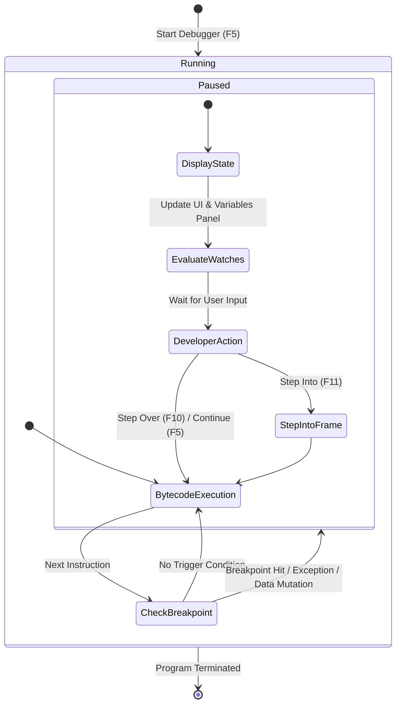

# 🐞 Day 2 Advanced Java Debugging — Revision README

> **Module:** P00.M04.L01 — Day 2
> **Date:** August 7, 2026
> **Topics:** Exception Breakpoints · Field Watchpoints · Hit Count Breakpoints · Call Stack Navigation · Debugger State Machines

A single-page, exam-ready reference for everything covered in this lesson. Skim the **⚡ Quick Recall** section for a fast refresh, or dive into the full breakdown below for deeper revision.

---

## 📚 Table of Contents

1. [Quick Recall Cheat Sheet](#-quick-recall-cheat-sheet)
2. [Learning Objectives](#-learning-objectives)
3. [Foundational Concepts](#-foundational-concepts)
4. [Exception Breakpoints](#-exception-breakpoints)
5. [Field Watchpoints / Data Breakpoints](#-field-watchpoints--data-breakpoints)
6. [Hit Count vs. Conditional Breakpoints](#-hit-count-vs-conditional-breakpoints)
7. [Call Stack Navigation](#-call-stack-navigation)
8. [Hands-On Exercise Walkthrough](#-hands-on-exercise-walkthrough)
9. [Debugger State Machine (Diagram)](#-debugger-state-machine-diagram)
10. [Engineering Insights](#-engineering-insights)
11. [Open Source Connection](#-open-source-connection)
12. [Final Checklist](#-final-checklist)
13. [Git Commit Reference](#-git-commit-reference)

---

## ⚡ Quick Recall Cheat Sheet

| Concept | One-Line Definition |
|---|---|
| **Step Over (`F10`)** | Run the current line (including calls) as one block; stop on the next line |
| **Step Into (`F11`)** | Jump inside the method called on the current line |
| **Standard Breakpoint** | Pauses **every time** the line executes |
| **Conditional Breakpoint** | Pauses only when a boolean expression is `true` |
| **Hit Count Breakpoint** | Pauses only on the **Nth execution** of a line |
| **Watch Expression** | Live-evaluates any expression on the current stack frame |
| **Field Watchpoint** | Pauses when a specific **field/variable** is read/written — not tied to a line |
| **Exception Breakpoint** | Pauses when a specific exception type is thrown (caught or uncaught) |
| **Call Stack** | Top = currently executing method; below = chain of callers |
| **Reset/Drop Frame** | Rewinds the top stack frame to re-run a method with new values |
| **Smart Step Into** | Lets you pick *which* nested method call to step into on a busy line |

---

## 🎯 Learning Objectives

- Automatically halt on **caught/uncaught exceptions**.
- Track **in-memory field mutations** without scattering line breakpoints.
- Inspect **caller context** via the call stack.
- Pause precisely using **hit count** and **conditional** breakpoints.
- Understand the debugger as a **state machine** (Running ↔ Paused).

---

## 🧠 Foundational Concepts

### Step Over vs. Step Into

| | Step Over (`F10`) | Step Into (`F11`) |
|---|---|---|
| Behavior | Executes line as a unit (method call included) | Enters the called method |
| Stops at | Next line, same frame | First statement of the called method |
| Use case | You trust the method works | You need to debug *inside* the method |

### Standard vs. Conditional Breakpoints

- **Standard:** stops on *every* hit — good for simple, rarely-hit lines.
- **Conditional:** stops only when an expression evaluates `true`, e.g. `i == 50`. Ideal for loops where you only care about one iteration.

### Watch Expressions
Let you evaluate arbitrary expressions (method calls, math, object properties) **live**, against the current frame — no recompiling, no code changes.

### The Call Stack Panel
- **Top-down order**: currently executing method is at the top; callers stack below it.
- Clicking a **higher frame** updates the editor + variables panel to show that caller's state *at the moment it invoked the next method*.

### 🆚 println() vs. Interactive Debugger

| Feature | `System.out.println()` | Interactive Debugger |
|---|---|---|
| Code impact | Mutates source, needs cleanup | Non-destructive |
| Feedback loop | Requires recompile/rerun | Real-time inspection |
| State control | Static log output | Live variable edits + Hot Code Replace |
| Scope | Only explicit print lines | Full call stack & object graph access |

### 💡 Warm-Up Exercise: Null-Safe Conditional Breakpoint

**Task:** Pause when `user.getRole().equals("ADMIN")`.

```java
user != null && "ADMIN".equals(user.getRole())
```

> **Why it works:** Putting the string literal `"ADMIN"` **first** means `.equals()` is called on a non-null constant, so a `null` return from `getRole()` can never throw a `NullPointerException` during evaluation.

---

## 🚨 Exception Breakpoints

- Set up in the **Debugger window**, targeting a specific exception class (`NullPointerException`, `IllegalArgumentException`, etc.).
- Can be scoped to:
  - **Caught** exceptions
  - **Uncaught** exceptions
- **Superpower:** you don't need to know *where* in the code the exception originates — the debugger finds it for you. Extremely useful for third-party JARs/libraries with no visible source.

---

## 🔬 Field Watchpoints / Data Breakpoints

Instead of watching a *line*, you watch a **field** — the debugger pauses the instant that field's value changes (or is read), no matter which method touches it.

**Trigger modes:**
- **Modification (Write)**
- **Access (Read)**
- **Both**

**Why it matters:** Perfect for "sneaky state mutations" — bugs where a field is silently changed somewhere in a large class with many methods.

### How to set one up

| IDE | Steps |
|---|---|
| **IntelliJ IDEA** | Click the gutter next to the field declaration (e.g. `private String status`) |
| **VS Code** | `F5` to launch → pause execution → open **VARIABLES** panel → expand object → right-click field → **Break on Value Change** |

---

## 🔁 Hit Count vs. Conditional Breakpoints

| Type | Pauses when... | Example |
|---|---|---|
| **Conditional** | A **boolean expression** is true | `user.isAdmin()` |
| **Hit Count** | The line has executed **N times** | Pause on the 100th loop iteration |

> Hit count breakpoints save you from manually clicking "Continue" dozens/hundreds of times to reach a specific deep-loop iteration.

**Bonus tools from the reading:**
- **Reset/Drop Frame** — rewind the top call stack frame to its invocation point and re-run it with tweaked values, without restarting the whole debug session.
- **Smart Step Into** — when a line has multiple chained/nested calls (e.g. `process(user.getDetails().getRole())`), lets you choose exactly which method to step into.

---

## 🧭 Call Stack Navigation

- Frames are listed **top (current) → bottom (oldest caller)**.
- Selecting any frame **rewinds the editor + variables view** to show that method's local state *exactly as it was* at the point it called the next frame down.
- Essential for tracing "who called this, and with what values?"

---

## 💻 Hands-On Exercise Walkthrough

### Exercise 1 — Conditional Breakpoint + Watch Expression
- Simulated a transaction stream: breakpoint condition `tx > 500.0`.
- Added watch expression `balance + tx` to preview the resulting balance live.
- Confirmed execution paused **only** on transactions exceeding the $500 threshold.

### Exercise 2 — Catching a Hidden Field Mutation

**File:** `OrderStateDebug.java`

```java
public class OrderStateDebug {
    private String status = "PENDING";

    public void step1() { /* Internal processing */ }
    public void step2() { status = "CORRUPTED"; } // Target mutation!
    public void step3() { /* Internal processing */ }

    public static void main(String[] args) {
        OrderStateDebug order = new OrderStateDebug();
        order.step1();
        order.step2();
        order.step3();
        System.out.println("Final Status: " + order.status);
    }
}
```

**Goal:** Find exactly where `status` flips from `"PENDING"` to `"CORRUPTED"` — without manually placing breakpoints in every method.

**Approach:** Set a **Field Watchpoint** on `status` (Modification mode).

**Result:** ✅ Debugger halted **inside `step2()`**, at the exact millisecond `status` was mutated — no guesswork needed.

---

## 🗺️ Debugger State Machine (Diagram)

The debugger's behavior can be modeled as a state machine — the JVM cycles through **Running** and **Paused** states based on triggers.



**Reading the diagram:**
1. The JVM continuously executes bytecode.
2. After each instruction, it checks: *did I hit a breakpoint, exception, or watched mutation?*
3. If yes → **Paused** state → UI updates → watches evaluate → waits for you.
4. Your action (Step Over / Step Into / Continue) sends it back into execution.

---

## 🛠️ Engineering Insights

1. **Field Watchpoints operate at the memory level.** The JVM intercepts mutation at the engine level — it doesn't matter if 1 or 100 methods touch that variable, the watchpoint still catches it.
2. **Exception Breakpoints shine with compiled dependencies.** When you don't have source access to a third-party JAR, you can't place line breakpoints inside it — but an exception breakpoint still catches the failure the moment it's thrown.

---

## 🌍 Open Source Connection

- **JUnit 5 & Spring Framework** maintainers rely heavily on exception breakpoints (e.g. catching `BeanCreationException` or `AssertionError`) to pause complex startup/instantiation sequences and inspect deep call stacks — without cluttering the framework's own codebase with manual breakpoints.

---

## 💬 Reflection Highlights

- **Field Watchpoints** remove the guesswork in large codebases where many methods mutate shared state.
- **Exception Breakpoints** jump straight to the origin frame of an error, saving hours versus manual stack-trace reading.
- **Call Stack Navigation** lets you "time travel" up the caller chain to see exact prior state.
- **Hit Count ≠ Conditional:** frequency-based vs. logic-based pausing — know when to use which.

---

## ✅ Final Checklist

- [x] Warm-up questions reviewed & null-safe condition understood
- [x] Exception Breakpoints (caught/uncaught) — video lecture concepts internalized
- [x] Field Watchpoints / Data Breakpoints — Baeldung reading + IDE setup steps
- [x] Hit Count Breakpoints & Reset Frame concepts reviewed
- [x] `OrderStateDebug` field watchpoint lab completed & verified
- [x] Mermaid debugger state diagram understood
- [x] End-of-day reflections answered

---

> 📌 **Revision Tip:** Before your next session, try to explain the difference between a **Field Watchpoint**, a **Conditional Breakpoint**, and a **Hit Count Breakpoint** out loud, from memory, using the `OrderStateDebug` example. If you can, you've internalized this lesson.