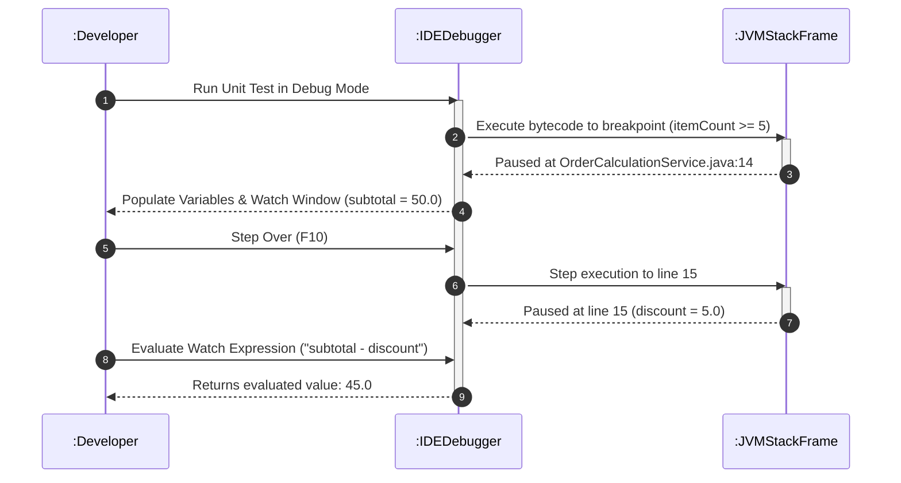

# 📖 P00.M04.L01 — Day 3 Order State Machine & Faulty Calculation Debugging Lab

> **Module**: Phase 00 → Module 04 → Lesson 01
> **Date**: August 8, 2026
> **Focus**: Root Cause Analysis (RCA) · Conditional Breakpoints · Watch Expressions · JUnit 5 · Avoiding Symptom Patching

---

## 🗺️ How to Use These Notes

This lesson is about one core skill: **finding bugs that don't announce themselves.** No crash, no red stack trace — just a wrong number quietly moving downstream. Read top to bottom the first time; on revision, jump straight to **Step 9 (Reflection Summary)** for a 60-second refresh, then dip into whichever section you're shaky on.

---

## 🎯 1. Objective & Big Picture

| | |
|---|---|
| **Goal** | Master isolating **silent logic bugs** — code that compiles and runs fine, but produces the *wrong* result. |
| **Why it matters** | Compilers catch syntax errors. Stack traces catch exceptions. Nothing catches a bug that just quietly returns `15.0` instead of `25.0` — except you, with the right tools. |
| **Toolkit** | Conditional Breakpoints · Watch Expressions · Call Stack Frame Inspection · Step Over (`F10`) · Step Into (`F11`) · JUnit 5 |

> 💡 **Mental model**: Syntax errors are loud, exceptions are medium-loud, silent logic bugs are silent — and silence is the most dangerous kind of bug in production.

---

## 🧠 2. Core Concepts (Quick Recall)

| Concept | What it does | When to use it |
|---|---|---|
| **Field Watchpoint** | Pauses execution whenever a *specific field* is read or written — anywhere in the class | Tracking a mystery mutation across multiple methods |
| **Exception Breakpoint** | Pauses the instant a chosen exception is thrown (caught or not) | Skips the need for a throwaway `try-catch` just to get a breakpoint |
| **Step Over (`F10`)** | Runs the current line (and anything it calls) as one atomic step | You trust the method being called; you just want the next line |
| **Step Into (`F11`)** | Jumps inside the method being called | You suspect the bug is *inside* that call |
| **Step Out (`Shift+F11`)** | Finishes the current method and pops back to the caller | You went too deep and want to resurface |
| **Call Stack Navigation** | Clicking a higher frame restores the Variables/Watch view to *that* method's state at the moment it made the call | Tracing how bad state travels *up* the chain |

### ⚖️ Symptom Patching vs. Proper Design
- **Exceptions** = legitimate signals for unrecoverable/boundary events (network down, missing DB row).
- **Logic errors** (e.g., an `IndexOutOfBoundsException` caused by an off-by-one) need the *root cause* fixed — not a blanket `try-catch` that hides the symptom.

### 🔬 Warm-up Example — Spot the Bug Pattern
```java
class PriceCalculator {
    private final double discountRate = 0.1;

    double calculatePrice(double itemPrice, double quantity) {
        double discountPrice = itemPrice * quantity * discountRate;
        double totalPrice = itemPrice * quantity;
        return totalPrice - discountPrice;
    }
}
```
This one's actually correct — it's here to establish the shape of a "calculate → discount → subtract" method, so you recognize the *pattern* when a broken version shows up later (see Step 4).

---

## 🎥 3. Debugging Workflow Mechanics

- **Line Breakpoint** → pauses every time that line runs.
- **Conditional Breakpoint** → pauses only when a boolean expression is true, e.g. `itemCount >= 5` or `i == 75`. Huge time-saver in loops/parameterized tests — skip the 74 boring passes, land right on the failure.
- **Watch Panel** → type an inline expression like `subtotal - discount` and see it evaluate live, without editing source code.
- **Frame stepping**: `F10` over, `F11` into, `Shift+F11` out.

---

## 📚 4. Bug Classification Cheat Sheet

| Bug Category | Occurs At | Detected By | Severity |
|---|---|---|---|
| Syntax Errors | Build time | Compiler / IDE | 🟢 Low — blocks build, easy fix |
| Runtime Exceptions | Execution | Stack trace | 🟡 Medium — crashes loudly, path is visible |
| **Silent Logic Bugs** | Execution | Wrong output, no crash | 🔴 **High** — corrupts data quietly |
| Performance/Resource | Long-running ops | Profilers, heap dumps | 🔴 High — leaks, deadlocks, O(N²) |

### 🔁 The 5-Step Systematic Debugging Workflow
1. **Reproduce** — write a deterministic automated test that fails every time.
2. **Isolate** — conditional breakpoints + watchpoints to pinpoint the exact line where state goes wrong.
3. **Hypothesize** — form a theory for *why* runtime state breaks the domain rule.
4. **Fix & Verify** — correct the root invariant, no side effects.
5. **Prevent** — keep the failing test as a permanent regression test in CI/CD.

> 🧭 Memory hook: **R-I-H-F-P** — "Reproduce It, Hypothesize, Fix, Prevent."

---

## 💻 5. Coding Lab #1 — Off-By-One Array Average

**Bug**: Average of `{10, 20, 30, 40}` returned `15.0` instead of `25.0`.
**Cause**: Loop bound `i < nums.length - 1` skipped the last element.

```java
public class ArrayAverageDebug {
    public static double computeAverage(int[] nums) {
        if (nums == null || nums.length == 0) return 0.0;

        int sum = 0;
        // FIXED: 'i < nums.length - 1' → 'i < nums.length'
        for (int i = 0; i < nums.length; i++) {
            sum += nums[i];
        }
        return (double) sum / nums.length;
    }
}
```

> ⚠️ **Off-by-one pattern to remember**: `length - 1` in a loop *bound* silently drops the last element. This is one of the most common silent logic bugs — burn it into memory.

---

## 🧪 6. Coding Lab #2 — Order Calculation Service

**Bug**: Bulk discount was being subtracted **twice**.
```java
// BROKEN (was):
double finalTotal = (subtotal - discount) - discount;

// FIXED:
double finalTotal = subtotal - discount;
```

### `OrderCalculationService.java` (fixed)
```java
package handbook.phase00.p00m04l01;

public class OrderCalculationService {

    public double calculateTotal(double itemPrice, int itemCount) {
        if (itemPrice <= 0.0 || itemCount <= 0) {
            throw new IllegalArgumentException("Invalid price or item count.");
        }

        double subtotal = itemPrice * itemCount;
        double discount = 0.0;

        // Bulk Order Discount: 10% off for 5 or more items
        if (itemCount >= 5) {
            discount = subtotal * 0.10;
        }

        double finalTotal = subtotal - discount;
        return finalTotal;
    }
}
```

### `OrderCalculationServiceTest.java`
```java
package handbook.phase00.p00m04l01;

import org.junit.jupiter.api.BeforeEach;
import org.junit.jupiter.api.Test;
import static org.junit.jupiter.api.Assertions.*;

public class OrderCalculationServiceTest {

    private OrderCalculationService service;

    @BeforeEach
    void setUp() {
        service = new OrderCalculationService();
    }

    @Test
    void testStandardOrderCalculation() {
        // 2 items @ $10.0 -> $20.0 (no discount)
        assertEquals(20.0, service.calculateTotal(10.0, 2), 0.001);
    }

    @Test
    void testBulkOrderDiscountCalculation() {
        // 5 items @ $10.0 -> $50.0 subtotal - 10% discount ($5.0) = $45.0
        assertEquals(45.0, service.calculateTotal(10.0, 5), 0.001);
    }

    @Test
    void testInvalidInputsThrowException() {
        assertAll("Precondition Errors",
            () -> assertThrows(IllegalArgumentException.class, () -> service.calculateTotal(-10.0, 5)),
            () -> assertThrows(IllegalArgumentException.class, () -> service.calculateTotal(10.0, 0))
        );
    }
}
```

| Test Case | Input | Expected | Why |
|---|---|---|---|
| Standard order | 2 × $10.0 | $20.0 | No discount tier reached |
| Bulk discount | 5 × $10.0 | $45.0 | 10% off $50 subtotal |
| Invalid inputs | negative price / zero count | throws `IllegalArgumentException` | Precondition guard |

---

## 📊 7. Debugger Flow — Sequence Diagram



**Reading it**: The dev sets a *conditional* breakpoint (only triggers when `itemCount >= 5`), steps line-by-line with `F10`, and confirms the fix live in the Watch panel — all before touching source code.

---

## 💡 8. Engineering Insight

### RCA vs. Symptom Patching

| | Symptom Patching | Root Cause Analysis |
|---|---|---|
| **Approach** | Ad-hoc `+1`/`-1` tweaks or blanket `try-catch` | Reproducible test → breakpoint → watch → fix at source |
| **Result** | Fixes one case, silently breaks others ("blast radius") | Fixes the actual invariant violation, once |
| **Debt** | Accumulates hidden landmines | Leaves a regression test as documentation |

> 🎯 **Rule of thumb**: If your fix is a number tweak you can't explain in one sentence, you're patching a symptom, not fixing a cause.

### How Real Libraries Do It (Jackson, Apache Commons Math)
1. Write a minimal failing unit test from the reported issue.
2. Set conditional breakpoints on stream indexes or matrix dimensions.
3. Trace state in the Watch panel across stack frames *before* committing any fix.

---

## 💬 9. IDE Tips Worth Remembering

- **No `main()` needed** — modern IDEs run `@Test` methods directly as debugger entry points.
- **VS Code setup**: install the **Extension Pack for Java** (bundles the **Test Runner for Java**); use the inline **Run | Debug** CodeLens above `@Test`, or the **Testing/Beaker** sidebar icon.
- **Why conditional breakpoints on tests?** In loops or parameterized tests, they let you skip every passing case and land exactly on the failing input (`itemCount >= 5`, `i == 75`, etc.) instead of clicking "continue" fifty times.

---

## 🪞 10. End-of-Day Reflection — 60-Second Recall

1. **Silent Logic Bugs** — compile clean, run clean, produce wrong output. The most dangerous bug category because nothing alerts you.
2. **Conditional Breakpoints + Watch Expressions** — skip the noise, land on the failure, inspect live expressions without editing code.
3. **Symptom Patching is a trap** — forcing one test to pass without understanding *why* it failed creates hidden technical debt.
4. **Step Into (`F11`) across frames** — traces how corrupted state in one method poisons the methods it calls.
5. **Regression tests are permanent** — every fixed bug should leave behind a test so it can never silently return.

---

## ✅ Quick Self-Check (cover the answers, then check yourself)

<details>
<summary><b>Q1. What's the difference between Step Over and Step Into?</b></summary>
Step Over runs a line (and any calls it makes) as one atomic step and lands on the next line in the same frame. Step Into jumps inside the called method itself.
</details>

<details>
<summary><b>Q2. Why prefer a conditional breakpoint over a regular one in a loop?</b></summary>
It only pauses when your condition is true (e.g. `i == 75`), so you skip every passing iteration and land directly on the failing one.
</details>

<details>
<summary><b>Q3. What was the actual bug in <code>OrderCalculationService</code>?</b></summary>
The discount was subtracted twice: <code>(subtotal - discount) - discount</code> instead of <code>subtotal - discount</code>.
</details>

<details>
<summary><b>Q4. Why is symptom patching dangerous?</b></summary>
It fixes the visible case without understanding the root invariant, often breaking other cases elsewhere — a wide "blast radius" of hidden bugs.
</details>

<details>
<summary><b>Q5. What's the 5-step debugging workflow, in order?</b></summary>
Reproduce → Isolate → Hypothesize → Fix & Verify → Prevent.
</details>