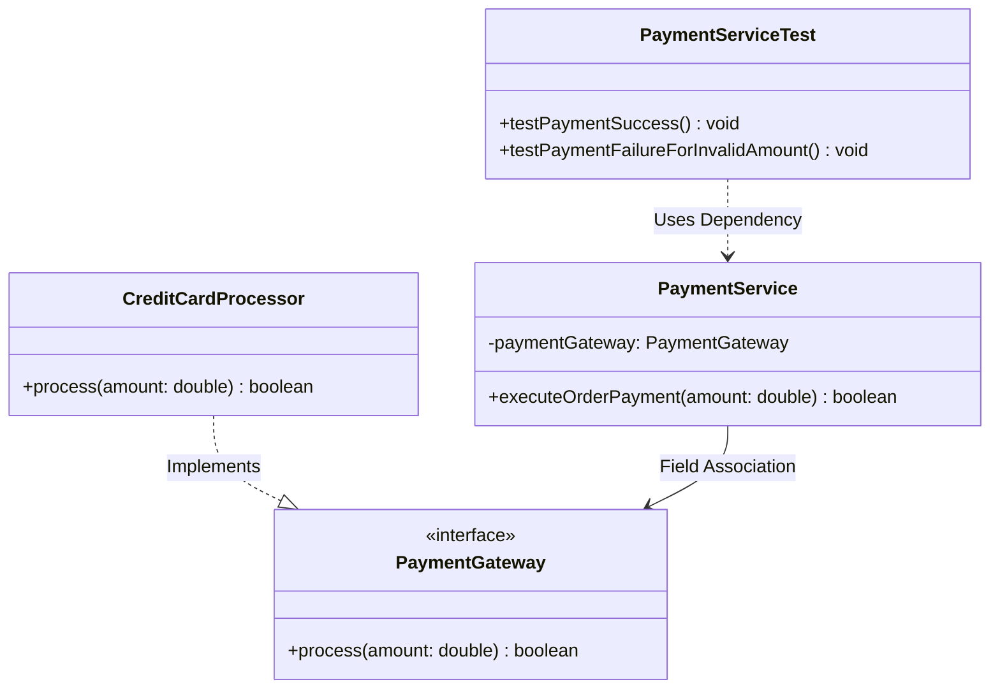

# 📓 P00.M04.L02 — Day 2 Reverse-Engineering Unfamiliar Codebases

> **Focus:** Code Reading Strategies · Object Collaboration · UML Class Diagrams
> **Date:** August 10, 2026
> **Module:** P00.M04.L02

A revision-ready reference for reading unfamiliar, undocumented code and turning it into clear mental models and diagrams.

---

## 🗺️ The Big Picture (Mind Map)

```
Raw / Undocumented Source Code
        │
        ▼
Identify Public Contracts / Facades
        │
        ▼
Map Object Collaboration Graphs
        │
        ▼
Externalize to UML Class Diagram
```

**One-line takeaway:** Don't read code top to bottom line-by-line — read the *contracts* first, trace *who talks to whom*, then draw it.

---

## 📑 Table of Contents

1. [Core Fundamentals](#-1-core-fundamentals)
2. [3-Step Reverse-Engineering Method](#-2-3-step-reverse-engineering-method)
3. [Design Patterns & Code Smells](#-3-design-patterns--code-smells)
4. [Project Setup Reference](#-4-project-setup-reference)
5. [Worked Example: Payment Subsystem](#-5-worked-example-payment-subsystem)
6. [UML Class Diagram](#-6-uml-class-diagram)
7. [UML Notation Cheat Sheet](#-7-uml-notation-cheat-sheet)
8. [Engineering Insights](#-8-engineering-insights)
9. [Quick Revision Summary](#-9-quick-revision-summary-5-facts)

---

## 🧠 1. Core Fundamentals

### Top-Down vs. Bottom-Up Reading

| Approach | Starting Point | Direction | Best For |
|---|---|---|---|
| **Top-Down** | Entry points, controllers, service facades (e.g. `PaymentService`) | High → Low | Understanding *business intent* |
| **Bottom-Up** | Core data structures, utilities, entities | Low → High | Debugging, performance auditing |

> 💡 **Rule of thumb:** If you want to know *what the system is for*, go top-down. If you want to know *why it's slow or broken*, go bottom-up.

### 🎹 IDE Navigation Power Keys

| Shortcut | Action | What It Does |
|---|---|---|
| `F12` / `Ctrl+Click` | Go to Definition | Jumps to the **declared type** (interface/contract) |
| `Ctrl + F12` | Go to Implementation | Skips the interface → lists **concrete classes** |
| `Shift + F12` | Find All References | Shows **every place** a class/method is used |
| `Alt + Left` | Navigate Back | Returns to where you came from |

> 🔑 **Memory trick:** `F12` = "what does it *promise*?" · `Ctrl+F12` = "who *actually does it*?"

### 🧪 Tests as Free Documentation

`*Test.java` files are the **best unofficial docs** you'll find in undocumented code, because they show:
- Expected inputs & outputs
- Edge cases
- Lifecycle setup (`@BeforeEach`, etc.)
- Failure modes

➡️ **When lost in a codebase, read the tests before the implementation.**

### 🧩 Cognitive Load Theory (Miller's Law)

> Working memory holds **4–7 items** at once.

Bloated, flat classes overload this limit and feel "impenetrable." **Diagrams externalize structure** so your brain doesn't have to hold it all in memory.

### ⚠️ Gotcha: ArrayList Growth Formula

`ArrayList` grows by **50%** using a right bit-shift:

```java
// Precedence trap: '+' binds tighter than '>>' in this context
// ALWAYS parenthesize bit-shift expressions:
int newCapacity = oldCapacity + (oldCapacity >> 1);
```

---

## 🎥 2. 3-Step Reverse-Engineering Method

```
Step 1              Step 2                  Step 3
Identify      →      Extract         →       Map
Stereotypes          Public Contracts        Relationships
```

| Step | Action | Ignore |
|---|---|---|
| **1. Identify Stereotypes** | Sort classes into **Core Entities** (data), **Service Facades** (orchestrators), **Adapters/Gateways** (external boundaries) | — |
| **2. Extract Public Contracts** | Read method signatures, constructor params, interface types | Method *bodies* |
| **3. Map Relationships** | Trace field references (associations) & parameter dependencies | Implementation detail |

---

## 📚 3. Design Patterns & Code Smells

### GoF Patterns You Can Spot from Signatures Alone

| Pattern | Signature Clue | UML Representation |
|---|---|---|
| **Strategy** | Constructor takes an interface param — `PaymentService(PaymentGateway gateway)` | Association `-->` to interface |
| **Observer** | Class holds a list of listener interfaces | `1 --> *` (one-to-many) |
| **Decorator** | Class **implements** interface A *and* **accepts** an instance of interface A in its constructor | Self-referential association |

### 🚩 Red Flag Architectural Smells

| Smell | Description | Why It Matters |
|---|---|---|
| **God Class** | One class doing everything, breaks SRP | Hard to test, hard to change |
| **Cyclic Dependency** | A → B → A | Breaks unit testing & modularity |
| **Leaky Abstraction** | Low-level detail (raw SQL, HTTP) leaks into a high-level interface | Hidden coupling, fragile contracts |

---

## 🛠️ 4. Project Setup Reference

### Maven Coordinates (`pom.xml`)

| Field | Meaning | Convention |
|---|---|---|
| `groupId` | Root package namespace | e.g. `unfamiliar.payment` |
| `artifactId` | Module output name | **kebab-case**, e.g. `payment` |

> ℹ️ Maven does **not** strictly enforce that `package` names match `groupId` — but keeping them aligned = cleaner architecture.

```xml
<groupId>unfamiliar.payment</groupId>
<artifactId>payment</artifactId>
<version>1.0-SNAPSHOT</version>
```

---

## 💻 5. Worked Example: Payment Subsystem

A minimal Strategy Pattern implementation used to practice the reverse-engineering method above.

**① Interface / Contract**
```java
package unfamiliar.payment;

public interface PaymentGateway {
    boolean process(double amount);
}
```

**② Concrete Strategy**
```java
package unfamiliar.payment;

public class CreditCardProcessor implements PaymentGateway {
    @Override
    public boolean process(double amount) {
        if (amount <= 0.0) {
            return false;
        }
        System.out.printf("[CreditCardProcessor] Charged: $%.2f%n", amount);
        return true;
    }
}
```

**③ Service Facade**
```java
package unfamiliar.payment;
import java.util.Objects;

public class PaymentService {
    private final PaymentGateway paymentGateway;

    public PaymentService(PaymentGateway paymentGateway) {
        this.paymentGateway = Objects.requireNonNull(paymentGateway);
    }

    public boolean executeOrderPayment(double amount) {
        return paymentGateway.process(amount);
    }
}
```

> 🔍 **Spot the pattern:** `PaymentService` never knows *which* gateway it's using — that's the Strategy pattern, visible purely from the constructor signature (Step 2 of the method above).

---

## 📐 6. UML Class Diagram



---

## 🔖 7. UML Notation Cheat Sheet

| Relationship | Arrow | Meaning | Example Above |
|---|---|---|---|
| **Implementation** | `..▷` dashed, hollow triangle | Class implements an interface | `CreditCardProcessor ..|> PaymentGateway` |
| **Association** | `──▷` solid, open arrow | Class holds a **long-lived field reference** | `PaymentService --> PaymentGateway` |
| **Dependency** | `··▷` dashed, open arrow | **Temporary** use — local var, method param, or test call | `PaymentServiceTest ..> PaymentService` |

> 🧠 **Recall trick:** *Solid = permanent (field). Dashed = temporary (local/param/test).* *Triangle = "is-a" type relationship. Open arrow = "uses/has-a."*

---

## ⚡ 8. Engineering Insights

- **Mental Model Externalization** — Drawing the diagram forces you to separate "what a class promises" (interface) from "how it's built" (implementation). Cyclic dependencies and structural flaws become visually obvious once mapped out.
- **JUnit 5 Jupiter API** (`org.junit.jupiter.api`) — Its clean interface hierarchy (`Extension` ← `BeforeEachCallback`, `AfterEachCallback`, `ParameterResolver`) is a real-world example of contract-first design: plugins extend test behavior without ever touching the core engine.

---

## 🎯 9. Quick Revision Summary (5 Facts)

1. **Strategy:** Reverse-engineer top-down — find facades, extract public signatures, trace connections, *then* read implementations.
2. **Shortcuts:** `F12` = declared type · `Ctrl+F12` = concrete implementation.
3. **Cognitive limit:** Humans hold 4–7 chunks in working memory — diagrams offload the rest.
4. **Implementation vs. Association:** `..|>` = "is-a" (interface inheritance) · `-->` = "has-a" (field reference).
5. **Contract-first mindset:** Interfaces describe *what*, not *how* — read them first to avoid cognitive overload.

---

*Made for fast recall — skim the headers, drill into tables when you need the detail.*