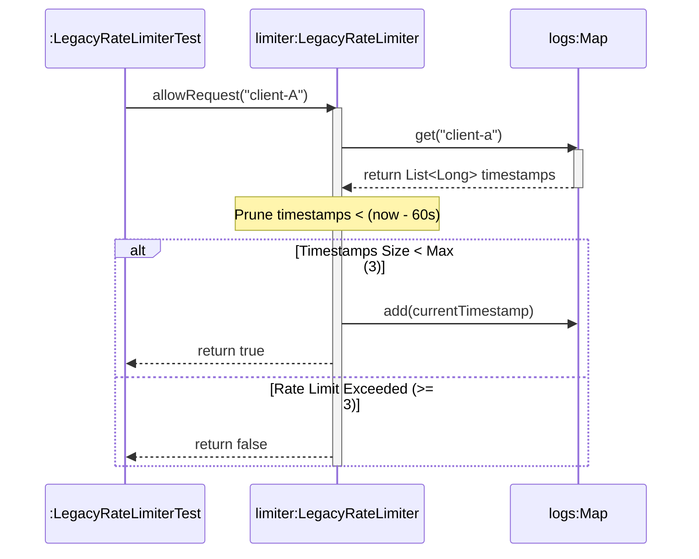

# 📘 P00.M04.L02 — Day 3 Unfamiliar Component Code Archeology & Refactoring

> **Date:** August 11, 2026
> **Focus:** Safely refactoring legacy Java code under test protection, Java Streams, language design mechanics, and sliding-window algorithms.

---

## 🧭 Table of Contents

1. [Warm-up Recall & Core Concepts](#1--warm-up-recall--core-concepts)
2. [Micro-Refactoring Recipes](#2--micro-refactoring-recipes)
3. [Fowler's Two Hats Rule](#3--fowlers-two-hats-rule)
4. [Coding Exercise: LegacyCalculator & Streams](#4--coding-exercise-legacycalculator--java-streams)
5. [Deep Dive: Java Streams & Language Design](#5--deep-dive-java-language-design--streams)
6. [Hands-on Lab: LegacyRateLimiter](#6--hands-on-lab-legacyratelimiter--efficiency-audit)
7. [Sequence Diagram: Sliding Window Flow](#7--sequence-diagram-sliding-window-flow)
8. [Engineering Insight & OSS Connection](#8--engineering-insight--open-source-connection)
9. [Reflection Q&A Summary](#9--reflection-answers-summary)
10. [Quick Revision Cheat Sheet](#-quick-revision-cheat-sheet)

---

## 1 — 🔍 Warm-up Recall & Core Concepts

### UML Class Diagrams for Auditing
Give a **macro-level view** of system structure *before* touching code. Used to spot:
- 🧨 Bloated "god" classes
- 🔁 Cyclic dependencies
- 🔗 Tight coupling
- 🏗️ Architectural debt

### IDE Navigation Shortcuts

| Shortcut | Action | What it Does |
|---|---|---|
| `F12` | **Go to Definition** | Jumps to where a method/variable is *declared* (e.g. the interface contract) |
| `Ctrl+F12` | **Go to Implementation** | Jumps directly to the *concrete class* implementing the interface method |

### UML Relationship Notations

| Notation | Meaning | Visual |
|---|---|---|
| `..\|>` | **Interface Implementation** | Dashed line + hollow triangular arrowhead → points to interface |
| `-->` | **Association** | Solid line + open arrow → points from dependent class to supplier |

### 🥇 The Golden Rule of Refactoring
> **Never refactor code without a passing safety-net test suite in place first.**

Lock in existing public behavior *before* altering internal logic.

### Public vs. Private
- **Public methods** = the external behavioral *contract*
- **Private loops/variables** = internal execution *details* (free to change)

### ✅ Warm-up Coding Solution

```java
@Test
void testExceedingLimitRejectsFourthRequest() {
    assertTrue(rateLimiter.allowRequest("client-A"));
    assertTrue(rateLimiter.allowRequest("client-A"));
    assertTrue(rateLimiter.allowRequest("client-A"));
    assertFalse(rateLimiter.allowRequest("client-A")); // Rejects 4th request
}
```

---

## 2 — 🎥 Micro-Refactoring Recipes
*(Source: Emily Bache / Martin Fowler — Classic Refactoring Playbook)*

### Step-by-Step Refactoring Workflow

1. **Inline Variables** — eliminate redundant temp variables that obscure flow
2. **Split Loops** — separate multi-purpose loops into single-purpose ones
3. **Slide Statements** — move variable declarations close to where they're used
4. **Extract Methods** — pull isolated logic into well-named private helpers

> 💡 **Core Takeaway:** Refactoring isn't a massive rewrite — it's a series of **tiny, verifiable transformations**. Tests stay green after almost every single step.

---

## 3 — 🎩 Fowler's "Two Hats Rule"

> *"When you develop software, you divide your time between two distinct activities: adding function and refactoring."* — Martin Fowler

| 🛠️ "Adding Function" Hat | 🧹 "Refactoring" Hat |
|---|---|
| Adds brand-new capabilities | Restructures existing code only |
| Progress = new tests written & passing | No new capabilities/tests (unless filling coverage gaps) |
| Code structure modified to fit the feature | Code cleaned up while existing tests stay **100% green** |

**Mnemonic:** *Adding = growing outward. Refactoring = tidying inward.*

---

## 4 — 💻 Coding Exercise: `LegacyCalculator` & Java Streams

**Problem:** Convert an imperative CSV parser (manual string splitting) into a clean, declarative **Stream pipeline** — without changing public behavior.

```java
package scratch;

import java.util.Arrays;

public class LegacyCalculator {
    public int computeSum(String csvNumbers) {
        if (csvNumbers == null || csvNumbers.trim().isEmpty()) {
            return 0;
        }

        return Arrays.stream(csvNumbers.split(","))
                .map(String::trim)
                .filter(s -> !s.isEmpty())
                .mapToInt(Integer::parseInt)
                .sum();
    }
}
```

**Pipeline breakdown:**
`split(",")` → `map(trim)` → `filter(not empty)` → `mapToInt(parseInt)` → `sum()`

---

## 5 — 🧠 Deep Dive: Java Language Design & Streams

### Why Streams Instead of Direct `List` Methods?

| Reason | Explanation |
|---|---|
| **Lazy Evaluation** | Chaining `.filter().map()` on a `List` would allocate new intermediate lists each step. Streams process only when a **terminal operation** is called. |
| **Separation of Concerns** | `List` = memory bucket (storage). `Stream` = conveyor belt (computation). |
| **Immutability** | Streams never mutate the underlying collection. |

### Stream Operations & Functional Interfaces

| Operation | Functional Interface | Purpose | Example |
|---|---|---|---|
| `filter(...)` | `Predicate<T>` | Keep elements matching a boolean test | `s -> !s.isEmpty()` |
| `map(...)` | `Function<T,R>` | Transform `T` → `R` | `String::trim` |
| `mapToInt(...)` | `ToIntFunction<T>` | Convert to primitive `IntStream` (avoids autoboxing) | `Integer::parseInt` |
| `reduce(...)` | `BinaryOperator<T>` | Aggregate to a single value | `(acc, val) -> acc + val` |
| `forEach(...)` | `Consumer<T>` | Side-effect per element, no return | `System.out::println` |

### Why `final` Variables Must Be Explicitly Initialized

- Instance variables default to `0`, `false`, or `null`.
- If a `final` field auto-defaulted, that **default would count as its one allowed assignment** — locking it forever at that default.
- Java enforces **Definite Assignment**: "blank final" variables must be explicitly assigned on *every* constructor path before construction completes.

---

## 6 — 🧪 Hands-on Lab: `LegacyRateLimiter` & Efficiency Audit

**What changed:** Internal storage refactored from inefficient array scanning → a **sliding-window map structure**.

```java
package handbook.phase00.p00m04l02;

import java.util.*;

public class LegacyRateLimiter {
    private final int maxRequestsPerMinute;
    private final Map<String, List<Long>> requestLogs = new HashMap<>();

    public LegacyRateLimiter(int maxRequestsPerMinute) {
        if (maxRequestsPerMinute <= 0) {
            throw new IllegalArgumentException("Max requests must be positive.");
        }
        this.maxRequestsPerMinute = maxRequestsPerMinute;
    }

    public boolean allowRequest(String clientId) {
        if (clientId == null || clientId.trim().isEmpty()) {
            throw new IllegalArgumentException("Client ID required.");
        }
        long now = System.currentTimeMillis();
        long windowStart = now - 60_000;

        String key = clientId.trim().toLowerCase();
        requestLogs.putIfAbsent(key, new ArrayList<>());
        List<Long> timestamps = requestLogs.get(key);

        // Prune timestamps older than 60 seconds
        timestamps.removeIf(time -> time < windowStart);

        if (timestamps.size() < maxRequestsPerMinute) {
            timestamps.add(now);
            return true;
        }
        return false;
    }
}
```

### 🚨 Production Bottleneck Audit

| Issue | Detail |
|---|---|
| **Unbounded Memory Leak** | Inactive `clientId` keys are never evicted from `requestLogs` → memory grows indefinitely |
| **Thread Safety Issues** | `HashMap` & `ArrayList` are non-atomic, unsynchronized → race conditions under concurrency |
| **O(N) Removal Overhead** | `ArrayList.removeIf()` shifts elements on removal. Production systems prefer **O(1)** structures: `ArrayDeque` or token-bucket counters |

---

## 7 — 🔄 Sequence Diagram: Sliding Window Flow



**Reading it:** Every request first **prunes stale timestamps**, then checks capacity — this is the essence of the sliding-window algorithm.

---

## 8 — 🌐 Engineering Insight & Open Source Connection

### The Safety Net Strategy
Refactoring legacy code relies on **test suites** to:
- Catch hidden invariants
- Prevent regressions when swapping internal data structures

### 🔗 Real-World Example: OkHttp (`square/okhttp`)
OkHttp maintains **3,000+ automated integration tests** validating HTTP specifications. This safety net lets maintainers refactor low-level pieces (HTTP/2 frame parsers, connection pool recyclers) **without breaking** the public `OkHttpClient` API.

> 🧩 **Big Idea:** Test coverage is what makes bold internal refactoring *safe* at scale.

---

## 9 — 📝 Reflection Answers Summary

| # | Question Theme | Key Answer |
|---|---|---|
| 1 | Safety Net Workflow | **Audit → Test → Refactor → Verify** |
| 2 | Why run tests *before* refactoring? | Confirms pre-existing bugs are identified *before* modification begins |
| 3 | Why preserve public API contracts? | Guarantees callers/downstream clients see **zero breaking changes** |
| 4 | Testing sliding windows | Assert boundary behavior — allow up to max, block at max + 1 — to verify pruning correctness |
| 5 | Industrial-scale refactoring | Projects like OkHttp use automated suites to safely refactor internals while keeping external APIs stable |

---

## ⚡ Quick Revision Cheat Sheet

- 🥇 **Golden Rule:** No refactor without passing tests first.
- 🎩 **Two Hats:** Adding function ≠ Refactoring — never wear both at once.
- 🪜 **Refactor Recipe Order:** Inline vars → Split loops → Slide statements → Extract methods.
- 🌊 **Streams = conveyor belt**, `List` = storage bucket. Lazy, immutable, no side-allocations.
- 🔒 **Blank finals:** must be assigned exactly once, on every constructor path (no auto-default allowed).
- 🕰️ **Sliding Window Pattern:** prune (`removeIf` stale) → check capacity → add/reject.
- 🐛 **Legacy Rate Limiter's 3 flaws:** memory leak (no eviction), no thread safety, O(N) removal (use `ArrayDeque`/token bucket instead).
- 🧪 **Why tests enable fearless refactors:** they lock in *public behavior* so internals can change freely (see OkHttp: 3,000+ tests).

---

*End of notes — happy revising! 🚀*