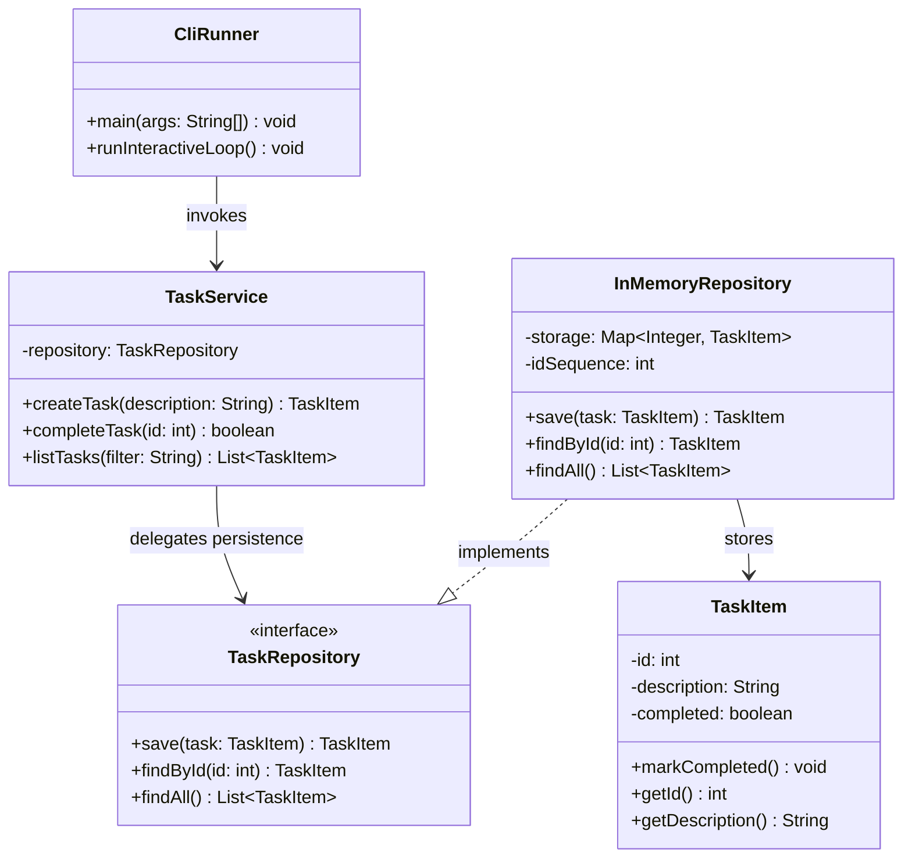

# 📚 Study Notes: Day 2 In-Memory Task Repository & 3-Tier Architecture

> A structured revision guide covering the Repository Pattern, 3-tier architecture, defensive copying, and JUnit 5 testing — using a Java Task Manager as the running example.

---

## 📑 Table of Contents

1. [Warm-up Recall & Core Fundamentals](#1-warm-up-recall--core-fundamentals)
2. [Core Architecture: Repository Pattern & Service Layer](#2-core-architecture-repository-pattern--service-layer)
3. [Implementation Code Reference](#3-implementation-code-reference)
4. [Static Class Design (UML)](#4-static-class-design-uml-architecture)
5. [End-of-Day Reflections (Key Takeaways)](#5-end-of-day-reflections)
6. [Deep-Dive Discussions & Chat Highlights](#6-deep-dive-discussions--chat-highlights)
7. [Quick Revision Cheat Sheet](#7-quick-revision-cheat-sheet)

---

## 1. Warm-up Recall & Core Fundamentals

| Concept | Why It Matters |
|---|---|
| 🖥️ **Console I/O Isolation** | Keeping `System.in`/`System.out` away from business logic lets domain rules be unit-tested with simple assertions — no need to mock or capture system streams. |
| 🔒 **Encapsulation over Generic Setters** | Use intent-revealing methods like `markCompleted()` instead of `setCompleted(true)`. This guards invariants and makes business intent explicit. |
| 🧭 **Command Dispatcher Pattern** | Decouples CLI parsing (via `switch`/maps) from execution logic — eliminates messy nested `if-else` chains. |
| 📖 **Clean Code Connection** | Ch.3 *(Functions)* → single-responsibility argument parsing. Ch.14 *(Successive Refinement)* → builds a full CLI parser. |
| 🛠️ **Real-World Parallel** | Tools like **Git** and **Maven** separate raw flag parsing from their core execution engines, operating only on strongly typed config objects. |

### 🔌 Interface Declaration Contract

```java
import java.util.List;

public interface TaskRepository {
    TaskItem save(TaskItem task);
    TaskItem findById(int id);
    List<TaskItem> findAll();
}
```

> 💡 **Remember:** An interface defines *what* a repository can do — not *how*. This is what allows swapping `InMemoryRepository` for a database-backed one later.

---

## 2. Core Architecture: Repository Pattern & Service Layer

### 🏗️ The 3-Tier Flow

```
┌───────────────────────────┐
│     CliRunner / CLI       │  ← Presentation Layer (Console I/O, UI formatting)
└─────────────┬─────────────┘
              │
              ▼
┌───────────────────────────┐
│        TaskService        │  ← Service Layer (Business rules, contextual checks)
└─────────────┬─────────────┘
              │
              ▼
┌───────────────────────────┐
│    InMemoryTaskRepository │  ← Repository Layer (Storage & query facade)
└─────────────┬─────────────┘
              │
              ▼
┌───────────────────────────┐
│         TaskItem          │  ← Domain Entity (Data state & invariants)
└───────────────────────────┘
```

**Read it top-down:** the CLI never talks to storage directly — it always goes *through* the service, which enforces rules before delegating to the repository.

### Key Ideas

- **Repository Pattern** → Acts like an in-memory *collection facade*. It hides whether data lives in a `HashMap`, SQL database, or NoSQL store — domain logic doesn't care.
- **Defensive Copying** → `return new ArrayList<>(storage.values());` ensures callers can't accidentally (or maliciously) clear/mutate the repository's internal state via the returned list.

> ⚠️ **Common Pitfall:** If you return the internal collection directly (not a copy), any external `.clear()` or `.remove()` call will silently corrupt your "database."

---

## 3. Implementation Code Reference

### 🗂️ `InMemoryRepository.java`

```java
package com.example.task_manager;

import java.util.ArrayList;
import java.util.HashMap;
import java.util.List;
import java.util.Map;

public class InMemoryRepository implements TaskRepository {
    private final Map<Integer, TaskItem> storage = new HashMap<>();
    private int idSequence = 1;

    @Override
    public TaskItem save(TaskItem task) {
        task.setId(idSequence++);
        storage.put(task.getId(), task);
        return task;
    }

    @Override
    public TaskItem findById(int id) {
        return storage.get(id); // Returns null automatically if key does not exist
    }

    @Override
    public List<TaskItem> findAll() {
        return new ArrayList<>(storage.values()); // Defensive copy
    }
}
```

**Line-by-line recall:**
- `idSequence++` → auto-increments IDs like a primary key, starting from 1.
- `storage.get(id)` → returns `null` if absent (no exception thrown — good to remember for null-checks later).
- `new ArrayList<>(...)` → the defensive copy in action.

### 🧪 `InMemoryRepositoryTest.java` (Isolated Unit Testing)

```java
package com.example.task_manager;

import static org.junit.jupiter.api.Assertions.*;
import java.util.List;
import org.junit.jupiter.api.BeforeEach;
import org.junit.jupiter.api.Test;

public class InMemoryRepositoryTest {

    private InMemoryRepository repository;

    @BeforeEach
    void setup() { // Must NOT be static
        repository = new InMemoryRepository();
    }

    @Test
    void shouldAssignSequentialIdsOnSave() {
        TaskItem t1 = repository.save(new TaskItem("Task 1"));
        TaskItem t2 = repository.save(new TaskItem("Task 2"));

        assertEquals(1, t1.getId());
        assertEquals(2, t2.getId());
    }

    @Test
    void shouldVerifyDefensiveCopyImmutability() {
        repository.save(new TaskItem("Task 1"));
        List<TaskItem> copy = repository.findAll();

        copy.clear(); // Mutate returned list

        // Assert internal state remains untouched
        assertNotNull(repository.findById(1));
        assertEquals(1, repository.findAll().size());
    }
}
```

**What each test proves:**
| Test | Proves |
|---|---|
| `shouldAssignSequentialIdsOnSave` | IDs increment correctly and independently per saved task. |
| `shouldVerifyDefensiveCopyImmutability` | Clearing the *returned* list does NOT affect internal `storage` — defensive copy works. |

---

## 4. Static Class Design (UML Architecture)



**How to read this diagram:**
- Solid arrows (`-->`) = "uses / calls."
- Dashed arrow with hollow triangle (`..|>`) = "implements" (interface realization).
- `TaskService` never touches `InMemoryRepository` directly in code — it only knows about the `TaskRepository` **interface**. This is the core of loose coupling.

---

## 5. End-of-Day Reflections

Five things to lock into long-term memory:

1. **Repository Responsibility** — Provides a collection-like interface to domain objects while hiding the underlying storage mechanism from the rest of the app.
2. **Defensive Copies** — Prevent encapsulation leaks; callers can't clear/modify internal state via a returned list.
3. **3-Tier Testability** — Presentation layer can be skipped for tests; services can be tested with mock/in-memory repos, avoiding real I/O.
4. **Validation Enforcement** — `TaskService` is responsible for system-wide checks (duplicates, rate limits) **before** anything reaches persistence.
5. **Spring Data Link** — Interfaces like `CrudRepository` (`save`, `findById`, `findAll`) are dynamically implemented by Spring at runtime for SQL/NoSQL — this hand-written pattern is literally what Spring automates.

---

## 6. Deep-Dive Discussions & Chat Highlights

### 🏭 Where Are Objects Instantiated?

| Layer | Responsibility |
|---|---|
| **Service (`TaskService`)** | Constructs domain objects (`new TaskItem(...)`) and runs contextual business checks *before* handing off to the repository. |
| **Repository (`InMemoryRepository`)** | Pure persistence only — ID assignment and storage. No business logic here. |

### ✅ Validation: Who Checks What?

| Layer | Validation Type | Example |
|---|---|---|
| **Domain Entity (`TaskItem`)** | Structural Invariants | Throwing `IllegalArgumentException` for null/empty strings in the constructor. |
| **Service (`TaskService`)** | Contextual Business Rules | Checking if a task description *already exists* in storage — needs external/system data. |

> 🧠 **Mnemonic:** Entity checks "is this object valid by itself?" Service checks "is this valid *given everything else in the system*?"

### 🔁 Map Key Streaming Syntax

```java
map.keySet().stream()
   .filter(key -> key.startsWith("Task"))
   .toList();
```

Useful pattern for filtering/transforming map keys functionally instead of looping manually.

### 🧪 JUnit 5 Execution Lifecycle Rules

| Rule | Detail |
|---|---|
| **Default Order** | Non-deterministic by design (relies on JVM reflection) — this *promotes test isolation* by discouraging order-dependent tests. |
| **Explicit Ordering** | Use `@TestMethodOrder(MethodOrderer.OrderAnnotation.class)` + `@Order(n)` when order truly matters. |
| **`@BeforeEach`** | Must **never** be `static`. Runs once *per test instance* → guarantees isolated state per test. |
| **`@BeforeAll`** | Runs once *per class*, and **must** be `static`. |

### ⚖️ JDBC vs. Hibernate vs. NoSQL

| Feature | JDBC | Hibernate (ORM) |
|---|---|---|
| **Abstraction** | Low-level SQL execution engine | High-level Object-Relational Mapping (ORM) |
| **Mapping** | Manual, via `ResultSet` | Automatic, via `@Entity` / `@Table` |
| **Boilerplate** | High (manual connections, SQL, error handling) | Low (session lifecycle + dynamic SQL handled for you) |
| **NoSQL Support** | Relational SQL only | Standard Hibernate = SQL only. Legacy *Hibernate OGM* tried NoSQL, but **Spring Data MongoDB** is the modern go-to. |

---

## 7. Quick Revision Cheat Sheet

Use this section for last-minute review before an exam or interview:

- [ ] I can explain **why** console I/O should be isolated from business logic.
- [ ] I can write a `TaskRepository` interface with `save`, `findById`, `findAll`.
- [ ] I understand **defensive copying** and can point to the exact line that implements it.
- [ ] I can draw the **3-tier flow** (CLI → Service → Repository → Entity) from memory.
- [ ] I know **which layer** validates structural rules vs. contextual/business rules.
- [ ] I remember `@BeforeEach` is per-instance/non-static; `@BeforeAll` is static/per-class.
- [ ] I can compare **JDBC vs. Hibernate** in terms of boilerplate and mapping.
- [ ] I understand how this hand-rolled repository pattern **maps to Spring's `CrudRepository`**.

---

*Compiled as a revision-friendly reference — designed to be skimmed quickly or read in depth when concepts need reinforcing.*