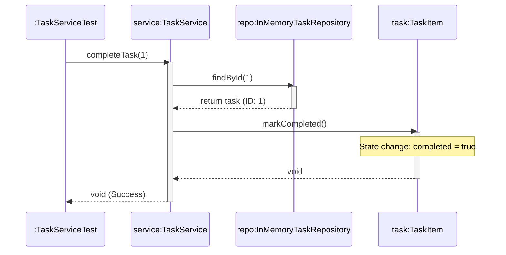

# 📘 P00.M04.L03 — Day 3 CLI Task Tracker Engine & Command Dispatcher

> **Module Focus:** Layered architecture, dependency injection, and defensive state management — illustrated through a CLI Task Tracker built in Java.
> **Use this doc as a quick-recall revision sheet** before interviews, exams, or when revisiting the lab code.

---

## 🗂️ Table of Contents

1. [Core Concepts Review](#1-core-concepts-review)
2. [Architecture & Dependency Injection](#2-architecture--dependency-injection)
3. [Lab Architecture & Implementation](#3-lab-architecture--implementation)
4. [Deep-Dive: List Returning Strategies](#4-deep-dive-list-returning-strategies-in-java)
5. [System Modeling & Real-World Mapping](#5-system-modeling--real-world-mapping)
6. [Phase 0 Summary & Reflection](#6-phase-0-summary--reflection)
7. [Quick Recall Cheat Sheet](#7-quick-recall-cheat-sheet)

---

## 1. Core Concepts Review

### 🏗️ 3-Tier Layered Architecture

A design pattern that separates an application into three independent layers, each with a single responsibility. This separation makes code easier to test, maintain, and swap out.

| Layer | Responsibility |
|---|---|
| **Presentation Layer** | Handles user interaction — parsing CLI input and formatting output. |
| **Service Layer** | Implements business rules, data transformations, and input validation. |
| **Repository Layer** | Encapsulates persistence — queries and direct state mutation live here only. |

> 💡 **Why it matters:** Each layer only talks to the layer directly below it. The Presentation layer never touches the database directly, and the Repository layer knows nothing about business rules.

---

### 🔒 Defensive Copying & State Encapsulation

**The problem:** If a repository returns a *direct reference* to its internal collection (e.g., a `HashMap`'s values), any external class can mutate that internal state — bypassing all business rules in the Service layer. This breaks encapsulation.

**The fix:** Return a **defensive copy** instead:

```java
return new ArrayList<>(storage.values());
```

This hands the caller an **isolated snapshot** — they can do whatever they want with it, but the repository's real internal state stays protected.

---

### 🔍 Corrected Stream Search Pattern

A safe way to search a list for a matching item without throwing exceptions when nothing is found:

```java
// Returning matching element or null safely using Java Streams
TaskItem findById(List<TaskItem> tasks, int id) {
    return tasks.stream()
                .filter(task -> task.getId() == id)
                .findFirst()
                .orElse(null);
}
```

**Breakdown:**
- `.stream()` → converts the list into a stream for functional-style processing.
- `.filter(...)` → keeps only tasks matching the given `id`.
- `.findFirst()` → returns an `Optional<TaskItem>` wrapping the first match (if any).
- `.orElse(null)` → unwraps the `Optional`, returning `null` if no match was found instead of throwing.

> ⚠️ **Recall tip:** `.orElse(null)` is a simple, safe fallback — but in stricter codebases you might prefer `.orElseThrow()` to force explicit handling of the "not found" case.

---

## 2. Architecture & Dependency Injection

### 🧩 Constructor Dependency Injection (CDI)

**Mechanism:** Instead of a class creating its own dependencies internally, they are *passed in* through the constructor:

```java
TaskService service = new TaskService(new InMemoryTaskRepository());
```

| Benefit | Explanation |
|---|---|
| **Testability** | Each test can build a fresh, isolated `TaskService` with a clean fixture — no external mocking libraries needed. |
| **Swappability** | You can replace `InMemoryTaskRepository` with a SQL-backed or file-based repository *without touching* `TaskService` at all. |

> 💡 **Mental model:** CDI decouples *"what a class needs"* from *"how that need gets created."* The class just declares a dependency type; someone else decides which implementation to hand over.

---

### 🚧 Clean Boundaries & I/O Isolation

- `TaskService` (the domain logic) is **completely unaware** of how it's being used — whether that's a CLI, a REST API, or a GUI.
- It's also unaware of *how* data is persisted (memory, SQL, files, etc.).
- Because validation logic lives inside the domain service (not tangled up with I/O), you can unit test it with **JUnit 5** instantly — no server, no database, no I/O startup required.

**Why this matters for revision:** This is the core payoff of layered architecture — *fast, isolated, dependency-free tests.*

---

## 3. Lab Architecture & Implementation

### 📦 Component Responsibilities

| Component | Responsibility |
|---|---|
| `TaskItem.java` | Immutable value fields (`id`, `createdAt`) + mutable `completed` status + invariant enforcement. |
| `InMemoryTaskRepository.java` | Atomic ID sequence generation, `HashMap`-based storage, defensive-copy queries. |
| `TaskService.java` | Domain orchestrator — enforces non-null checks, duplicate-description invariants, missing-ID exceptions. |
| `TaskServiceTest.java` | Automated test suite covering both positive paths and boundary/exception cases. |

---

### 🛡️ Key Domain Invariant Enforcement

```java
public TaskItem createTask(String description) {
    if (description == null || description.trim().isEmpty()) {
        throw new IllegalArgumentException("Description required.");
    }
    for (TaskItem t : repository.findAll()) {
        if (t.getDescription().equalsIgnoreCase(description.trim())) {
            throw new IllegalArgumentException("Task with description already exists.");
        }
    }
    return repository.save(description);
}
```

**Step-by-step recall:**
1. **Null/empty guard** → rejects blank or missing descriptions immediately.
2. **Duplicate check** → loops through all existing tasks (via `repository.findAll()`, which returns a *defensive copy*) and rejects case-insensitive duplicates.
3. **Delegation** → only after passing both checks does it hand off to the repository to actually persist the task.

> 💡 **Pattern name:** This is **invariant enforcement at the Service layer** — the repository stays "dumb" (just storage), while all business rules live in one place.

---

## 4. Deep-Dive: List Returning Strategies in Java

| Strategy | Java Version | Mutability | Best Use Case |
|---|---|---|---|
| `new ArrayList<>(collection)` | 1.2+ | **Mutable** | Caller needs to modify, filter, or sort the returned list locally. |
| `.collect(Collectors.toList())` | 8+ | **Mutable** (in practice) | Stream pipelines where a mutable list output is required. |
| `.stream().toList()` | 16+ | **Unmodifiable** | Enforce read-only access — prevents callers from altering the list structure. |

> 🎯 **Quick decision rule:**
> - Want to protect data but let callers work with a *copy*? → `new ArrayList<>(...)`
> - Want to *guarantee* callers can never modify the result at all? → `.stream().toList()`

---

## 5. System Modeling & Real-World Mapping

### 🔁 UML Task Completion Sequence



**Reading this diagram:**
- The **test** never talks to the repository or the task object directly — everything is routed through the **service**.
- This mirrors the layered architecture: presentation/test → service → repository → domain object.

---

### 🌍 Open Source Mapping: `gh issue close`

A great real-world example of this exact pattern, seen in the GitHub CLI:

| Layer | GitHub CLI Equivalent |
|---|---|
| **CLI Dispatcher** | `gh issue close 42` — parses the command and the issue ID. |
| **Service Orchestration** | Passes issue ID `42` to a local service facade for handling. |
| **State Mutation** | Calls `.markClosed()` on the issue's domain model, then syncs the change remotely. |

> 💡 **Takeaway:** The same 3-tier pattern you built in a toy CLI task tracker scales up to real, production-grade developer tools.

---

## 6. Phase 0 Summary & Reflection

### 🏁 Core Milestones Achieved

- **Execution Fundamentals** — stack vs. heap scope, primitive vs. reference types, dynamic arrays, bit-shifts.
- **Robust Code** — stack frame lifecycle, method overload signatures, unchecked exception hierarchies, exception chaining.
- **Developer Tooling** — JUnit 5 assertions (`assertThrows`), Git DAG rebasing/tagging, Maven POM dependency management.
- **Clean Architecture** — encapsulation via access modifiers, the Facade pattern, and 3-Tier Layered Architecture.

---

## 7. Quick Recall Cheat Sheet

Use this section for a last-minute skim before a test or interview.

- ✅ **3 Layers:** Presentation → Service → Repository (each only talks to the one below it)
- ✅ **Defensive copy:** `new ArrayList<>(storage.values())` protects internal state
- ✅ **Safe stream search:** `.filter(...).findFirst().orElse(null)`
- ✅ **CDI:** pass dependencies via constructor → testable + swappable
- ✅ **Domain isolation:** `TaskService` doesn't know about CLI/REST/GUI or DB type
- ✅ **Invariant checks live in Service layer**, not Repository
- ✅ **List return strategies:**
  - `new ArrayList<>(...)` → mutable copy
  - `Collectors.toList()` → mutable (Java 8+)
  - `.stream().toList()` → unmodifiable (Java 16+)
- ✅ **Real-world parallel:** `gh issue close 42` follows the exact same CLI → Service → Domain Model flow

---

*📅 Generated as a revision-ready study reference for Module 04, Lesson 03 (Phase 0).*