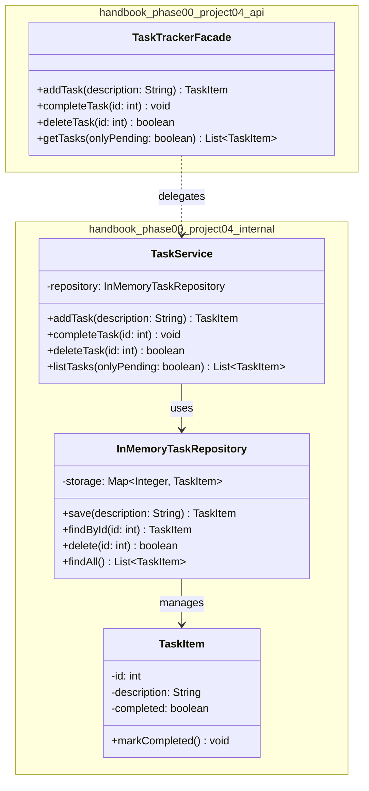

# 🎓 Phase 0 Capstone & Graduation Notes
### CLI Task Tracker — Clean Java Architecture, Testing & Release Engineering
📅 *Session Date: 2026-08-15*

---

## 🧭 How to Use This README

This document is a **revision-ready summary** of Phase 0's final module. It's organized so you can:
- **Skim** the tables/summaries for a 5-minute refresh
- **Deep-dive** into the code samples when you need implementation details
- **Trace** the full project structure via the UML diagram before an interview or graduation review

---

## 📖 Table of Contents

1. [Core Fundamentals Recap](#1-core-fundamentals-recap)
2. [Clean Architecture Principles](#2-clean-architecture-principles)
3. [Kent Beck's 4 Rules of Simple Design](#3-kent-becks-4-rules-of-simple-design)
4. [Defensive Programming: Guard Validation](#4-defensive-programming-guard-validation)
5. [Capstone Architecture: CLI Task Tracker](#5-capstone-architecture-cli-task-tracker)
6. [UML Diagram](#6-uml-diagram)
7. [Graduation Matrix — Before vs After](#7-graduation-matrix--before-vs-after)
8. [Real-World Connection](#8-real-world-connection)
9. [Key Takeaways & What's Next](#9-key-takeaways--whats-next)

---

## 1. Core Fundamentals Recap

### 🧠 JVM Memory Management

| Region | What Lives There | Lifecycle |
|---|---|---|
| **Stack** | Local variables, method parameters, references | Popped automatically when the method returns |
| **Heap** | Actual objects | Persists until no stack reference points to it → eligible for **Garbage Collection (GC)** |

> 💡 **Mental model:** The stack holds *addresses*, the heap holds the *actual house*. Once nobody has the address anymore, the house gets demolished (GC'd).

---

### ⚠️ Checked vs. Unchecked Exceptions

| Type | Examples | Philosophy |
|---|---|---|
| **Checked** | `IOException`, `SQLException` | Recoverable, environment/I-O related. Compiler **forces** you to `catch` or `throws` it. |
| **Unchecked** (`RuntimeException`) | `NullPointerException`, `IllegalArgumentException` | Programmer bugs/logic errors. **Fail fast** — don't try to recover, fix the root cause in code. |

---

### ✅ JUnit 5 Assertion Mechanics

| Method | Purpose |
|---|---|
| `assertAll()` | Runs **every** nested assertion even if one fails — gives you the *full* failure report in one test run instead of stopping at the first broken assertion. |
| `assertThrows()` | Confirms a lambda throws a specific exception class, and **returns the exception object** so you can assert on its message/fields too. |

---

### 📘 Effective Java — Item 15 (Joshua Bloch)

> **"Minimize the accessibility of classes and members."**

- Default to **package-private** visibility wherever possible.
- Prevents external clients from tightly coupling to your internals.
- Lets you refactor internals freely **without breaking the public API**.

---

### 🔌 Constructor Dependency Injection (DI)

```java
new TaskTrackerFacade(repository)
```

- Dependencies are passed in explicitly, not created internally.
- **Benefits:**
  - Decouples high-level policy (Facade) from low-level details (storage)
  - Makes unit testing trivial via mocks/test doubles
  - Enforces non-null invariants right at object creation

---

### ⚡ Warm-Up Commands Cheat Sheet

```bash
# Build Maven project artifact while bypassing unit test execution
mvn clean package -DskipTests

# Create an annotated release tag in Git with tag metadata
git tag -a v1.0.0-p00m04 -m "Release Module 00.04 Capstone Project"
```

---

## 2. Clean Architecture Principles

### 🏗️ Class Structure Ordering (top → bottom)

```
1️⃣ Static / Instance Fields
2️⃣ Public Constructors & Public Entry Point Methods
3️⃣ Private Helper Methods (kept lower for top-down readability)
```

### 🎯 Core Design Principles

| Principle | Meaning |
|---|---|
| **SRP** (Single Responsibility) | A class should have exactly one reason to change. Keep it small and focused. |
| **High Cohesion** | Methods that operate on the same domain state should live together, tightly encapsulated. |
| **Dependency Inversion** | Depend on abstractions/facades — not concrete implementation details. |

---

## 3. Kent Beck's 4 Rules of Simple Design

> Apply **in strict priority order** — never sacrifice a higher rule for a lower one.

| Priority | Rule | Core Objective |
|:---:|---|---|
| 🥇 1 | **Passes All Tests** | Verifies correctness, guards against regressions |
| 🥈 2 | **Reveals Intention** | Self-documenting code with clear domain naming |
| 🥉 3 | **No Duplication (DRY)** | Single source of truth for every piece of logic |
| 4️⃣ | **Fewest Elements** | Minimize classes/overhead — *but only after 1–3 are satisfied* |

---

## 4. Defensive Programming: Guard Validation

**Concept:** Public API boundaries must validate inputs *immediately* — fail fast with clear, actionable errors.

### 🧪 Test Strategy

```java
@Test
void testForNullRepository() {
    assertThrows(IllegalArgumentException.class, () -> new TaskTrackerFacade(null));
}

@Test
void testForInvalidTaskDescription() {
    TaskTrackerFacade facade = new TaskTrackerFacade(new InMemoryTaskRepository());
    assertAll(
        () -> assertThrows(IllegalArgumentException.class, () -> facade.createTask(null)),
        () -> assertThrows(IllegalArgumentException.class, () -> facade.createTask("   "))
    );
}
```

### 🛡️ Implementation: Constructor & Entry-Point Guards

```java
public class TaskTrackerFacade {
    private final TaskRepository repository;

    public TaskTrackerFacade(TaskRepository repository) {
        if (repository == null) {
            throw new IllegalArgumentException("Repository is required");
        }
        this.repository = repository;
    }

    public Task createTask(String description) {
        if (description == null || description.trim().isEmpty()) {
            throw new IllegalArgumentException("Description is required");
        }
        return repository.create(description.trim());
    }
}
```

> 💡 **Pattern to remember:** *Validate → Fail Fast → Delegate.* Guards live at the very top of a public method, before any real logic runs.

---

## 5. Capstone Architecture: CLI Task Tracker Subsystem

### 📦 Package Layout & Boundaries

```
handbook.phase00.project04.api
└── TaskTrackerFacade        → the ONLY public boundary exposed to clients

handbook.phase00.project04.internal
├── TaskItem                 → package-private domain entity (non-blank desc, positive IDs)
├── InMemoryTaskRepository   → package-private in-memory persistence layer
└── TaskService              → package-private business logic engine (dup checks, completion flags)
```

> 🔒 **Why this matters:** Only `TaskTrackerFacade` is `public`. Everything else is package-private — clients can *never* reach into the internals directly, even by accident.

---

### 🚀 Production Release Pipeline

| Step | Action |
|---|---|
| **1. Branch** | `git checkout -b feature/module-04-capstone` |
| **2. Commit atomically** | See conventional commits below |
| **3. Merge & Tag** | Rebase → merge into `main` → tag `v1.0.0-p00m04` |

**Conventional Commit Sequence:**
```
feat(project04): implement core domain entities and facade api
test(project04): add full junit 5 verification suite
docs(project04): document architecture adr and design specs
```

**Version Mapping:**
```
Maven GAV: 1.0.0-SNAPSHOT  →  1.0.0  (on release)
Git Tag:   v1.0.0-p00m04
```

---

## 6. UML Diagram



**Flow to remember:**
```
Client → TaskTrackerFacade (public API)
             │  delegates
             ▼
        TaskService (business logic: dup checks, completion)
             │  uses
             ▼
   InMemoryTaskRepository (storage: Map<Integer, TaskItem>)
             │  manages
             ▼
        TaskItem (domain entity)
```

---

## 7. Graduation Matrix — Before vs After

| Engineering Dimension | 🔴 Before Phase 0 | 🟢 After Phase 0 (Graduation) |
|---|---|---|
| **Code Structure** | Monolithic `main()` scripts | 3-Tier Layered Architecture (`API → Service → Repository`) |
| **Error Handling** | Swallowing exceptions / print dumps | Custom exception hierarchies & explicit boundary guards |
| **Testing** | Manual `System.out` printing | Automated JUnit 5 suites (`assertAll`, `assertThrows`) |
| **Build & Versioning** | Untracked loose files | Standard Maven GAV builds + Git rebase release tags (`v1.0.0`) |
| **Debugging** | Print statement debugging | IDE line/conditional breakpoints & field watchpoints |

---

## 8. Real-World Connection

**🌍 Spring Boot CLI & `kubectl`**

Production-grade tools like Spring Boot CLI and Kubernetes' `kubectl` follow the **exact same encapsulation pattern** taught in this module:

- Internal cluster-management logic, networking clients, and parsers live in **internal packages**
- Only minimal **command facades** are exposed publicly
- Result: internal refactors never break downstream plugins or extensions

> This is the same "public facade, private internals" pattern you just built in `TaskTrackerFacade` — just at massive scale.

---

## 9. Key Takeaways & What's Next

### 💎 Big Ideas to Remember

1. **Package Encapsulation** — Keeping repositories/entities `package-private` means swapping the storage engine (in-memory → SQL → Redis) requires **zero changes** to the client-facing `TaskTrackerFacade` contract.

2. **SemVer + Git Tags** — Aligning Git tags (`v1.0.0-p00m04`) with Maven GAV versions (`1.0.0`) creates full **build provenance**: every shipped binary traces back to an exact commit.

3. **Readiness for Phase 1 (OOP Design)** — The mindset shift is:
   > From *"writing syntax that works"* → to *"designing structures that adapt to changing requirements"* through trade-off analysis, domain modeling, and clean abstraction boundaries.

### ✅ Quick Self-Check Before Moving to Phase 1

- [ ] Can I explain *why* stack vs heap matters for GC?
- [ ] Can I explain *when* to use checked vs unchecked exceptions?
- [ ] Can I write `assertAll` + `assertThrows` tests from memory?
- [ ] Can I redraw the `Facade → Service → Repository → Entity` diagram unaided?
- [ ] Do I understand why only `TaskTrackerFacade` is `public`?
- [ ] Can I recite Kent Beck's 4 rules in priority order?

---

*End of Phase 0 Capstone Notes — onward to Phase 1: Object-Oriented Design 🚀*