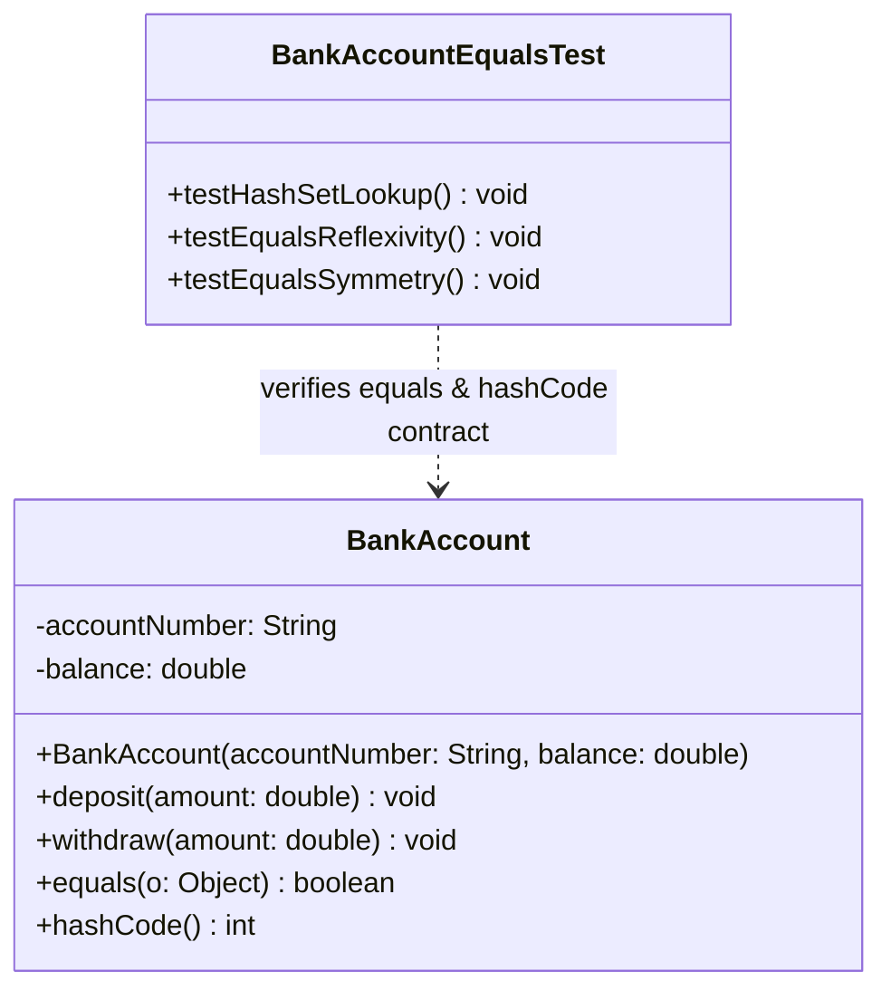
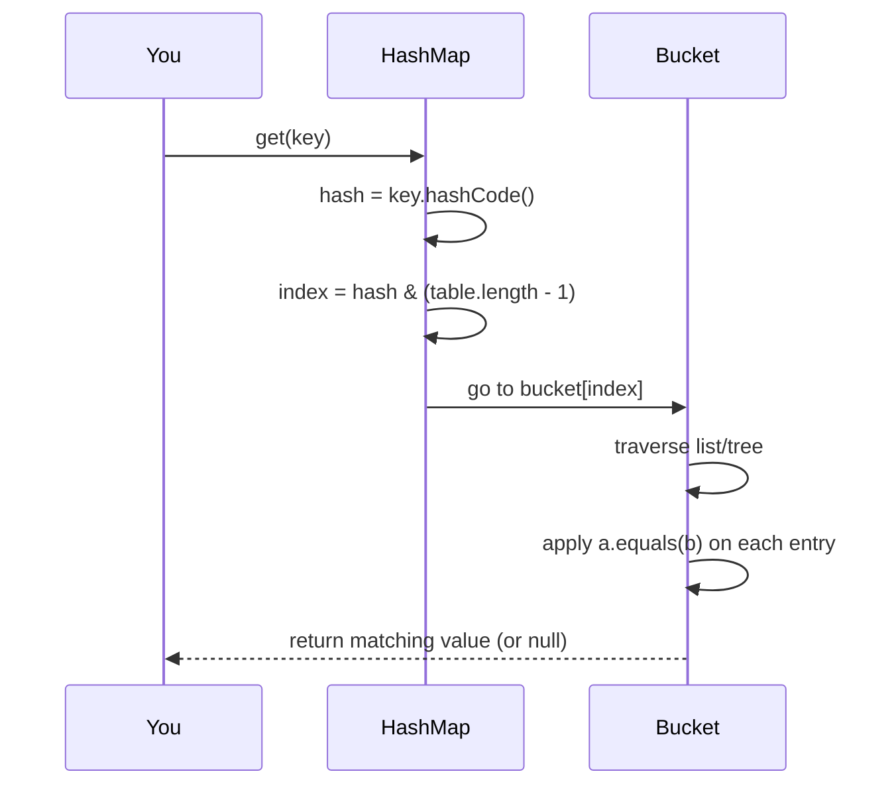

# 📘 P01.M01.L01 — Day 2 Equals, HashCode & Domain Invariants

> **Lecture Notes | Java Object Contracts & Rich Domain Modeling**
> 📅 Date: August 17, 2026

A complete revision guide covering `equals()`/`hashCode()` contracts, identity vs. state equality, domain modeling patterns, and JVM internals — with runnable code, edge cases, and a UML diagram.

---

## 🗂️ Table of Contents

1. [Core Concepts: Identity vs. State](#1-core-concepts-identity-vs-state)
2. [Domain Modeling Philosophy](#2-domain-modeling-philosophy)
3. [The equals() Contract](#3-the-equals-contract)
4. [The hashCode() Contract](#4-the-hashcode-contract)
5. [Tricky Edge Cases](#5-tricky-edge-cases)
6. [JVM Internals: String.hashCode()](#6-jvm-internals-stringhashcode)
7. [Code Implementation: BankAccount](#7-code-implementation-bankaccount)
8. [UML Class Diagram](#8-uml-class-diagram)
9. [How HashMap Actually Finds Your Key](#9-how-hashmap-actually-finds-your-key)
10. [Real-World Connection: Hibernate/JPA](#10-real-world-connection-hibernatejpa)
11. [Quick-Revision Cheat Sheet](#11-quick-revision-cheat-sheet)
12. [Session Checklist](#12-session-checklist)

---

## 1. Core Concepts: Identity vs. State

| Concept | Operator/Method | What it Really Checks |
|---|---|---|
| **Identity** | `==` | *"Are these two variables pointing at the same box in memory?"* |
| **State Equality** | `.equals()` | *"Do these two (possibly different) boxes contain the same data?"* |

> ⚠️ **Default trap**: `Object.equals()` silently falls back to `==`. If you don't override it, two objects with **identical fields** will still be judged "not equal."

**Mental model**: Think of two identical twins standing in different rooms.
- `==` asks: *"Is this literally the same person?"* → No.
- `.equals()` (if overridden properly) asks: *"Do they look/behave the same?"* → Yes.

---

## 2. Domain Modeling Philosophy

### 🧊 Anemic Domain Model (Anti-Pattern)
- Class = just data (fields + getters/setters).
- All logic lives in external "Service" classes.
- **Problem**: Nothing stops invalid states — encapsulation is broken, business rules leak everywhere.

### 💪 Rich Domain Model (Preferred)
- Class owns **both** data and behavior (`deposit()`, `withdraw()`).
- Validates *before* mutating (precondition guards).
- Business rules live in **one place** — the object itself.

### 🔒 Immutability Bonus
- `final` fields + defensive copying → object can't change after construction.
- **Free thread-safety** — no locks/synchronization needed, because there's no mutable state to race over.

---

## 3. The `equals()` Contract

> 📖 Source: *Effective Java*, Item 10

Five mathematical rules `equals()` **must** satisfy:

| # | Rule | Plain English |
|---|---|---|
| 1 | **Reflexive** | `x.equals(x)` → always `true`. An object always equals itself. |
| 2 | **Symmetric** | `x.equals(y)` ⇔ `y.equals(x)`. Equality shouldn't depend on who's asking. |
| 3 | **Transitive** | `x=y` and `y=z` ⇒ `x=z`. Equality chains must hold. |
| 4 | **Consistent** | Same inputs → same output, every time (as long as fields aren't mutated). |
| 5 | **Non-nullability** | `x.equals(null)` → always `false`. Never throws, never true. |

💡 **Memory hook**: *"Reflexive, Symmetric, Transitive, Consistent, Non-null"* → **R-S-T-C-N** ("Rest Can Not").

---

## 4. The `hashCode()` Contract

> 📖 Source: *Effective Java*, Item 11

> ### 🏆 The Golden Rule
> **If `a.equals(b)` is `true`, then `a.hashCode()` MUST equal `b.hashCode()`.**
> (The reverse is *not* required — different objects can share a hash code; that's a "collision," not a bug.)

### ❗ Why breaking this rule is dangerous
If you override `equals()` but forget `hashCode()`:
- `HashMap`/`HashSet` compute a **bucket index** using `hashCode()`.
- Two "equal" objects can land in **different buckets**.
- Result: `map.get(equalKey)` returns `null`, `set.contains(equalObj)` returns `false` — even though logically they *should* match.

**Rule of thumb**: `equals()` and `hashCode()` are a **package deal**. Always override both, or neither.

---

## 5. Tricky Edge Cases

### 🎨 The `ColorPoint` Inheritance Dilemma

**Setup**: `Point(x, y)` is a value class. You try to extend it → `ColorPoint(x, y, color)`.

| Approach | What Breaks | Why |
|---|---|---|
| Check with `instanceof` | **Transitivity** | `ColorPoint(1,2,RED).equals(Point(1,2))` → true, and `Point(1,2).equals(ColorPoint(1,2,BLUE))` → true, but the two ColorPoints ≠ each other. Chain breaks. |
| Check with `getClass()` | **Liskov Substitution Principle** | Symmetry/transitivity hold, but a `Set<Point>` can no longer treat a `ColorPoint` as a true `Point` substitute. |

### ✅ The Fix: Favor Composition over Inheritance
```
❌ class ColorPoint extends Point        // "is-a" → breaks equals() math
✅ class ColorPoint { private Point p; } // "has-a" → clean, no contract violation
```
**Takeaway**: Value-based classes should almost never be extended. Wrap, don't inherit.

---

### 🌀 StackOverflowError in JPA / Lombok Entities

**Scenario**: Bidirectional relationship — `User` has `List<Order>`, `Order` has `User`.

Auto-generated `equals()`/`hashCode()` (via `@EqualsAndHashCode` or IDE defaults) recurse infinitely:
```
User.hashCode() → hashes Orders → Order.hashCode() → hashes User → User.hashCode() → ... 💥
```

**Fix options**:
1. Exclude child collections (`@ToString.Exclude`, `@EqualsAndHashCode.Exclude`) from the calculation.
2. **Better**: Base entity equality *only* on the primary key (`@Id`) — this is the recommended JPA pattern anyway.

---

### 🧬 How Every Class Secretly Extends `Object`

- If you don't write `extends`, the compiler (`javac`) silently inserts `extends java.lang.Object`.
- At the bytecode level: the default constructor calls `invokespecial java/lang/Object."<init>":()V`.
- **Interfaces** don't literally inherit from `Object`, but the JLS *guarantees* every interface reference still exposes all public `Object` methods (`equals`, `hashCode`, `toString`, etc.).

---

### 🏷️ Labeled Blocks + `break` (Control Flow Trick)

```java
changed: {
    for (int i = 0; i < 4; i++) {
        if (i == 2) {
            break changed; // exits the ENTIRE labeled block, not just the loop
        }
    }
}
```
**Use case**: Escaping deeply nested loops cleanly — no boolean "found" flags, no exceptions for control flow.

---

## 6. JVM Internals: `String.hashCode()`

What actually happens when you call `accNumber.hashCode()`:

```mermaid
flowchart TD
    A[Call .hashCode()] --> B{Cached hash != 0?}
    B -- Yes --> C[Return cached value — O(1)]
    B -- No --> D[Check encoding: LATIN1 or UTF16]
    D --> E[Compute polynomial hash]
    E --> F[Cache result, then return]
```

1. **Cached lookup** — checks private `int hash` field; if already computed, returns instantly.
   - *Java 13+*: adds a `hashIsZero` flag so a legitimately-zero hash isn't recomputed every time.
2. **Compact string check** — Java 9+ inspects whether the backing `byte[] value` is `LATIN1` or `UTF16` encoded.
3. **Polynomial formula** (base-31):

$$h = \sum_{i=0}^{n-1} s[i] \cdot 31^{n-1-i}$$

4. **Optimization trick** — multiplying by 31 is done via bit-shift, not real multiplication:

$$31h = (h \ll 5) - h$$

   *(Shifting left by 5 = ×32, minus original h = ×31 — faster than a multiply instruction.)*

---

## 7. Code Implementation: BankAccount

📁 `scratch/BankAccount.java`

```java
package scratch;

import java.util.Objects;

public class BankAccount {
    private final String accountNumber;
    private double balance;

    public BankAccount(String accountNumber, double initialBalance) {
        if (accountNumber == null || accountNumber.isBlank()) {
            throw new IllegalArgumentException("Account number cannot be empty.");
        }
        if (initialBalance < 0) {
            throw new IllegalArgumentException("Initial balance cannot be negative.");
        }
        this.accountNumber = accountNumber;
        this.balance = initialBalance;
    }

    public void deposit(double amount) {
        if (amount <= 0) {
            throw new IllegalArgumentException("Deposit amount must be positive.");
        }
        this.balance += amount;
    }

    public void withdraw(double amount) {
        if (amount <= 0 || amount > balance) {
            throw new IllegalArgumentException("Invalid withdrawal amount.");
        }
        this.balance -= amount;
    }

    @Override
    public boolean equals(Object o) {
        if (this == o) return true;
        if (!(o instanceof BankAccount)) return false;
        BankAccount that = (BankAccount) o;
        return Double.compare(that.balance, balance) == 0 &&
               Objects.equals(accountNumber, that.accountNumber);
    }

    @Override
    public int hashCode() {
        return Objects.hash(accountNumber, balance);
    }
}
```

### 🔍 Why each design choice matters

| Detail | Reason |
|---|---|
| Parameter type is `Object o`, not `BankAccount o` | Prevents an **overload** instead of an **override** — a classic silent bug. |
| `instanceof` check | Implicitly handles `null` (rule #5) — `null instanceof AnyClass` is always `false`. |
| `Double.compare()` instead of `==` | Correctly handles `NaN` and `-0.0` edge cases that raw `==` gets wrong. |
| `this == o` fast-path | Satisfies reflexivity cheaply and short-circuits identical references. |
| `Objects.hash(...)` in `hashCode()` | Guarantees the Golden Rule — same fields used in `equals()` are used in `hashCode()`. |

---

## 8. UML Class Diagram



---

## 9. How HashMap Actually Finds Your Key

`map.get(key)` under the hood:



**Three steps, memorized**: *Hash → Bucket → Equals.*
1. **Hash indexing**: `hash & (table.length - 1)` picks the bucket (fast modulo trick since table length is a power of 2).
2. **Bucket traversal**: walks the linked list (or red-black tree, for large buckets) at that index.
3. **Exact match**: only `.equals()` confirms it's *the* key, not just a hash collision.

---

## 10. Real-World Connection: Hibernate/JPA

- ORMs must track entity identity **across database sessions** (an entity can be loaded, detached, reattached, or proxied).
- Best practice: override `equals()`/`hashCode()` using the **business key or primary key (`@Id`)** — *not* all fields, and *never* child collections (see StackOverflow issue above).
- **Payoff**: detached objects and lazy proxies still correctly collapse into a single entry when placed in a `Set`, preventing duplicate rows across transactions.

---

## 11. Quick-Revision Cheat Sheet

```
┌─────────────────────────────────────────────────────────────┐
│  == compares memory address   |   .equals() compares state   │
├─────────────────────────────────────────────────────────────┤
│  equals() 5 rules: Reflexive, Symmetric, Transitive,          │
│                    Consistent, Non-null                       │
├─────────────────────────────────────────────────────────────┤
│  hashCode() golden rule: equal objects → equal hash codes     │
│  (NOT the reverse — collisions are fine)                      │
├─────────────────────────────────────────────────────────────┤
│  Never extend a value class → use composition (has-a)         │
├─────────────────────────────────────────────────────────────┤
│  JPA entities: base equals()/hashCode() on @Id ONLY           │
├─────────────────────────────────────────────────────────────┤
│  Always override equals() + hashCode() TOGETHER, never one    │
└─────────────────────────────────────────────────────────────┘
```

---

## 12. Session Checklist

- [x] Warm-up questions completed
- [x] 5 properties of `equals()`/`hashCode()` contract mastered
- [x] Inheritance breakdown vs. composition solution understood
- [x] JVM `String.hashCode()` bitwise mechanics reviewed
- [x] `BankAccount` domain entity & JUnit test suite written
- [x] UML class diagram generated
- [x] End-of-day reflection completed

---

<div align="center">

📌 *Keep this file in your revision folder — re-read the **ColorPoint** and **StackOverflowError** sections first, they're the most exam-relevant traps.*

</div>