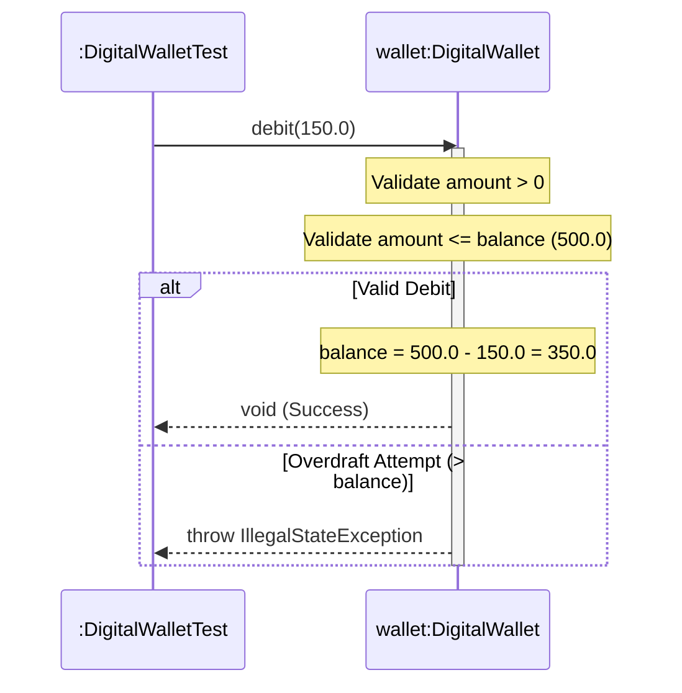

# 📘 P01.M01.L01 — Day 3 Domain Entity State & Identity Management

> **Phase 01 · Module 01 · Lesson 01**
> Core theme: how an object's *identity* should be kept separate from its *state*, and how Domain-Driven Design (DDD) uses this idea to build safe, self-protecting domain models.

---

## 🗺️ Quick Map of This Lesson

| # | Section | What it answers |
|---|---------|------------------|
| 1 | [Equality Contract Mechanics](#1-️-equality-contract-mechanics) | Why `equals()` and `hashCode()` must be overridden *together*, and on *what* |
| 2 | [DDD Core Concepts](#2--domain-driven-design-ddd-core-concepts) | Vocabulary: Entity, Value Object, Aggregate, Ubiquitous Language |
| 3 | [Architectural Deep-Dive](#3--architectural-deep-dive) | Aggregate vs Domain Service vs Application Service vs Repository |
| 4 | [Coding Exercise](#4--coding-exercise-faultyentitydebugjava) | A real bug caused by hashing mutable state, and its fix |
| 5 | [Hands-on Lab](#5--hands-on-lab-digitalwalletjava) | Full working `DigitalWallet` implementation |
| 6 | [Sequence Diagram](#6--sequence-diagram-debit-flow) | Visualizing a `debit()` call, success vs overdraft |
| 7 | [Framework Connection](#7--framework-connection-jpa--hibernate) | How this maps to real-world ORM tools |
| 8 | [Revision Checklist](#8--revision-checklist) | Fast self-test before moving on |

---

## 1. ⚖️ Equality Contract Mechanics

### The core rule
> **If you override `equals()`, you must override `hashCode()` too — and both must be based on the same fields.**

### Why it breaks

| Problem | Cause | Consequence |
|---|---|---|
| **Overriding `equals()` without `hashCode()`** | Default `Object.hashCode()` is based on memory address, not field values | Two logically-equal objects get *different* hash codes → hash-based collections (`HashSet`, `HashMap`) treat them as different entries |
| **Basing `hashCode()` on a *mutable* field** | `HashSet` places an object into a bucket *once*, at insertion time, based on its hash at that moment | If the field later changes, the object's hash changes too — but the `HashSet` never moves it. The object becomes "lost" inside its own collection |

### 🧠 Mental model: Identity vs. State

```
Identity  → walletId   → immutable, set once at creation, defines "which object is this"
State     → balance    → mutable, changes over time, defines "what condition is it in"
```

**Rule of thumb:** `equals()`/`hashCode()` should only ever look at the **identity** fields, never the **state** fields.

### ✅ Correct pattern

```java
import java.util.Objects;

public class DigitalWallet {
    private final String walletId; // final → immutable identity

    public DigitalWallet(String walletId) {
        this.walletId = walletId;
    }

    @Override
    public int hashCode() {
        return Objects.hash(walletId); // Objects.hash() is null-safe
    }
}
```

### Behavioral methods > raw setters

| Style | Example | Effect |
|---|---|---|
| ❌ Raw setter | `setBalance(-500)` | No validation — anyone can push the object into an invalid state |
| ✅ Behavioral method | `debit(500)` | Encapsulates the business rule (e.g. throws `IllegalStateException` on overdraft) — the object *protects itself* |

> 💡 **Recall trick:** "Setters expose plumbing. Behavior methods enforce promises."

---

## 2. 🏛️ Domain-Driven Design (DDD) Core Concepts

### Strategic Design (the "big picture" layer)

| Concept | Meaning |
|---|---|
| **Ubiquitous Language** | The same vocabulary is used by business experts *and* in the code itself. Example: methods are named `credit()` / `debit()`, not generic `setBalance()`, because that's how a banker actually talks about it. |
| **Event Storming** | A workshop technique to map out key domain events across a lifecycle — e.g. `WalletCreated` → `FundsCredited` → `FundsDebited`. |
| **Subdomains** | The business is split into three types: |

**Subdomain types:**
```
Core        → the part that makes your product special (competitive advantage)
Supporting  → helps the core function, but isn't the differentiator
Generic     → common problems already solved elsewhere (often outsourced/3rd-party)
```

### Tactical Design (the "building blocks" layer)

| Building Block | Definition | Example |
|---|---|---|
| **Entity** | Has a unique, immutable identity (e.g. a `UUID` or `walletId`); its internal state *can* change over its lifetime | `DigitalWallet` |
| **Value Object** | Immutable, defined only by its attributes, **has no identity** — two Value Objects with the same values *are* the same object | `Money`, `Address` |
| **Aggregate** | A cluster of Entities + Value Objects treated as one consistency/transactional unit | A `Wallet` aggregate might include `Balance` + `TransactionHistory` |
| **Aggregate Root** | The single entry point that manages an Aggregate's invariants | The `DigitalWallet` object itself |

### Rich Model vs. Anemic Model

| Model Type | Characteristics |
|---|---|
| **Anemic Domain Model** | Objects are just data bags — public getters/setters, no logic. Business rules live *outside* the object (usually in a service). |
| **Rich Domain Model** | Objects encapsulate their own validation and behavior. Business rules live *inside* the object. ✅ This is what DDD encourages. |

---

## 3. 🏗️ Architectural Deep-Dive

### Layer responsibilities at a glance

| Element | Layer | Responsibility | Example |
|---|---|---|---|
| **Aggregate** | Domain | Enforces internal invariants for a *single* entity's state transitions | `wallet.debit(100.0)` checks `balance ≥ 100` |
| **Domain Service** | Domain | Coordinates logic that spans **multiple** aggregates, or stateless domain math | `CurrencyConversionService.transfer(walletA, walletB, amount)` |
| **Application Service** | Application | Orchestrates transactions, repositories, messaging — contains **zero** domain rules | Load wallet → call domain method → save → send email |
| **Repository** | Infrastructure | Loads/persists Aggregate Roots | `walletRepository.findById("W-1001")` |

> 💡 **Recall trick:** *Aggregate* = "one object's rules." *Domain Service* = "rules between objects." *Application Service* = "the plumbing that wires it all together." *Repository* = "the filing cabinet."

### 🐛 Memory Leak Mechanics: Mutated `HashSet` Entries

What actually happens step by step when a mutable field is part of `hashCode()`:

```
Step 1 — Insertion
   object.hashCode() computed using balance = 500
   → placed into Bucket A

Step 2 — Mutation
   object.setBalance(300)   // balance changes AFTER insertion
   → HashSet does NOT re-bucket it. It stays in Bucket A.

Step 3 — Lookup attempt
   set.contains(object)
   → recomputes hashCode() using the NEW balance (300)
   → looks in Bucket B (wrong bucket!) → finds nothing → returns false

Step 4 — The leak
   GC Root → HashSet → (internal table) → Node → Object
   → a strong reference still exists, so the Garbage Collector
     can NEVER reclaim it — even though your code can never
     "find" or remove it again.
```

**Net effect:** the object is simultaneously *unreachable via lookup* and *un-garbage-collectible*. That's the leak.

---

## 4. 🧪 Coding Exercise: `FaultyEntityDebug.java`

### The bug
`equals()` and `hashCode()` were originally written against the **mutable** `balance` field. As soon as `setBalance()` was called, `set.contains(entity)` silently started returning `false` — even though the object was still physically inside the set.

### The fix
Re-anchor both methods to the **immutable** `walletId`.

```java
public class FaultyEntityDebug {
    private final String walletId;
    private double balance;

    public FaultyEntityDebug(String walletId, double balance) {
        this.walletId = walletId;
        this.balance = balance;
    }

    public void setBalance(double balance) { this.balance = balance; }

    @Override
    public boolean equals(Object o) {
        if (this == o) return true;
        if (!(o instanceof FaultyEntityDebug)) return false;
        FaultyEntityDebug that = (FaultyEntityDebug) o;
        return Objects.equals(walletId, that.walletId); // ✅ Identity-based
    }

    @Override
    public int hashCode() {
        return Objects.hash(walletId); // ✅ Identity-based
    }
}
```

> 🧩 **Takeaway for revision:** *Any time you see `hashCode()`/`equals()` reference a field that also has a public setter, that's a red flag.*

---

## 5. 🔧 Hands-on Lab: `DigitalWallet.java`

**Package:** `handbook.phase01.p01m01l01`

### Responsibilities
- Encapsulates `walletId` (identity), `currency`, and `balance` (state).
- Enforces invariants:
  - `initialBalance >= 0`
  - credit/debit amounts must be positive
  - **overdraft protection** — you can never debit more than the current balance

### Full implementation

```java
package handbook.phase01.p01m01l01;

import java.util.Objects;

public class DigitalWallet {
    private final String walletId;
    private final String currency;
    private double balance;

    public DigitalWallet(String walletId, String currency, double initialBalance) {
        if (walletId == null || walletId.trim().isEmpty()) {
            throw new IllegalArgumentException("Wallet ID required.");
        }
        if (currency == null || currency.trim().isEmpty()) {
            throw new IllegalArgumentException("Currency required.");
        }
        if (initialBalance < 0.0) {
            throw new IllegalArgumentException("Initial balance cannot be negative.");
        }
        this.walletId = walletId.trim();
        this.currency = currency.trim().toUpperCase();
        this.balance = initialBalance;
    }

    public void credit(double amount) {
        if (amount <= 0.0) {
            throw new IllegalArgumentException("Credit amount must be positive.");
        }
        this.balance += amount;
    }

    public void debit(double amount) {
        if (amount <= 0.0) {
            throw new IllegalArgumentException("Debit amount must be positive.");
        }
        if (amount > this.balance) {
            throw new IllegalStateException("Insufficient funds: Overdraft prevented.");
        }
        this.balance -= amount;
    }

    public String getWalletId() { return walletId; }
    public String getCurrency() { return currency; }
    public double getBalance() { return balance; }

    @Override
    public boolean equals(Object o) {
        if (this == o) return true;
        if (!(o instanceof DigitalWallet)) return false;
        DigitalWallet that = (DigitalWallet) o;
        return Objects.equals(walletId, that.walletId);
    }

    @Override
    public int hashCode() {
        return Objects.hash(walletId);
    }
}
```

### Design notes worth remembering
| Line/Feature | Why it matters |
|---|---|
| `walletId` and `currency` are `final` | Locks in identity + a config value that shouldn't change post-creation |
| Constructor validation (`IllegalArgumentException`) | Fails fast — invalid wallets can never exist |
| `credit()` / `debit()` instead of `setBalance()` | Rich domain model — business rules travel *with* the data |
| `debit()` throws `IllegalStateException` on overdraft | Distinguishes "bad input" (`IllegalArgumentException`) from "invalid operation given current state" (`IllegalStateException`) |
| `equals()`/`hashCode()` use only `walletId` | Keeps the object safe to store in `HashSet`/`HashMap` even while `balance` mutates |

---

## 6. 📊 Sequence Diagram: Debit Flow



**Reading this diagram:** the wallet itself decides whether a debit is legal — the caller (`Test`) never touches `balance` directly. This *is* encapsulation in action.

---

## 7. 🔌 Framework Connection: JPA & Hibernate

| Concept in this lesson | Real-world equivalent |
|---|---|
| Identity-based `equals()`/`hashCode()` | JPA `@Entity` classes map these to the immutable `@Id` field (primary key or business UUID) |
| Stable hash buckets | Enables **Hibernate's First-Level Cache** to reliably track entity identity across: <br>• dirty-checking cycles <br>• state flushes <br>• transaction boundaries |

> 💡 **Why this matters in practice:** if you based `equals()`/`hashCode()` on a mutable column (like `balance` or `updatedAt`), Hibernate's session cache could lose track of an entity mid-transaction — the exact same bug as the `HashSet` leak above, just inside a real persistence framework.

---

## 8. ✅ Revision Checklist

Use this before moving to the next lesson — if any point feels shaky, jump back to that section.

- [ ] I can explain **why** overriding `equals()` alone (without `hashCode()`) breaks hash collections.
- [ ] I can explain **why** a mutable field in `hashCode()` causes a silent `HashSet` memory leak (bucket misalignment → lookup failure → un-collectible object).
- [ ] I can state the difference between an object's **identity** and its **state** in one sentence each.
- [ ] I know the four DDD tactical building blocks: **Entity, Value Object, Aggregate, Aggregate Root.**
- [ ] I can distinguish **Rich Domain Model** from **Anemic Domain Model**.
- [ ] I can place any given piece of logic into the correct layer: **Aggregate vs Domain Service vs Application Service vs Repository.**
- [ ] I can recreate `DigitalWallet`'s `credit()`/`debit()` invariants from memory, including which exception type applies where.
- [ ] I understand how this maps to Hibernate/JPA `@Entity` equality.

### 🎯 One-line summary to memorize
> **"Identity defines equality. State defines behavior. Never let the two mix inside `equals()`/`hashCode()`."**