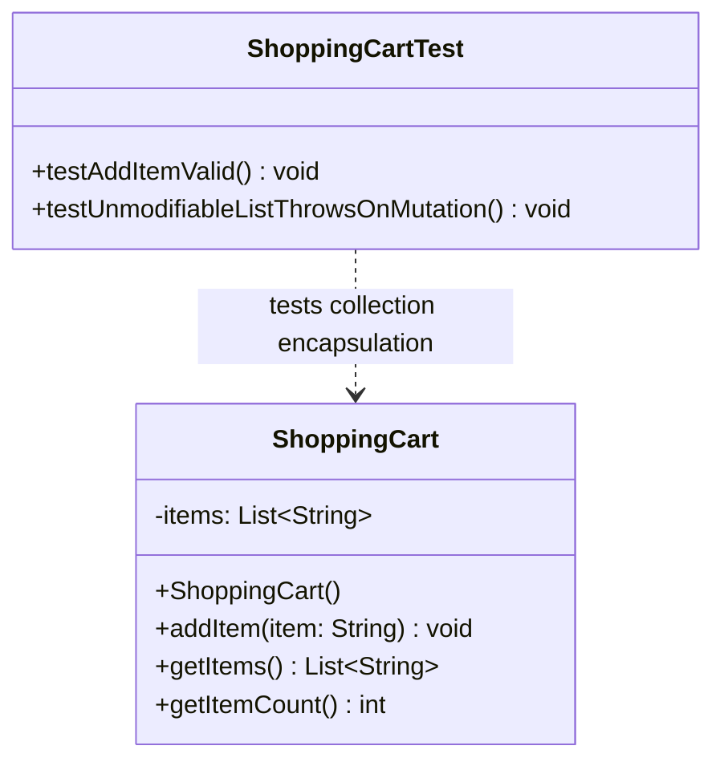

# 📘 P01.M01.L02 — Day 2 Encapsulation, Invariants & Defensive Copying

> **Module Focus:** Defensive Copying for Mutable Collections (`List.copyOf()`, `Collections.unmodifiableList()`), Collection Encapsulation, Access Control & UML Modeling
> **Date:** August 20, 2026

---

## 🗺️ Quick Navigation

| Section | What's Inside |
|---|---|
| [1. Core Concepts](#1--core-concepts-warm-up-recall) | Reference leaks, invariants, TOCTOU, `Instant` vs `Date`, encapsulation |
| [2. Unmodifiable View vs Immutable Snapshot](#2--unmodifiable-view-vs-immutable-snapshot) | The "Glass Window vs Photograph" analogy + diagram |
| [3. Gotchas](#3--key-gotchas--edge-cases) | `List.of()` pitfall, null handling, performance |
| [4. Effective Java Notes](#4--effective-java-reading-notes) | Item 15 & Item 50 |
| [5. Code Walkthroughs](#5--hands-on-code) | `SecurePeriod`, `ShoppingCart` + tests |
| [6. UML Diagram](#6--uml-class-diagram) | Class structure |
| [7. Comparison Matrix](#7--engineering-comparison-matrix) | Cheat-sheet table |
| [8. Ecosystem Notes](#8--open-source-connection) | Guava `ImmutableList` |
| [9. Reflection Summary](#9--end-of-day-reflection-summary) | 5 key takeaways |
| [10. Quick Revision Flashcards](#10--quick-revision-flashcards) | Rapid-fire Q&A |

---

## 1. 🎯 Core Concepts (Warm-Up Recall)

### Q1 — What is a Reference Leak?
A **reference leak** happens when a class hands out or absorbs a direct pointer to its internal mutable state — e.g. assigning an incoming object straight to a field, or returning an internal field straight from a getter.

> ⚠️ **Impact:** Outside code gets a "backdoor key" to internal memory. It can call `.add()`, `.clear()`, `.setTime()`, etc. and silently corrupt the object's state — completely bypassing validation.

### Q2 — What is a Domain Invariant?
A **business rule** that must hold true for the *entire lifetime* of an object.

> 💡 Example: In a bank account, `credit(double amount)` must always enforce `amount >= 0`. The object should never enter an illegal state, ever.

### Q3 — Why copy *before* validating? (TOCTOU)
**TOCTOU = Time-Of-Check to Time-Of-Use.**

```
❌ Risky order:            ✅ Safe order:
1. Validate input           1. Copy input FIRST (freeze a snapshot)
2. (another thread          2. Validate the frozen copy
   mutates it here!)        3. Assign — nothing can have changed
3. Assign — too late,
   invariant may be broken
```

In a multi-threaded environment, if you validate *then* copy, another thread can sneak in and mutate the object between those two steps. Copying first **freezes** the data so what you validate is exactly what you store.

### Q4 — `java.time.Instant` vs. legacy `java.util.Date`

| | `java.util.Date` (legacy) | `java.time.Instant` (modern) |
|---|---|---|
| Mutability | ❌ Mutable (`setTime()`) | ✅ Immutable Value Object |
| Needs defensive copies? | Yes — in constructors *and* getters | No — never |
| Modifying it | Changes the same object | Returns a brand-new object |

### Q5 — `private` vs. True Encapsulation
- **`private`** → just an *access-control* keyword; restricts *visibility*.
- **True encapsulation** → actually protecting *state integrity* — using defensive copies, unmodifiable wrappers, and validating mutators so invariants can never be broken, even by code within the same package that technically "shouldn't" see the field.

> 🧠 **Mental model:** `private` locks the door. Encapsulation makes sure that even if someone picks the lock, there's nothing dangerous to steal or corrupt.

---

## 2. 🪟 Unmodifiable View vs. Immutable Snapshot

This is the **most important distinction** in this module — don't skip it.

```
       +-------------------------------------------------------------+
       |                     ORIGINAL LIST                           |
       |               items = ["Laptop", "Mouse"]                   |
       +-------------------------------------------------------------+
                               /             \
                              /               \
                             v                 v
    +---------------------------------+   +---------------------------------+
    |  Collections.unmodifiableList() |   |          List.copyOf()          |
    |         (Glass Window)          |   |           (Photograph)          |
    |  • O(1) lightweight view        |   |  • O(N) independent copy        |
    |  • Reflects original changes    |   |  • Isolated from future updates |
    |  • Permits nulls (if source does|   |  • Throws NPE on null elements  |
    +---------------------------------+   +---------------------------------+
```

### 🔍 The Analogy (memorize this!)

| | 🪟 `Collections.unmodifiableList(list)` — **The Glass Window** | 📷 `List.copyOf(list)` — **The Photograph** |
|---|---|---|
| What happens | No data is copied — you place a read-only pane of glass *over* the original list | Java creates a brand-new, independent, unmodifiable copy in memory |
| Caller mutation | Cannot mutate *through* the window | Cannot mutate at all — it's a separate object |
| Internal mutation | If the underlying list changes, **everyone looking through the window sees it immediately** | Whatever happens to the original later has **zero effect** — the photo is frozen in time |

> 🧠 **Rule of thumb:** If you want callers to see live updates → glass window. If you want a frozen, safe snapshot for a getter → photograph.

---

## 3. ⚠️ Key Gotchas & Edge Cases

### 3.1 The `List.of()` Varargs Trap
`List.of()` uses **varargs** (`T... elements`) — passing a *List* into it wraps the whole list as a single element, not its contents!

```java
// ❌ WRONG — creates a List<List<String>> of size 1!
List<String> items = new ArrayList<>(List.of("A", "B"));
List<List<String>> nested = List.of(items);

// ✅ CORRECT — List.copyOf() takes a Collection<T>, unpacks properly
List<String> snapshot = List.copyOf(items);
```

> 💡 **Takeaway:** Never pass an existing collection into `List.of()` expecting it to flatten. Use `List.copyOf()` for that.

### 3.2 Null Handling Differences

| Method | Behavior with `null` elements |
|---|---|
| `List.copyOf(collection)` | 🚫 Throws `NullPointerException` |
| `Collections.unmodifiableList(list)` | ✅ Permits `null`s (if the underlying list allows them) |

### 3.3 Performance & Memory Reality

| | `Collections.unmodifiableList()` | `List.copyOf()` |
|---|---|---|
| Creation time | O(1) — instant | O(N) — iterates & copies |
| Memory | Tiny wrapper reference | Trimmed to exact size |
| vs `ArrayList` | N/A (same backing array) | **More memory-efficient than `ArrayList`** — no spare capacity reserved for future `.add()` calls, and optimized for fast iteration |

---

## 4. 📖 *Effective Java* Reading Notes (Joshua Bloch)

### Item 15 — Minimize the accessibility of classes and members
- Rank, most restrictive to least: `private` > `package-private` > `protected` > `public`.
- Public classes should **never**:
  - expose mutable fields directly, or
  - return references to internal mutable arrays/collections.

### Item 50 — Make defensive copies when needed
- **Assume the worst**: program as if every client will actively try to break your invariants.
- Copy **before** validating (see TOCTOU, Q3 above).
- ❌ Don't use `.clone()` for defensive copying if the type is subclassable by untrusted code — a malicious subclass can override `clone()`.
- ✅ Instead use constructors, static factories (`List.copyOf()`), or explicit copy logic.

---

## 5. 💻 Hands-On Code

### 5.1 Exercise 1 — `SecurePeriod` (Date defensive copying)

```java
import java.util.Date;

public final class SecurePeriod {
    private final Date start;
    private final Date end;

    public SecurePeriod(Date start, Date end) {
        // 1️⃣ Defensive copy FIRST — prevents TOCTOU attack
        this.start = new Date(start.getTime());
        this.end = new Date(end.getTime());

        // 2️⃣ Validate invariant SECOND
        if (this.start.after(this.end)) {
            throw new IllegalArgumentException("Start date cannot be after end date.");
        }
    }

    public Date getStart() {
        return new Date(this.start.getTime()); // defensive copy out
    }

    public Date getEnd() {
        return new Date(this.end.getTime());   // defensive copy out
    }
}
```

**Why it matters:** Both the constructor *and* the getters copy. Constructor copy stops external mutation from corrupting state at creation; getter copy stops callers from mutating the internal `Date` after the fact.

---

### 5.2 Exercise 2 — `ShoppingCart` Collection Encapsulation

#### `ShoppingCart.java`
```java
package scratch;

import java.util.ArrayList;
import java.util.List;

public class ShoppingCart {
    private final List<String> items = new ArrayList<>();

    public void addItem(String item) {
        if (item == null || item.trim().isEmpty()) {
            throw new IllegalArgumentException("Item name cannot be empty or null.");
        }
        this.items.add(item);
    }

    /** Fixes collection leaks — returns an immutable snapshot copy. */
    public List<String> getItems() {
        return List.copyOf(this.items);
    }

    public int getItemCount() {
        return this.items.size();
    }
}
```

#### `ShoppingCartTest.java`
```java
package scratch;

import org.junit.jupiter.api.Test;
import static org.junit.jupiter.api.Assertions.*;

class ShoppingCartTest {

    @Test
    void testAddItemValid() {
        ShoppingCart cart = new ShoppingCart();
        cart.addItem("Laptop");

        assertEquals(1, cart.getItemCount());
        assertEquals("Laptop", cart.getItems().get(0));
    }

    @Test
    void testUnmodifiableListThrowsOnMutation() {
        ShoppingCart cart = new ShoppingCart();
        cart.addItem("Laptop");

        List<String> itemsSnapshot = cart.getItems();

        // External mutation attempts must throw
        assertThrows(UnsupportedOperationException.class, () -> itemsSnapshot.add("Free TV"));
        assertThrows(UnsupportedOperationException.class, () -> itemsSnapshot.clear());
    }
}
```

> ✅ **Pattern to remember:** `addItem()` is the *only* door into the cart's state, and it validates every entry. `getItems()` never leaks the real list — it hands out a frozen photograph instead.

---

## 6. 🧩 UML Class Diagram



---

## 7. 📊 Engineering Comparison Matrix

| Property | `Collections.unmodifiableList(list)` | `List.copyOf(list)` |
|---|---|---|
| **Mechanism** | Wraps original list in an unmodifiable *view* | Creates an independent immutable *snapshot* |
| **Time Complexity** | O(1) — instant wrapper | O(N) — upfront copy |
| **Mutation via Original** | View **updates** if original mutates | Snapshot is **fully isolated** |
| **Null Tolerance** | Permits `null`s (if source does) | Throws `NullPointerException` |
| **Recommended Use** | Static/fixed lists that never change | Domain getters returning collection state |

> 🏆 **Senior Developer Rule:** Always prefer `List.copyOf()` (or an equivalent defensive copy) when returning collection state from domain entities — it guarantees thread safety and protects invariants.

---

## 8. 🌍 Open Source Connection

**Google Guava `ImmutableList`** & **JDK 10+ `List.copyOf()`**
- Both enforce collection immutability *at application boundaries*.
- Guava's `ImmutableList` bakes the immutability guarantee right into the **type signature** — a caller can tell at a glance that a list can't be mutated.
- In layered architectures (`Service → Repository → API`), passing immutable collections lets data move safely across thread and layer boundaries **without redundant defensive copies at every hop**.

---

## 9. ✅ End-of-Day Reflection Summary

1. **Direct `ArrayList` getters break encapsulation** — returning raw internal references is a reference leak; callers can mutate contents and bypass domain rules.
2. **Mutation Exception** — calling `.add()`, `.remove()`, `.clear()` on a `List.copyOf()` result throws `UnsupportedOperationException`.
3. **View vs. Snapshot** — `Collections.unmodifiableList()` = live O(1) view (reflects source changes); `List.copyOf()` = isolated O(N) snapshot (never changes).
4. **Domain methods as boundary guards** — methods like `addItem()` validate elements *before* they enter internal state, acting as the sole authoritative entry point.
5. **Multi-layer safety with `ImmutableList`** — Guava's type guarantees immutability across service layers, avoiding duplicate defensive copies everywhere.

---

## 10. ⚡ Quick Revision Flashcards

<details>
<summary><b>Q: What's the #1 rule for defensive copying order in constructors?</b></summary>
Copy first, validate second — to close the TOCTOU window.
</details>

<details>
<summary><b>Q: Glass Window or Photograph — which one reflects live changes to the source?</b></summary>
Glass Window (<code>Collections.unmodifiableList()</code>). The Photograph (<code>List.copyOf()</code>) is frozen forever.
</details>

<details>
<summary><b>Q: Which throws NPE on null elements — copyOf or unmodifiableList?</b></summary>
<code>List.copyOf()</code> throws NPE on nulls. <code>Collections.unmodifiableList()</code> permits them if the source does.
</details>

<details>
<summary><b>Q: Why is List.of(existingList) dangerous?</b></summary>
Because <code>List.of()</code> is varargs — it wraps the whole list as ONE element, producing a nested <code>List&lt;List&lt;T&gt;&gt;</code> instead of flattening it. Use <code>List.copyOf()</code> instead.
</details>

<details>
<summary><b>Q: Does Instant ever need defensive copying?</b></summary>
No — it's immutable by design. Any "modification" returns a new object, leaving the original untouched.
</details>

<details>
<summary><b>Q: private vs. encapsulation — what's the difference in one line?</b></summary>
<code>private</code> controls visibility; encapsulation protects state integrity (invariants) even from code that technically has access.
</details>

---

*End of notes — reviewed and structured for fast recall before exams/interviews.* 🎓