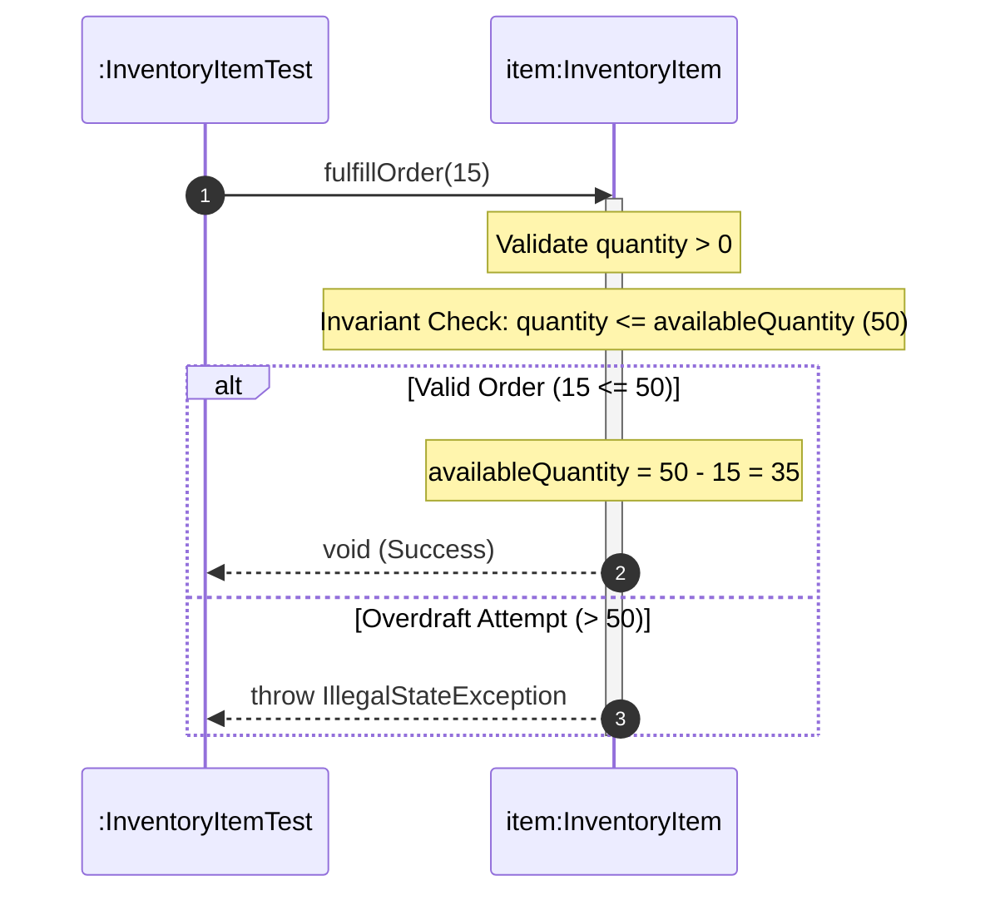

# 📘 P01.M01.L02 — Day 3 Encapsulation, Invariants & Defensive Design

> A revision-friendly guide covering encapsulation pitfalls, defensive copying, domain invariants, and rich domain modeling in Java.

---

## 📑 Table of Contents

1. [Quick Recall Cheatsheet](#1-quick-recall-cheatsheet)
2. [Collections: Unmodifiable vs Copy](#2-collections-unmodifiable-vs-copy)
3. [Defensive Copying & TOCTOU](#3-defensive-copying--toctou)
4. [Immutability vs Domain Invariants](#4-immutability-vs-domain-invariants)
5. [Warm-up Exercise: `validateQuantity`](#5-warm-up-exercise-validatequantity)
6. [Architecture: Anemic → Rich Domain Model](#6-architecture-anemic--rich-domain-model)
7. [Tactical DDD Glossary](#7-tactical-ddd-glossary)
8. [Effective Java — Item 49 & 50](#8-effective-java--item-49--50)
9. [Fixing Interdependent Invariants](#9-fixing-interdependent-invariants)
10. [Lab: `InventoryItem` Full Implementation](#10-lab-inventoryitem-full-implementation)
11. [Sequence Diagram Walkthrough](#11-sequence-diagram-walkthrough)
12. [Engineering Insights & Real-World Links](#12-engineering-insights--real-world-links)
13. [Reflection Q&A (Self-Test)](#13-reflection-qa-self-test)

---

## 1. Quick Recall Cheatsheet

| Concept | One-Line Takeaway |
|---|---|
| **Leaky getter** | Returning a raw internal `ArrayList`/mutable field lets callers mutate your object's state directly — invariants get silently broken. |
| **Unmodifiable collections** | Calling `.add()`/`.remove()`/`.clear()` on a `List.copyOf()` or `Collections.unmodifiableList()` result throws `UnsupportedOperationException`. |
| **TOCTOU bug** | Validate **after** copying, never before — otherwise another thread can mutate the object between your check and your use of it. |
| **Domain Invariant** | A rule that must hold `true` at *every* point in an object's life (not just at construction). |
| **Interdependent Invariant** | A rule spanning multiple fields, e.g. `reserved ≤ total`, `start ≤ end`. |

> 💡 **Golden Rule:** *Encapsulation isn't `private` fields — it's private fields + atomic methods that protect invariants + sealed references in and out.*

---

## 2. Collections: Unmodifiable vs Copy

Two ways to "protect" a list — they are **not** the same thing.

| Feature | `Collections.unmodifiableList(list)` | `List.copyOf(list)` |
|---|---|---|
| **Nature** | View / wrapper over original list | Independent snapshot copy |
| **Time & Space** | O(1) | O(N) |
| **Backing list mutates?** | ✅ Changes reflect in the view | ❌ Fully isolated |
| **Null elements** | Allowed (if backing list allows) | ❌ Throws `NullPointerException` |
| **Optimization** | Always wraps | Returns same instance in O(1) if already immutable |

**Rule of thumb:**
- Need a cheap, temporary read-only *view*? → `unmodifiableList`
- Need to guarantee the data can **never** change again (defensive copy)? → `List.copyOf`

---

## 3. Defensive Copying & TOCTOU

**TOCTOU** = *Time-Of-Check to Time-Of-Use*

```
❌ WRONG ORDER                       ✅ CORRECT ORDER
1. Validate input list                1. COPY the input list first
2. Copy the list                      2. Validate the COPY
3. Store copy                         3. Store the validated copy
   ⚠ Between steps 1–2, another         ✅ Original can be mutated by
   thread can mutate the original          another thread — doesn't matter,
   → validated assumption is stale!        your copy is already sealed.
```

**Rule:** Always **copy before validating**, and validate the copy — not the original reference.

Applies both directions:
- **In constructors** → copy mutable params *before* checking constraints.
- **In getters** → return a copy/unmodifiable snapshot, never the live internal reference.

---

## 4. Immutability vs Domain Invariants

| | **Immutability** | **Domain Invariant** |
|---|---|---|
| Definition | Object's state cannot change after creation | A business rule that must hold `true` at *every* point in the object's lifecycle |
| Example | `Money`, `LocalDate`, `String` | `startDate ≤ endDate`, `reservedQty ≤ totalQty` |
| Scope | About *whether* state can change | About *what valid* states look like, whether mutable or not |

> An object can be **mutable** and still be **invariant-safe** — as long as every mutation happens through a method that checks the rule atomically.

---

## 5. Warm-up Exercise: `validateQuantity`

**Goal:** Throw the right exception type for the right kind of error.

```java
package handbook.phase01.p01m01l02;

public class Validation {

    /**
     * Validates that the requested stock quantity does not exceed availability.
     * - IllegalArgumentException → bad input (non-positive requested value)
     * - IllegalStateException    → valid input, but violates system state (overdraft)
     */
    public void validateQuantity(int requested, int available) {
        if (requested <= 0) {
            throw new IllegalArgumentException("Requested quantity must be positive.");
        }
        if (requested > available) {
            throw new IllegalStateException("Requested quantity cannot exceed available stock.");
        }
    }
}
```

🧠 **Recall trick:**
- `IllegalArgumentException` → *"You gave me garbage."*
- `IllegalStateException` → *"Your input was fine, but doing this now would break the system's state."*

---

## 6. Architecture: Anemic → Rich Domain Model

**Anemic model** = data classes with no behavior + all logic sitting in services (procedural code wearing OOP clothes).
**Rich model** = entities own their behavior and protect their own invariants.

```
[HTTP Request / Controller]
           │
           ▼
[Application Service / Handler] ──(1. Fetch)──► [Repository]
           │                                          │
           │ (2. Delegates Business Action)           ▼
           ▼                                   [Domain Entity]
     [Domain Entity]                           - Invariants Enforced
     - Validates atomic state                  - State Mutated
     - Records Domain Event                    - Events Buffered
           │
           ▼
[Application Service / Handler] ──(3. Persist)─► [Repository]
           │
           │ (4. Dispatches Side Effects)
           ▼
 [Domain Event Dispatcher] ──► [Email / Notification Handlers]
```

**Flow in words:**
1. Controller receives the request and hands off to an **Application Service**.
2. Application Service fetches the entity from the **Repository**.
3. Application Service delegates the actual business action to the **Domain Entity** — the entity validates and mutates itself atomically, buffering any domain events.
4. Application Service persists the updated entity.
5. Application Service dispatches buffered events to async handlers (email, notifications, etc.).

---

## 7. Tactical DDD Glossary

| Term | Definition |
|---|---|
| **Entity** | Defined by a unique, persistent **identity** (`id`), not by its attribute values. Mutable via encapsulated methods. |
| **Value Object** | Defined purely by its **attributes** — no identity. Strictly immutable. E.g. `Money`, `Address`, `DateRange`. |
| **Aggregate / Aggregate Root** | A cluster of entities & value objects treated as one transactional consistency boundary. All external writes must go **through the root**. |
| **Domain Service** | Pure business logic that spans *multiple* aggregates (e.g. `TransferService` moving money between two `Account` aggregates). |
| **Application Service** | Orchestrates use cases — talks to repositories, calls domain logic, dispatches side effects. Contains *no* business rules itself. |
| **Domain Event** | An immutable record of "something happened" raised inside an entity, handled asynchronously later (decouples side effects like emails/logging). |

---

## 8. Effective Java — Item 49 & 50

### Item 49 — Check Parameters for Validity
- **Fail fast**: catch bad input at the boundary, before it corrupts internal state.
- **Public/protected APIs** → throw standard runtime exceptions:
  - `IllegalArgumentException`, `NullPointerException`, `IllegalStateException`
- **Private/package-private methods** → use assertions instead (cheaper, dev-time only):
  ```java
  assert quantity >= 0 : "Internal invariant violated: quantity < 0";
  ```
- Use `Objects` helpers for common checks:
  ```java
  Objects.requireNonNull(obj, "message");
  Objects.checkIndex(index, size);
  ```

### Item 50 — Make Defensive Copies When Needed
- Never trust client-supplied **mutable** objects (`Date`, `ArrayList`, custom mutable types).
- **Constructors** → copy mutable parameters **before** validating them.
- **Getters** → return a copy or unmodifiable snapshot, never the live internal reference.

---

## 9. Fixing Interdependent Invariants

### ❌ The Problem
Separate setters let two related fields drift out of sync:

```java
item.setReservedQuantity(80);   // total is only 50 — now invalid, but no error thrown!
item.setTotalQuantity(50);
```

### ✅ The Fix — Atomic Domain Methods
Force every mutation through **one method** that checks the relationship at the same time it changes state.

```java
package handbook.phase01.p01m01l02;

public class StockItemDebug {
    private int totalQuantity;
    private int reservedQuantity;

    public StockItemDebug(int totalQuantity) {
        if (totalQuantity < 0) {
            throw new IllegalArgumentException("Total quantity cannot be negative.");
        }
        this.totalQuantity = totalQuantity;
        this.reservedQuantity = 0;
    }

    // Atomic Domain Method: Enforces the multi-field invariant!
    public void reserveStock(int amount) {
        if (amount <= 0) {
            throw new IllegalArgumentException("Reservation amount must be positive.");
        }
        if (this.reservedQuantity + amount > this.totalQuantity) {
            throw new IllegalStateException("Cannot reserve more than total available stock.");
        }
        this.reservedQuantity += amount;
    }

    public int getAvailableStock() { return totalQuantity - reservedQuantity; }
    public int getTotalQuantity() { return totalQuantity; }
    public int getReservedQuantity() { return reservedQuantity; }
}
```

📌 **Takeaway:** No public setters for `reservedQuantity`/`totalQuantity` individually — the invariant `reserved ≤ total` can *never* be broken from outside.

---

## 10. Lab: `InventoryItem` Full Implementation

A complete rich-domain entity applying **every** concept above: input validation, defensive copy on input *and* output, and atomic invariant-safe methods.

```java
package handbook.phase01.p01m01l02;

import java.util.List;
import java.util.Objects;

public class InventoryItem {
    private final String sku;
    private final String name;
    private final int reorderThreshold;
    private int availableQuantity;
    private final List<String> supplierTags;

    public InventoryItem(String sku, String name, int initialQuantity, int reorderThreshold, List<String> supplierTags) {
        if (sku == null || sku.trim().isEmpty()) {
            throw new IllegalArgumentException("SKU required.");
        }
        if (name == null || name.trim().isEmpty()) {
            throw new IllegalArgumentException("Item name required.");
        }
        if (initialQuantity < 0) {
            throw new IllegalArgumentException("Initial quantity cannot be negative.");
        }
        if (reorderThreshold <= 0) {
            throw new IllegalArgumentException("Reorder threshold must be positive.");
        }

        this.sku = sku.trim().toUpperCase();
        this.name = name.trim();
        this.availableQuantity = initialQuantity;
        this.reorderThreshold = reorderThreshold;

        // Defensive Copy on Input!
        this.supplierTags = supplierTags != null ? List.copyOf(supplierTags) : List.of();
    }

    public void restock(int quantity) {
        if (quantity <= 0) {
            throw new IllegalArgumentException("Restock quantity must be positive.");
        }
        this.availableQuantity += quantity;
    }

    public void fulfillOrder(int quantity) {
        if (quantity <= 0) {
            throw new IllegalArgumentException("Order quantity must be positive.");
        }
        if (quantity > this.availableQuantity) {
            throw new IllegalStateException("Insufficient stock: Order fulfillment prevented.");
        }
        this.availableQuantity -= quantity;
    }

    public boolean isReorderNeeded() {
        return this.availableQuantity <= this.reorderThreshold;
    }

    public String getSku() { return sku; }
    public String getName() { return name; }
    public int getAvailableQuantity() { return availableQuantity; }
    public int getReorderThreshold() { return reorderThreshold; }

    // Defensive Copy on Output!
    public List<String> getSupplierTags() {
        return List.copyOf(supplierTags);
    }
}
```

### ✅ Verification Suite — `InventoryItemTest.java`

| Test | What It Proves |
|---|---|
| `testRestockIncreasesQuantity` | Happy-path restock math is correct (50 + 20 = 70). |
| `testFulfillOrderDecreasesQuantity` | Happy-path fulfillment math is correct (50 − 15 = 35). |
| `testFulfillOrderBeyondStockThrowsIllegalStateException` | Overdraft protection works — ordering 100 when only 50 exist throws `IllegalStateException`. |
| `testReorderNeededFlag` | Boundary logic: reorder flag flips `true` exactly when stock ≤ threshold (8 ≤ 10). |
| `testSupplierTagsCollectionEncapsulation` | Getter leak protection — mutating the returned list throws `UnsupportedOperationException`. |

```java
package handbook.phase01.p01m01l02;

import org.junit.jupiter.api.BeforeEach;
import org.junit.jupiter.api.DisplayName;
import org.junit.jupiter.api.Test;
import java.util.List;
import static org.junit.jupiter.api.Assertions.*;

public class InventoryItemTest {

    private InventoryItem item;

    @BeforeEach
    void setUp() {
        item = new InventoryItem("SKU-9901", "Gaming Mouse", 50, 10, List.of("PERIPHERALS", "LOGITECH"));
    }

    @Test
    @DisplayName("Restocking should increase available stock quantity")
    void testRestockIncreasesQuantity() {
        item.restock(20);
        assertEquals(70, item.getAvailableQuantity());
    }

    @Test
    @DisplayName("Fulfilling valid order decreases available stock")
    void testFulfillOrderDecreasesQuantity() {
        item.fulfillOrder(15);
        assertEquals(35, item.getAvailableQuantity());
    }

    @Test
    @DisplayName("Fulfilling stock beyond available capacity throws IllegalStateException")
    void testFulfillOrderBeyondStockThrowsIllegalStateException() {
        assertThrows(IllegalStateException.class, () -> item.fulfillOrder(100));
    }

    @Test
    @DisplayName("Reorder flag evaluates to true when stock reaches or falls below threshold")
    void testReorderNeededFlag() {
        assertFalse(item.isReorderNeeded()); // 50 > 10
        item.fulfillOrder(42);               // 50 - 42 = 8 (<= 10)
        assertTrue(item.isReorderNeeded());
    }

    @Test
    @DisplayName("Getter defensively prevents external mutation of internal collections")
    void testSupplierTagsCollectionEncapsulation() {
        List<String> tags = item.getSupplierTags();
        assertEquals(2, tags.size());
        assertThrows(UnsupportedOperationException.class, () -> tags.add("CHEAP"));
    }
}
```

---

## 11. Sequence Diagram Walkthrough



**Reading it:** The test calls `fulfillOrder(15)` on the entity. The entity itself — not the test, not an external service — validates the amount and checks the invariant before mutating its own state. This is the essence of a rich domain model: **the object protects itself.**

---

## 12. Engineering Insights & Real-World Links

### Interdependent Field Invariants
- **Simple invariant** → checks one property alone (`quantity ≥ 0`).
- **Interdependent invariant** → governs a relationship across fields (`reservedQuantity ≤ totalQuantity`).
- Exposing separate setters for interdependent fields creates **temporal coupling**: the object can pass through a broken intermediate state between two setter calls. **Atomic domain methods** eliminate that window entirely — the check and the mutation happen as one indivisible operation.

### 🔗 Open Source Connection — Google Guava & Apache Commons
High-performance data structures like ring buffers and bounded queues enforce multi-pointer invariants such as:

$$\text{readPointer} \le \text{writePointer} \le \text{capacity}$$

They use `Preconditions.checkState(...)`-style guards that throw `IllegalStateException` the instant an illegal multi-field transition is attempted — the exact same pattern used in `reserveStock()` above.

---

## 13. Reflection Q&A (Self-Test)

Cover the answers and try to recall them yourself before checking!

<details>
<summary><strong>Q1. What is an Interdependent Field Invariant?</strong></summary>

A relational business constraint spanning two or more fields, where the validity of one field depends on the state of another — e.g. `start ≤ end`, `reserved ≤ total`.
</details>

<details>
<summary><strong>Q2. Why are raw setters dangerous with interdependent invariants?</strong></summary>

They break atomicity. Updating fields one at a time leaves the object in a temporarily corrupt state between calls — exposing race conditions and invalid intermediate states to any concurrent reader.
</details>

<details>
<summary><strong>Q3. How does <code>InventoryItemTest</code> verify full invariant safety?</strong></summary>

- `assertEquals()` for happy-path stock transitions (restock/fulfill math).
- `assertThrows(IllegalStateException.class)` for overdraft boundary violations.
- `assertThrows(UnsupportedOperationException.class)` for collection mutation resistance (leak protection).
</details>

<details>
<summary><strong>Q4. Difference between <code>private</code> fields and true domain encapsulation?</strong></summary>

`private` only provides syntactic visibility control — it hides the field name, nothing more. True domain encapsulation bundles data together with atomic business operations, continuously validates invariants on every mutation, and seals reference leaks with defensive copies in and out.
</details>

<details>
<summary><strong>Q5. How does Google Guava validate multi-field invariants?</strong></summary>

Through state preconditions that check multi-pointer boundary conditions and buffer capacities (e.g. `readPointer ≤ writePointer ≤ capacity`), throwing `IllegalStateException` the instant a structural conflict is detected.
</details>

---

## 🎯 Final Takeaway

> Encapsulation is not about hiding fields — it's about **guaranteeing that an object can never be observed in an invalid state**, whether that threat comes from a leaky getter, an unguarded setter, a race condition, or a careless constructor. Defensive copying + atomic domain methods + fail-fast validation are the three tools that make that guarantee possible.