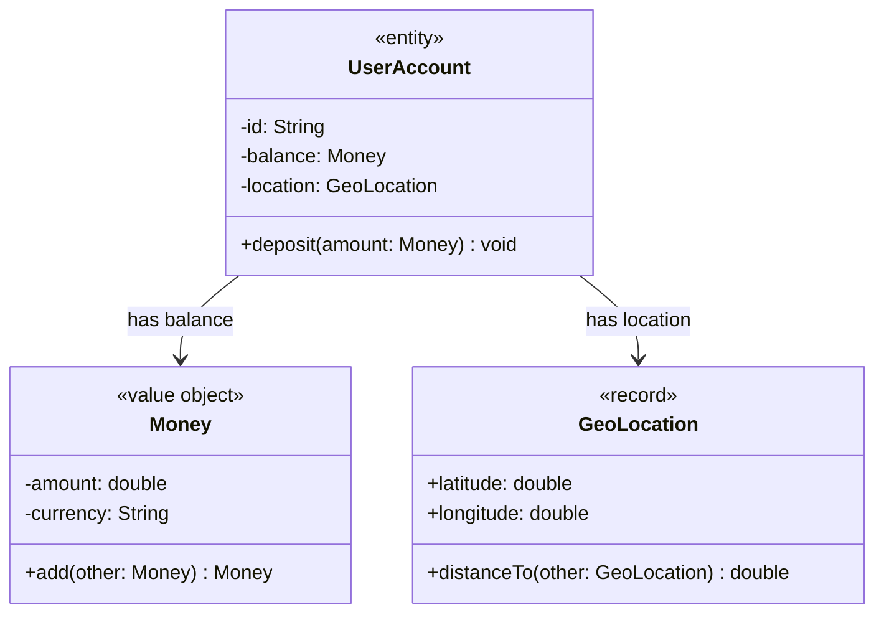

# 📘 Day 2 Modern Java Language Features & Domain Modeling
### `P01.M01.L03` — Records, Value Objects & Immutability

> A revision-ready guide to Java Records, Value Objects vs. Entities, immutability rules, and how it all connects to Spring Boot / Jackson in real projects.

---

## 🗂️ Table of Contents

1. [Conceptual Foundations](#1-️-conceptual-foundations)
2. [Java Records Deep Dive](#2--java-records-deep-dive)
3. [Constructors & Immutability Nuances](#3--constructors--immutability-nuances)
4. [Coding Exercises](#4--coding-exercises)
5. [Domain Model Diagram](#5--domain-model-diagram)
6. [Records vs. Traditional Classes](#6--records-vs-traditional-classes)
7. [Spring Boot 3 & Jackson Integration](#7--spring-boot-3--jackson-integration)
8. [Quick Review / Flashcards](#8--quick-review--flashcards)
9. [Cheat Sheet (TL;DR)](#9--cheat-sheet-tldr)

---

## 1. 🏛️ Conceptual Foundations

### Value Object vs. Entity

| | **Value Object** `<<value object>>` / `<<record>>` | **Entity** `<<entity>>` |
|---|---|---|
| **Identity** | None — defined by its *attributes* | Has a unique `id` tracked over time |
| **Equality** | Structural (`equals()`/`hashCode()` compare values) | Reference/ID-based |
| **Mutability** | Immutable, side-effect-free | Stateful, can mutate over its lifecycle |
| **Interchangeability** | Two objects with equal fields are interchangeable | Two entities are distinct even with identical fields |

### Key Anti-Pattern: Primitive Obsession

> Passing raw `int`, `String`, `double` across system boundaries with **no validation or domain meaning**, forcing every caller to duplicate defensive checks.

✅ **Fix:** Wrap primitives in Value Objects. Validation lives in **one place** (the constructor) instead of being scattered across the codebase.

### Side-Effect-Free Operations

- Methods like `Money.add()` **never mutate `this`**.
- They always **return a new instance**.
- Benefits: thread-safety, no aliasing bugs, predictable behavior.

### JDK Precedents (things you already use!)

| Class | Example Method | Behavior |
|---|---|---|
| `java.math.BigDecimal` | `.add(...)` | Returns new `BigDecimal` |
| `java.time.LocalDate` | `.plusDays(...)` | Returns new `LocalDate` |

### 🔹 Warm-up Syntax

```java
public record Point(int x, int y) {}
```

That single line generates a full immutable class — constructor, accessors, `equals()`, `hashCode()`, `toString()`.

---

## 2. 🧬 Java Records Deep Dive

Records (Java 14+) are **immutable data carriers** that make domain invariants transparent and compiler-enforced.

```
┌─────────────────────────────────────────────────────────────────────┐
│                           JAVA RECORD                                │
│  • Implicitly extends java.lang.Record  (no class inheritance)       │
│  • Implicitly final                     (cannot be extended)         │
│  • All header fields  →  private final                               │
│  • Accessors          →  x(), y()       (no "get" prefix)            │
│  • Auto-generated: equals(), hashCode(), toString(), canonical ctor  │
└─────────────────────────────────────────────────────────────────────┘
```

### 🔑 Key Architectural Rules

| Rule | Detail |
|---|---|
| **Auto-generated code** | Compiler creates `private final` fields, canonical constructor, accessors (e.g. `latitude()`), `equals()`, `hashCode()`, `toString()` |
| **Inheritance** | Implicitly extends `java.lang.Record` + implicitly `final` → **cannot extend a class**, and **nothing can extend a record**. **Can** implement interfaces. |
| **Instance fields** | ❌ Illegal to declare extra instance fields in the body (e.g. `private final int age;`) |
| **Static fields** | ✅ `public static final` constants and static helpers are fine |
| **Nested records** | Implicitly `static` → never hold a hidden reference to the enclosing instance |
| **Local records** | Since Java 16 — can declare a `record` inside a method body (handy for stream pipelines / grouped returns) |

---

## 3. 🔒 Constructors & Immutability Nuances

### A. Compact Canonical Constructor

Omits the parameter list **and** the `this.x = x;` assignments — the compiler fills those in. Use it purely for **validation** and **normalization**.

```java
public record GeoLocation(double latitude, double longitude) {
    // Compact constructor: parameter list & "this.x = x" are implicit!
    public GeoLocation {
        if (latitude < -90.0 || latitude > 90.0) {
            throw new IllegalArgumentException("Latitude must be between -90 and 90.");
        }
        if (longitude < -180.0 || longitude > 180.0) {
            throw new IllegalArgumentException("Longitude must be between -180 and 180.");
        }
        // Arguments can be normalized before assignment:
        // latitude = Math.round(latitude * 100.0) / 100.0;
    }
}
```

### B. Overloaded (Non-Canonical) Constructors

Must **always delegate** to the canonical constructor via `this(...)`.

```java
public record Point(int x, int y) {
    public Point(int x) {
        this(x, 0); // Mandatory delegation
    }
}
```

### C. Shallow vs. Deep Immutability ⚠️

> Records are only **shallowly** immutable. If a component holds a *mutable* structure (like `List`), the reference itself can't be reassigned — but its **contents can still be changed from outside**.

**Fix — defensive copy inside the compact constructor:**

```java
public record ShoppingCart(List<String> items) {
    public ShoppingCart {
        // Defensive copy prevents external mutation:
        items = List.copyOf(items);
    }
}
```

| Immutability Type | What's Protected | What's NOT Protected (without defensive copy) |
|---|---|---|
| **Shallow** (default) | The reference variable itself | Contents of mutable fields (`List`, `Map`, arrays) |
| **Deep** (manual) | Reference **and** contents | — (fully safe) |

---

## 4. 💻 Coding Exercises

### Exercise 1 — `Money` as a Pure Value Object (manual class, pre-records style)

```java
import java.math.BigDecimal;
import java.util.Objects;

public final class Money {
    private final BigDecimal amount;
    private final String currency;

    public Money(BigDecimal amount, String currency) {
        if (amount == null || currency == null || currency.isBlank()) {
            throw new IllegalArgumentException("Amount and currency must not be null or blank.");
        }
        this.amount = amount;
        this.currency = currency;
    }

    public Money add(Money other) {
        Objects.requireNonNull(other, "Cannot add null Money");
        if (!this.currency.equals(other.currency)) {
            throw new IllegalArgumentException("Currency mismatch: " + this.currency + " vs " + other.currency);
        }
        return new Money(this.amount.add(other.amount), this.currency);
    }

    public BigDecimal getAmount() { return amount; }
    public String getCurrency() { return currency; }

    @Override
    public boolean equals(Object o) {
        if (this == o) return true;
        if (!(o instanceof Money money)) return false;
        return amount.compareTo(money.amount) == 0 && currency.equals(money.currency);
    }

    @Override
    public int hashCode() {
        return Objects.hash(amount, currency);
    }

    @Override
    public String toString() {
        return amount + " " + currency;
    }
}
```

> 💡 **Why not a record here?** This illustrates *manually* what a record gives you for free — useful for understanding what's happening "under the hood," and relevant when you need extra control (e.g., `compareTo` for equality instead of raw `.equals()` on `BigDecimal`).

### Exercise 2 — `GeoLocation` as a Record

```java
public record GeoLocation(double latitude, double longitude) {
    // Compact canonical constructor for domain validation
    public GeoLocation {
        if (latitude < -90.0 || latitude > 90.0) {
            throw new IllegalArgumentException("Latitude must be between -90 and 90.");
        }
        if (longitude < -180.0 || longitude > 180.0) {
            throw new IllegalArgumentException("Longitude must be between -180 and 180.");
        }
    }

    // Custom domain operation (Haversine formula approximation)
    public double distanceTo(GeoLocation other) {
        double latDiff = Math.toRadians(other.latitude - this.latitude);
        double lonDiff = Math.toRadians(other.longitude - this.longitude);
        return Math.sqrt(latDiff * latDiff + lonDiff * lonDiff) * 6371.0; // Distance in km
    }
}
```

> 💡 Notice how much shorter this is than `Money` above — that's the whole point of records.

---

## 5. 🗺️ Domain Model Diagram



**Reading the diagram:**
- `UserAccount` is the **Entity** — it has an `id` and a mutating method (`deposit`).
- `Money` and `GeoLocation` are **Value Objects** — no identity, only attributes + pure functions.
- Composition arrows (`-->`) show the entity *owns* instances of the value objects.

---

## 6. ⚖️ Records vs. Traditional Classes

| Evaluation Criteria | Java `record` | Traditional Class |
|---|---|---|
| **Primary Intent** | Immutable data carriers, Value Objects, DTOs | Entities, mutable domain aggregates, state machines |
| **Boilerplate** | Zero (auto `equals`, `hashCode`, `toString`, accessors) | High (manual code / IDE generators / Lombok) |
| **Immutability** | Compiler-enforced (`private final`) | Developer-disciplined (can be broken accidentally) |
| **Inheritance** | Locked to `java.lang.Record` | Full polymorphism & class hierarchies |
| **Accessor Naming** | `geo.latitude()` | `geo.getLatitude()` (JavaBean style) |

> 🏆 **Senior Architecture Rule:**
> Use **Records** for Value Objects, DTOs, projection queries, and event payloads.
> Reserve **traditional classes** for domain **Entities** with mutable lifecycles and polymorphic hierarchies.

---

## 7. 🌱 Spring Boot 3 & Jackson Integration

- **Canonical Constructor Deserialization**: Jackson binds incoming JSON straight through a record's canonical constructor — no extra config needed.
- **Built-in Boundary Protection**: Any validation in the compact constructor runs **automatically during deserialization**, *before* your controller logic even executes. This means invalid data can never even reach your business logic.

```java
// Spring Boot 3 REST Endpoint DTO
public record CreateUserRequest(
    @NotBlank String name,
    @Email String email
) {
    public CreateUserRequest {
        if (name.isBlank()) {
            throw new IllegalArgumentException("Username cannot be blank");
        }
    }
}
```

**Flow of a request:**

```
Incoming JSON  →  Jackson deserialization  →  Canonical constructor runs
                                                   │
                                          (validation happens HERE)
                                                   │
                                                   ▼
                                     Controller method receives a
                                     guaranteed-valid CreateUserRequest
```

---

## 8. 🧠 Quick Review / Flashcards

<details>
<summary><b>Q: How does a compact canonical constructor simplify invariant validation?</b></summary>

It removes the noise of declaring the parameter list and explicit field assignments (`this.x = x`), leaving a clean block dedicated solely to validation and defensive transformation.
</details>

<details>
<summary><b>Q: What methods are automatically generated by the compiler for records?</b></summary>

A canonical constructor, component accessors (`x()`, `y()`), `equals()`, `hashCode()`, and `toString()`.
</details>

<details>
<summary><b>Q: Why are records prohibited from extending arbitrary classes?</b></summary>

Every record implicitly extends `java.lang.Record`. Since Java has no multiple class inheritance, extending any other class is forbidden.
</details>

<details>
<summary><b>Q: How do UML diagrams distinguish Value Objects from Entities?</b></summary>

Via stereotypes: `<<record>>` / `<<value object>>` vs. `<<entity>>`. Entities show an identity field (`- id: String`) and state-mutating methods; Value Objects show attribute fields and side-effect-free methods that return new instances.
</details>

<details>
<summary><b>Q: How do Jackson and Spring Boot leverage records?</b></summary>

Request payloads map directly to immutable record DTOs via canonical constructor deserialization, so invariant checks run immediately at the API boundary — before controller logic executes.
</details>

---

## 9. ⚡ Cheat Sheet (TL;DR)

- 🔹 `record` = immutable data carrier → auto `equals()`, `hashCode()`, `toString()`, accessors (no `get` prefix).
- 🔹 Implicitly `final` + extends `java.lang.Record` → **no class inheritance**, but **can implement interfaces**.
- 🔹 No extra instance fields in the body — only `static` fields allowed outside the header.
- 🔹 **Compact constructor** = validation/normalization, no explicit assignments needed.
- 🔹 Overloaded constructors **must** call `this(...)` to reach the canonical constructor.
- 🔹 Records are **shallowly immutable** — use `List.copyOf()` etc. for deep immutability.
- 🔹 Nested records are implicitly `static` (no hidden outer-class reference).
- 🔹 Local records allowed since **Java 16**.
- 🔹 Use records for: **Value Objects, DTOs, API payloads, event objects.**
- 🔹 Use classes for: **Entities with identity + mutable state.**
- 🔹 Jackson deserializes JSON straight through the canonical constructor → validation runs at the API boundary automatically.

---

*✍️ Compiled for revision purposes — Module P01.M01.L03: Modern Java Language Features & Domain Modeling.*