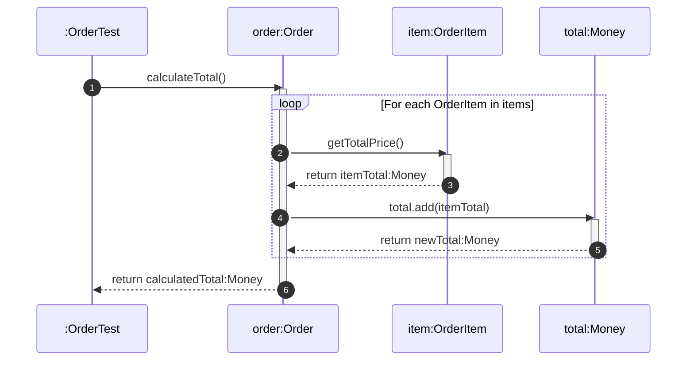

# 📘 P01.M01.L03 — Day 3 Value Objects, Entities & Records

> **Module:** Phase 01 · Module 01 · Lesson 03
> **Topic:** Domain-Driven Design fundamentals using modern Java `record` types
> **Prerequisite:** L01 (State/Identity/Behavior), L02 (Encapsulation & Access Control)
> **Next up:** Module 1.2 — Object Collaboration & Polymorphism

A complete revision guide covering the theory, syntax, build config, and hands-on lab for distinguishing **Entities** from **Value Objects** — and implementing both cleanly using Java 17 `record`s.

---

## 🗂️ Table of Contents

1. [Quick Recall Cheat Sheet](#1-quick-recall-cheat-sheet)
2. [Core Theory: Entities vs. Value Objects](#2-core-theory-entities-vs-value-objects)
3. [Decision Guide: `record` vs `final class`](#3-decision-guide-record-vs-final-class)
4. [⚠️ Common Pitfall: Maven Compiler Config](#4-️-common-pitfall-maven-compiler-config)
5. [Debugging Exercise](#5-debugging-exercise)
6. [Hands-on Lab: E-Commerce Domain Model](#6-hands-on-lab-e-commerce-domain-model)
7. [Sequence Diagram: Total Calculation Flow](#7-sequence-diagram-total-calculation-flow)
8. [Real-World Examples](#8-real-world-examples)
9. [Module Recap & Reflection](#9-module-recap--reflection)

---

## 1. Quick Recall Cheat Sheet

Use this section for **fast pre-exam / pre-interview review**.

| Concept | Key Fact |
|---|---|
| **Compact Canonical Constructor** | No `this.x = x` boilerplate — compiler auto-assigns. Used purely for **validation & normalization**. |
| **Auto-generated by `record`** | `private final` fields, `field()` accessors (no `get` prefix), `equals()`, `hashCode()`, `toString()`, canonical constructor. |
| **Inheritance** | Records implicitly extend `java.lang.Record` and are **implicitly final** → cannot extend other classes, but **can implement interfaces**. |
| **UML Stereotypes** | `<<record>>` / `<<valueObject>>` (no ID) vs. `<<entity>>` (has explicit `- id: String`). |
| **Immutability in UML** | Marked with `{readOnly}`, no mutator methods shown. |
| **`isBlank()` vs `.trim().isEmpty()`** | Prefer `isBlank()` (Java 11+) — avoids allocating intermediate heap strings. |
| **Spring + Jackson** | Jackson binds JSON straight through the canonical constructor; put `@NotBlank`, `@Size`, `@Positive` directly on record components, triggered via `@Valid`/`@Validated`. |

### 🔧 Warm-up Snippet — `Address` Record

```java
package handbook.phase01.p01m01l03;

public record Address(String street, String city, String zipCode) {
    public Address {
        if (street == null || street.isBlank()) {
            throw new IllegalArgumentException("Street is required");
        }
        if (city == null || city.isBlank()) {
            throw new IllegalArgumentException("City is required");
        }
        if (zipCode == null || zipCode.isBlank()) {
            throw new IllegalArgumentException("Zip code is required");
        }
    }
}
```

> 💡 **Why it matters:** this is the minimal template for *any* Value Object — validate in the compact constructor, no extra fields, no setters.

---

## 2. Core Theory: Entities vs. Value Objects

### 🧑‍💼 Entity (Martin Fowler)
- Identity **persists across time**, state changes, and representations (e.g. `Customer`, `Order`).
- Equality = **Identity equality** → compare by ID, *not* by field values.

### 💎 Value Object (Martin Fowler)
- Defined **purely by its attributes** (e.g. `Money`, `Coordinates`, `Address`).
- Two instances with identical fields are **fully interchangeable**.
- Equality = **Structural equality** → compare all fields.
- **Side-effect-free operations**: methods like `Money.add()` return a **new instance** instead of mutating state.

### 🧩 Aggregates (Thoughtworks — Tactical DDD)

| Term | Meaning |
|---|---|
| **Aggregate** | A cluster of Entities + Value Objects treated as one consistency unit (e.g. `Order` + its `OrderItem`s). |
| **Aggregate Root** | The single entry point (`Order`) — *all* mutations must go through it. |
| **Defensive Copies** | Root exposes internal collections via `List.copyOf(items)` so external code can't mutate internal state directly. |

> 🧠 **Memory hook:** *Entities answer "who am I?" (identity). Value Objects answer "what am I made of?" (structure).*

---

## 3. Decision Guide: `record` vs `final class`

### Decision Flow

```
Is it an immutable data carrier?
        │
   ┌────┴─────┐
  YES         NO → Use a standard Class / Entity
   │
Does it need class inheritance, non-component
cached fields, or legacy ORM zero-arg constructors?
   │
 ┌─┴──┐
 NO   YES
 │     │
record  final class
```

### Comparison Table

| Dimension | `record` (Java 16+) | `final class` |
|---|---|---|
| **Boilerplate** | Zero (auto ctor, accessors, `equals`/`hashCode`) | High (~30–40 lines) |
| **Accessors** | `field()` style | `getField()` style |
| **Inheritance** | Interfaces only | Can extend abstract base classes |
| **Encapsulation** | Transparent component exposure | Can hide/transform internal representation |
| **Best used for** | Modern DDD Value Objects | Cases needing custom internals (e.g. `Money` normalizing currency) |

> ⚡ **Rule of thumb:** Default to `record`. Reach for `final class` only when you need custom internal representation, inheritance, or non-record-component logic (see `Money.java` below — it normalizes currency casing internally).

---

## 4. ⚠️ Common Pitfall: Maven Compiler Config

**Symptom:** `record` syntax fails to compile even though JDK 17 is installed locally.

**Root cause:** Maven's compiler plugin **defaults to an old source level** (e.g. Java 8) unless the `pom.xml` explicitly says otherwise.

```
JDK 17 installed
      │
Maven POM configuration check
      │
 ┌────┴─────────────────────┐
properties missing     <release>17</release> set
      │                          │
❌ "record" unrecognized   ✅ Compiles records, pattern
   keyword error              matching, sealed classes
```

**✅ Fix — add to `pom.xml`:**

```xml
<properties>
    <maven.compiler.release>17</maven.compiler.release>
</properties>
```

> 📌 **Takeaway:** JDK version installed ≠ Java language level used by the compiler. Always set `maven.compiler.release` explicitly.

---

## 5. Debugging Exercise

**File:** `scratch/OrderItemDebug.java`

```java
package scratch;

public record OrderItemDebug(String productId, int quantity, double unitPrice) {
    public OrderItemDebug {
        if (productId == null || productId.isBlank()) {
            throw new IllegalArgumentException("Product ID required.");
        }
        if (quantity <= 0) {
            throw new IllegalArgumentException("Quantity must be positive.");
        }
        if (unitPrice < 0.0) {
            throw new IllegalArgumentException("Unit price cannot be negative.");
        }
    }

    public double getTotalPrice() {
        return quantity * unitPrice;
    }
}
```

**Test coverage (`OrderItemDebugTest.java`):**

| Test | Verifies |
|---|---|
| `shouldCalculateTotalPriceCorrectly` | `3 × 25.50 = 76.50` |
| `shouldThrowExceptionWhenQuantityIsZeroOrNegative` | Rejects `0` and negative quantities |
| `shouldThrowExceptionWhenUnitPriceIsNegative` | Rejects negative unit price |

> 💡 This is a **simplified, single-file version** of the lab's `OrderItem` — good for isolating validation logic before wiring it into the full aggregate.

---

## 6. Hands-on Lab: E-Commerce Domain Model

### 📁 Package Structure

```
handbook.phase01.p01m01l03
├── Money.java          → Value Object (final class)
├── Address.java        → Value Object (record)
├── OrderItem.java      → Value Object (record)
├── Order.java          → Entity / Aggregate Root
└── OrderTest.java      → JUnit 5 verification suite
```

### 💰 `Money.java` — Value Object as `final class`

Why a class and not a record here? Because it needs **custom normalization logic** (`currency.trim().toUpperCase()`) beyond simple field storage.

```java
package handbook.phase01.p01m01l03;

import java.util.Objects;

public final class Money {
    private final double amount;
    private final String currency;

    public Money(double amount, String currency) {
        if (amount < 0.0) throw new IllegalArgumentException("Amount cannot be negative.");
        if (currency == null || currency.isBlank()) throw new IllegalArgumentException("Currency required.");
        this.amount = amount;
        this.currency = currency.trim().toUpperCase();
    }

    public Money add(Money other) {
        if (!this.currency.equals(other.currency)) {
            throw new IllegalArgumentException("Currency mismatch: " + this.currency + " vs " + other.currency);
        }
        return new Money(this.amount + other.amount, this.currency);
    }

    public double getAmount() { return amount; }
    public String getCurrency() { return currency; }

    @Override
    public boolean equals(Object o) {
        if (this == o) return true;
        if (!(o instanceof Money money)) return false;
        return Double.compare(money.amount, amount) == 0 && Objects.equals(currency, money.currency);
    }

    @Override
    public int hashCode() { return Objects.hash(amount, currency); }
}
```

> 🔑 **Key pattern:** `add()` returns a **new** `Money` instance — never mutates `this`. This is the "side-effect-free operation" principle.

### 🧾 `OrderItem.java` — Value Object as `record`

```java
package handbook.phase01.p01m01l03;

public record OrderItem(String productId, int quantity, Money unitPrice) {
    public OrderItem {
        if (productId == null || productId.isBlank()) throw new IllegalArgumentException("Product ID required.");
        if (quantity <= 0) throw new IllegalArgumentException("Quantity must be positive.");
        if (unitPrice == null) throw new IllegalArgumentException("Unit price required.");
    }

    public Money getTotalPrice() {
        return new Money(unitPrice.getAmount() * quantity, unitPrice.getCurrency());
    }
}
```

### 📦 `Order.java` — Entity / Aggregate Root

```java
package handbook.phase01.p01m01l03;

import java.util.ArrayList;
import java.util.List;
import java.util.Objects;

public class Order {
    private final String orderId;
    private final Address shippingAddress;
    private final List<OrderItem> items = new ArrayList<>();
    private String status = "CREATED";

    public Order(String orderId, Address shippingAddress) {
        if (orderId == null || orderId.isBlank()) throw new IllegalArgumentException("Order ID required.");
        if (shippingAddress == null) throw new IllegalArgumentException("Shipping address required.");
        this.orderId = orderId.trim();
        this.shippingAddress = shippingAddress;
    }

    public void addItem(OrderItem item) {
        if (!"CREATED".equals(status)) {
            throw new IllegalStateException("Cannot add items to order in status: " + status);
        }
        if (item == null) throw new IllegalArgumentException("Item required.");
        items.add(item);
    }

    public Money calculateTotal() {
        if (items.isEmpty()) return new Money(0.0, "USD");
        String currency = items.get(0).unitPrice().getCurrency();
        Money total = new Money(0.0, currency);
        for (OrderItem item : items) {
            total = total.add(item.getTotalPrice());
        }
        return total;
    }

    public void cancelOrder() {
        if ("CANCELLED".equals(status)) throw new IllegalStateException("Order is already cancelled.");
        this.status = "CANCELLED";
    }

    public String getOrderId() { return orderId; }
    public Address getShippingAddress() { return shippingAddress; }
    public String getStatus() { return status; }
    public List<OrderItem> getItems() { return List.copyOf(items); } // Defensive Copy

    @Override
    public boolean equals(Object o) {
        if (this == o) return true;
        if (!(o instanceof Order order)) return false;
        return Objects.equals(orderId, order.orderId);
    }

    @Override
    public int hashCode() { return Objects.hash(orderId); }
}
```

> 🛡️ **Two things to notice:**
> 1. `equals()`/`hashCode()` use **only `orderId`** — proving `Order` is an **Entity**, not a Value Object.
> 2. `getItems()` returns `List.copyOf(items)` — an **immutable defensive copy**, so callers can't secretly mutate aggregate internals.

### ✅ `OrderTest.java` — Verification Suite

```java
package handbook.phase01.p01m01l03;

import org.junit.jupiter.api.BeforeEach;
import org.junit.jupiter.api.Test;
import static org.junit.jupiter.api.Assertions.*;

public class OrderTest {

    private Order order;
    private Money usd100;

    @BeforeEach
    void setUp() {
        Address address = new Address("123 Tech St", "San Jose", "95110");
        order = new Order("ORD-5001", address);
        usd100 = new Money(100.0, "USD");
    }

    @Test
    void testAddItemAndCalculateTotal() {
        order.addItem(new OrderItem("PROD-1", 2, usd100)); // $200
        order.addItem(new OrderItem("PROD-2", 1, usd100)); // $100
        Money total = order.calculateTotal();

        assertEquals(300.0, total.getAmount(), 0.001);
        assertEquals("USD", total.getCurrency());
    }

    @Test
    void testCancelOrderChangesStatusAndRejectsItems() {
        order.cancelOrder();
        assertEquals("CANCELLED", order.getStatus());
        assertThrows(IllegalStateException.class, () -> order.addItem(new OrderItem("PROD-1", 1, usd100)));
    }

    @Test
    void testItemsListEncapsulation() {
        order.addItem(new OrderItem("PROD-1", 1, usd100));
        assertThrows(UnsupportedOperationException.class, () -> order.getItems().clear());
    }
}
```

| Test | What It Proves |
|---|---|
| `testAddItemAndCalculateTotal` | Aggregation logic: `$200 + $100 = $300 USD` |
| `testCancelOrderChangesStatusAndRejectsItems` | State machine: `CREATED → CANCELLED`, and cancelled orders reject new items |
| `testItemsListEncapsulation` | `getItems()` returns a **truly immutable** list (`UnsupportedOperationException` on `.clear()`) |

---

## 7. Sequence Diagram: Total Calculation Flow



**Reading this diagram:** `Order` (the Aggregate Root) **delegates** — it never computes prices itself. It asks each `OrderItem` for its total, then asks `Money` to accumulate the running total. This is the *"Tell, Don't Ask"* principle in action.

---

## 8. Real-World Examples

### Stripe / Shopify SDKs

| Category | Examples | Trait |
|---|---|---|
| **Entities** | `Charge` (ID: `ch_12345`), `Customer`, `Refund` | Unique lifecycle, mutable state, tracked by ID |
| **Value Objects** | `Amount`, `Currency`, `Address`, `LineItem` | Stateless, immutable; changing a shipping address **replaces** the object rather than mutating it in place |

> 🌍 **Analogy:** A `Customer` is like a person — same person even as they age or move. An `Address` is like a sticky note — if it changes, you throw the old one away and write a new one; you don't edit the ink.

---

## 9. Module Recap & Reflection

### 🏁 Key Takeaways from This Lesson

- **Delegation:** `Order` coordinates aggregate-level operations, delegating arithmetic to `OrderItem.getTotalPrice()` and `Money.add()`.
- **Interchangeability:** Value Objects with no identity are safely swappable if their attribute values match.
- **Verification:** `OrderTest` covers calculations, state transitions (`CREATED → CANCELLED`), and list immutability.

### 📚 Module 1.1 Milestone Summary

| Lesson | Focus |
|---|---|
| **L01** | State, Identity, Behavior — encapsulation, object lifecycles, honoring the `equals()`/`hashCode()` contract |
| **L02** | Encapsulation & Access Control — multi-field invariants, defensive copying |
| **L03** *(this lesson)* | Entities, Value Objects & Records — using `record` for immutable Value Objects; reserving classes for identity-driven Entities |

### ➡️ Next: Module 1.2 — Object Collaboration & Polymorphism

---

## 🧠 5-Minute Self-Test (For Revision)

Before moving on, try answering these from memory:

1. What's the difference between `equals()` semantics for an Entity vs. a Value Object?
2. Why can't a `record` extend another class?
3. When would you choose `final class` over `record` for a Value Object?
4. What's the fix when `record` syntax fails to compile in Maven despite having JDK 17?
5. Why does `Order.getItems()` return `List.copyOf(items)` instead of `items` directly?
6. Why does `Money.add()` return a new object instead of mutating `this.amount`?

<details>
<summary>▶️ Click to reveal answers</summary>

1. Entity → identity/ID equality. Value Object → structural (all-fields) equality.
2. Records implicitly extend `java.lang.Record` and are implicitly `final`; Java doesn't allow multiple class inheritance.
3. When you need custom internal representation/normalization, non-record-component cached fields, inheritance, or legacy ORM zero-arg constructors.
4. Add `<maven.compiler.release>17</maven.compiler.release>` inside `<properties>` in `pom.xml`.
5. To prevent external callers from mutating the aggregate's internal list — enforces the Aggregate Root as the sole mutation gateway.
6. Because Value Objects use side-effect-free operations — immutability guarantees they stay safely interchangeable and thread-safe.

</details>