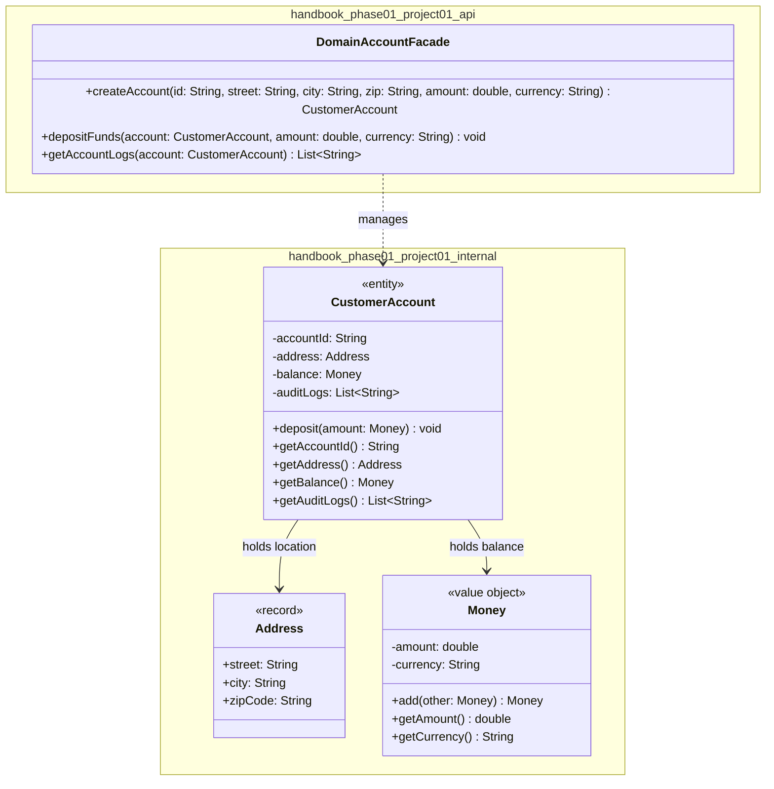

# 📘 Module 01.01 — Project Day Domain Model Integration Subsystem

> **Phase 1: Domain Modeling Foundations** · Project & Concept Synthesis
> Location: `projects/module-01-project/`

A revision-ready reference for the three pillars of object-oriented domain modeling in Java: **identity & state**, **encapsulation & invariants**, and **value objects & records**.

---

## 🎯 1. Objective

This module fuses three core OOP concepts into one working subsystem:

| # | Pillar | Lesson | What It Covers |
|---|--------|--------|-----------------|
| 1 | **Classes, State & Identity** | `L01` | Rich entities governed by identity-based `equals()` / `hashCode()` |
| 2 | **Encapsulation & Invariants** | `L02` | Guarding internal collections with defensive copies (`List.copyOf()`) |
| 3 | **Value Objects & Records** | `L03` | Immutable, side-effect-free concepts via Java Records — no primitive obsession |

---

## 🧠 2. Quick Recall Table

| Concept | Core Principle | ⚠️ Common Pitfall |
|---|---|---|
| **Entity vs. Value Object** | Entities have continuous **identity** (e.g. `accountId`) + mutable state. Value Objects are defined by their **attributes**, are immutable, and interchangeable. | Giving Value Objects DB IDs, or mutating VO fields in place. |
| **Defensive Copying** | Return `List.copyOf(collection)` / unmodifiable snapshots. | Returning raw references to internal mutable collections — lets callers bypass invariants. |
| **Java 14+ Records** | Transparent data carriers: auto canonical constructor, accessors, `equals`, `hashCode`, `toString`. | Adding non-final fields (illegal) or using records for entities that need identity. |
| **`equals()`/`hashCode()` Contract** | If `a.equals(b)` → `a.hashCode() == b.hashCode()`. Critical for `HashMap`/`HashSet`. | Overriding `equals()` without `hashCode()` → broken bucket lookups. |
| **Rich vs. Anemic Model** | Rich models co-locate state + business logic + validation. | Anemic models = passive getters/setters, logic scattered across services. |

```bash
# Build & verify tests
mvn clean test
```

---

## 🏗️ 3. Architecture Deep Dive: Layered vs. Vertical Slice

### 🔲 Layered (Horizontal) Architecture
- **Structure:** `Presentation → Application/Service → Domain → Persistence/Infrastructure`
- **Communication:** Each layer only talks to its immediate neighbor.
- **⚠️ Pass-Through / Sinkhole Problem:** Even trivial CRUD must traverse every layer (`Controller → Service → Repository → Entity → DTO`) with zero business logic added.
- **⚠️ Low Feature Cohesion:** One feature change = edits across many unrelated packages.

### 🍰 Vertical Slice Architecture (Feature Packaging)
- **Structure:** Code organized by **business feature**, not technical layer.
- **High Cohesion:** Endpoints, handlers, domain rules, and queries for one capability live together.
- **Cross-Slice Decoupling:** Slices talk via **domain events** (published by use-case handlers, consumed asynchronously) — not direct coupling.

> 💡 **Takeaway:** Layered = simple mental model but rigid; Vertical Slice = higher cohesion, better for feature-driven teams.

---

## 🔍 4. Deep-Dive Design Discussions

### Records: Overriding Accessors vs. Compact Constructor Defensive Copy

Two ways to protect a record's mutable component (like a `List`):

| Approach | What It Does |
|---|---|
| **Override accessor** | `public List<String> items() { return List.copyOf(items); }` — copies only on *read* |
| **Compact constructor copy** ✅ Best Practice | Copies on *construction*, so the field is immutable from birth — protects both incoming & outgoing mutation |

```java
public record Order(String id, List<String> items) {
    public Order {
        if (id == null || id.isBlank()) {
            throw new IllegalArgumentException("Order ID is required.");
        }
        // Defensive copy on ingestion guarantees immutability
        items = (items == null) ? List.of() : List.copyOf(items);
    }
}
```

### Records vs. Final Classes with Mutable State

- Records **cannot** have non-final fields — every component is implicitly `private final`.
- Need **mutable lifecycle state** (e.g., account balance)? → use a regular `class` (or `final class` to block subclassing).
- Mutation only through **domain-specific methods** (`deposit()`, `withdraw()`) — never raw public setters.

### Package Encapsulation & Facade Visibility

| Strategy | How It Hides Internals |
|---|---|
| **Package-Private** | All classes in one package; only the Facade is `public`, domain models have no modifier → invisible outside the package. |
| **JPMS (`module-info.java`)** | Split into `api` + `internal` packages. `internal` classes can be `public`, but the module only exports `api` — blocks external imports at **compile time**. |

```java
module handbook.phase01.project01 {
    exports handbook.phase01.project01.api;
    // internal package remains unexported
}
```

---

## 🧪 5. Invariant Wiring Test Suite

JUnit 5's `assertAll` validates invariants across Value Objects, Records, and Entities in one shot (all assertions run, not fail-fast):

```java
package handbook.phase01.project01;

import handbook.phase01.project01.internal.Address;
import handbook.phase01.project01.internal.CustomerAccount;
import handbook.phase01.project01.internal.Money;
import org.junit.jupiter.api.Test;

import java.util.List;

import static org.junit.jupiter.api.Assertions.*;

public class ValueObjectTest {

    @Test
    void testForCustomerAccount() {
        Address validAddress = new Address("101 St", "San Jose", "95113");
        Money validBalance = new Money(100.0, "USD");

        assertAll("CustomerAccount Invariants",
            () -> assertThrows(IllegalArgumentException.class, () -> new CustomerAccount(null, validAddress, validBalance)),
            () -> assertThrows(IllegalArgumentException.class, () -> new CustomerAccount("   ", validAddress, validBalance)),
            () -> assertThrows(IllegalArgumentException.class, () -> new CustomerAccount("ACC-1001", null, validBalance)),
            () -> assertThrows(IllegalArgumentException.class, () -> new CustomerAccount("ACC-1002", validAddress, null))
        );
    }

    @Test
    void testForMoney() {
        assertAll("Money Invariants",
            () -> assertThrows(IllegalArgumentException.class, () -> new Money(-1.0, "USD")),
            () -> assertThrows(IllegalArgumentException.class, () -> new Money(40.0, null)),
            () -> assertThrows(IllegalArgumentException.class, () -> new Money(23.0, "   "))
        );

        Money usd = new Money(100.0, "USD");
        assertThrows(IllegalArgumentException.class, () -> usd.add(new Money(100.0, "EUR")));
    }

    @Test
    void testForAddress() {
        assertAll("Address Invariants",
            () -> assertThrows(IllegalArgumentException.class, () -> new Address(null, "San Jose", "95113")),
            () -> assertThrows(IllegalArgumentException.class, () -> new Address("123 St", null, "95113")),
            () -> assertThrows(IllegalArgumentException.class, () -> new Address("123 St", "San Jose", null))
        );
    }

    @Test
    void testForAuditLogsEncapsulation() {
        Address address = new Address("100 Main St", "Boston", "02108");
        Money balance = new Money(250.0, "USD");
        CustomerAccount account = new CustomerAccount("ACC-1001", address, balance);

        List<String> auditLogs = account.getAuditLogs();
        assertThrows(UnsupportedOperationException.class, auditLogs::clear);
    }
}
```

> 💡 **Note:** `testForAuditLogsEncapsulation` proves the defensive copy works — calling `.clear()` on the returned list throws `UnsupportedOperationException` because it's an immutable snapshot, not the live internal list.

---

## 🧩 6. Domain Subsystem Implementation

### `Address.java` — Record Value Object

```java
package handbook.phase01.project01.internal;

public record Address(String street, String city, String zipCode) {
    public Address {
        if (street == null || street.trim().isEmpty()) throw new IllegalArgumentException("Street required.");
        if (city == null || city.trim().isEmpty()) throw new IllegalArgumentException("City required.");
        if (zipCode == null || zipCode.trim().isEmpty()) throw new IllegalArgumentException("Zip code required.");
    }
}
```

### `Money.java` — Immutable Value Object (final class)

```java
package handbook.phase01.project01.internal;

import java.util.Objects;

public final class Money {
    private final double amount;
    private final String currency;

    public Money(double amount, String currency) {
        if (amount < 0.0) throw new IllegalArgumentException("Amount cannot be negative.");
        if (currency == null || currency.trim().isEmpty()) throw new IllegalArgumentException("Currency required.");
        this.amount = amount;
        this.currency = currency.trim().toUpperCase();
    }

    public Money add(Money other) {
        if (other == null || !this.currency.equals(other.currency)) {
            throw new IllegalArgumentException("Currency mismatch: " + this.currency + " vs " + (other == null ? "null" : other.currency));
        }
        return new Money(this.amount + other.amount, this.currency);
    }

    public double getAmount() { return amount; }
    public String getCurrency() { return currency; }

    @Override
    public boolean equals(Object o) {
        if (this == o) return true;
        if (!(o instanceof Money money)) return false;
        return Double.compare(money.amount, amount) == 0 && Objects.equals(currency, money.currency);
    }

    @Override
    public int hashCode() { return Objects.hash(amount, currency); }
}
```

### `CustomerAccount.java` — Domain Entity (identity-based)

```java
package handbook.phase01.project01.internal;

import java.util.ArrayList;
import java.util.List;
import java.util.Objects;

public class CustomerAccount {
    private final String accountId;
    private final Address address;
    private Money balance;
    private final List<String> auditLogs = new ArrayList<>();

    public CustomerAccount(String accountId, Address address, Money initialBalance) {
        if (accountId == null || accountId.trim().isEmpty()) throw new IllegalArgumentException("Account ID required.");
        if (address == null) throw new IllegalArgumentException("Address required.");
        if (initialBalance == null) throw new IllegalArgumentException("Initial balance required.");

        this.accountId = accountId.trim();
        this.address = address;
        this.balance = initialBalance;
        this.auditLogs.add("Account created with balance: " + initialBalance.getAmount());
    }

    public void deposit(Money amount) {
        if (amount == null) throw new IllegalArgumentException("Amount required.");
        this.balance = this.balance.add(amount);
        this.auditLogs.add("Deposited: " + amount.getAmount() + " " + amount.getCurrency());
    }

    public String getAccountId() { return accountId; }
    public Address getAddress() { return address; }
    public Money getBalance() { return balance; }
    public List<String> getAuditLogs() { return List.copyOf(auditLogs); } // Defensive Snapshot

    @Override
    public boolean equals(Object o) {
        if (this == o) return true;
        if (!(o instanceof CustomerAccount that)) return false;
        return Objects.equals(accountId, that.accountId); // Identity-based equality
    }

    @Override
    public int hashCode() { return Objects.hash(accountId); }
}
```

### `DomainAccountFacade.java` — Subsystem Boundary

```java
package handbook.phase01.project01.api;

import handbook.phase01.project01.internal.Address;
import handbook.phase01.project01.internal.CustomerAccount;
import handbook.phase01.project01.internal.Money;
import java.util.List;

public class DomainAccountFacade {

    public CustomerAccount createAccount(String accountId, String street, String city, String zipCode, double initialAmount, String currency) {
        Address address = new Address(street, city, zipCode);
        Money balance = new Money(initialAmount, currency);
        return new CustomerAccount(accountId, address, balance);
    }

    public void depositFunds(CustomerAccount account, double amount, String currency) {
        if (account == null) throw new IllegalArgumentException("Account required.");
        Money depositMoney = new Money(amount, currency);
        account.deposit(depositMoney);
    }

    public List<String> getAccountLogs(CustomerAccount account) {
        if (account == null) throw new IllegalArgumentException("Account required.");
        return account.getAuditLogs();
    }
}
```

---

## 🗺️ 7. UML Architecture Diagram



---

## 💡 8. Engineering Insight & Enterprise Connections

| Pillar | Insight |
|---|---|
| **State & Identity (`L01`)** | `CustomerAccount` equality is based **solely** on `accountId`. Balance mutations don't affect hash code or break lookups in `Set`/`Map`. |
| **Encapsulation & Defensive Copies (`L02`)** | `getAuditLogs()` returns `List.copyOf()` — an unmodifiable snapshot — so internal state can never be mutated externally. |
| **Value Immutability (`L03`)** | `Money.add()` returns a **new** instance instead of mutating in place — prevents shared-reference side effects in financial calculations. |
| **Spring Boot / Enterprise Alignment** | Domain facades act as clean service entry points, shielding controllers from entity-construction details and protecting aggregate boundaries. |

---

## 🌙 9. End-of-Day Reflection Synthesis

1. **Facade Integration** — `DomainAccountFacade` builds immutable Value Objects (`Money`, `Address`), binds them into an Entity (`CustomerAccount`), and exposes safe operations without leaking internals.
2. **Defensive Copying Importance** — `List.copyOf(auditLogs)` prevents reference escape; callers can't tamper with audit history.
3. **Side-Effect-Free Math** — `Money.add()` validates currency match, returns a new `Money`, preserves immutability.
4. **Record Advantages** — `record Address(...)` auto-generates constructor, accessors, and value-based `equals`/`hashCode` — zero boilerplate.
5. **Bridge to Module 1.2** — Aggregate boundaries + invariant protection here set up the next module: multi-object collaboration, message passing, and polymorphic domain structures.

---

## ✅ Cheat-Sheet Recap

- **Entity** → identity (`accountId`) + mutable state → regular `class`
- **Value Object** → attributes only, immutable → `record` or `final class`
- **Always** pair `equals()` with `hashCode()`
- **Always** return `List.copyOf()` (or similar) from getters exposing internal collections
- **Records** = zero non-final fields; use compact constructors for validation + defensive copies
- **Vertical Slice** > Layered when feature cohesion matters more than strict technical separation